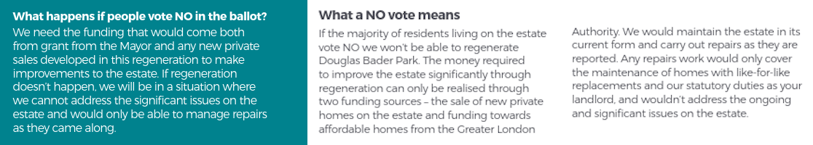
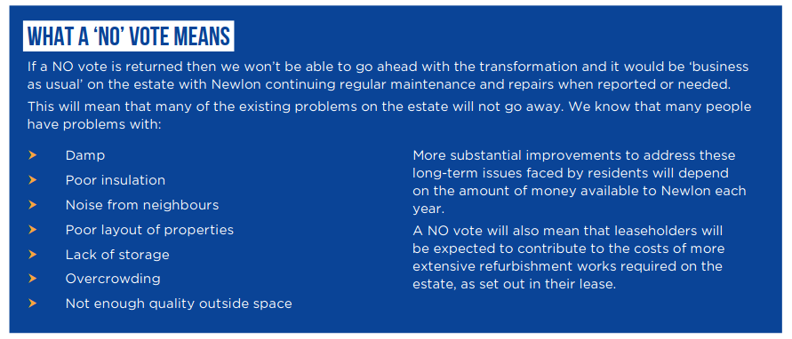
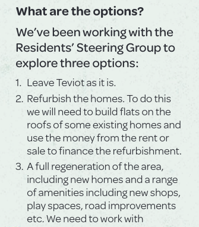

<h2> Estate Ballots - why the process is flawed</h2>

Estate ballots were introduced by the Mayor in 2018 but he [exempted](https://www.london.gov.uk/sites/default/files/2024-07/List-of-exemptions.pdf) around half of London's estates under threat from the requirement on the basis that they had already been allocated funding (even if many of these funding agreements have since expired). This includes many of the largest estates like the Aylesbury, South Acton and Grahame Park estates.

The remainder require a positive ballot if they want to receive Mayoral funding.

Most of the ballots that have taken place have resulted in residents voting in favour of demolition, but there are a number of problems with the ballot process:

# The issues
The main problems are as follows:

1. Ballots are being avoided altogether by schemes circumventing the requirement by not applying for Mayoral funding.  

2. Ballots are being repeated after a NO vote until a positive ballot is obtained. See for example the [Juniper Crescent and Gilbeys Yard estate](../estates/junipercrescent/).  

3. Temporary tenants, intermediate rent tenants and private rented sector tenants are excluded from being able to take part in ballots unless they have been on the Council's housing waiting list for at least one year.   

4. Significant resources are being allocated to YES vote campaigns while NO vote campaigns are entirely unfunded. In January 2022, it was revealed that Haringey Council spent a staggering £350k on its campaign for a YES vote in the [Love Lane estate](../estates/lovelane/) ballot.  

5. Estates are being decanted well ahead of any ballot such that the majority of residents at the time of a ballot are temporary tenants, who are incentivised to vote YES on the promise of a secure tenancy. For example, temporary tenants numbered 226 on the [Love Lane estate](../estates/lovelane/), compared with 43 secure tenants and 25 resident leaseholders. These were offered secure tenancies at social rents if they vote in favour of redevelopment. Note that temporary tenants usually pay much higher rents than secure tenants.  

6. Residents are faced with a choice of redevelopment or continued decline in living conditions - refurbishment is never offered as an option on the ballot paper. ballot Landlord Offers routinely make it clear that if residents vote NO then their estates will receive only essential maintenance. They are also sometimes told that if they vote against the plans they will be subject to building on green space or rooftops. 

7. The majority of ballot Landlord Offers fail to comply with the Mayor's requirement to provide details of the proposed tenure mix. For those offers that do, in some cases the tenure mix is watered down later on as schemes enter the planning process - see the [High Lane estate](../estates/highlane/) and the [Geoffrey Close estate](../estates/geoffreyclose/) as examples of this. In both cases the proportion of social rented housing was reduced from the levels proposed in the ballot Landlord Offer.

8. The majority of ballot Landlord Offers fail to provide detailed information about shared equity or equity loan schemes for leaseholders. These often end up being gatekept behind shared ownership (paying a proportion of rent) or accompanied by caveats in the small print which leave leaseholders worse off.   

# Demolition or disinvestment?
One of the recurring elements when it comes to estate regeneration ballots is that residents are faced with the choice of demolition or disinvestment.

Here are several examples of such ballot choices:

## Douglas Bader Park estate, Barnet
Residents on the [Douglas Bader Park estate](../estates/douglasbaderpark/) in Colindale, were told that they would only see 'like-for-like' repairs _'as they are reported'_ under the landlord's _'statutory duty'_ if demolition is rejected:

## Juniper Crescent estate, Camden
Similarly, residents of the [Juniper Crescent and Gilbeys Yard estate](../estates/junipercrescent/) in Camden were told that their estate would only receive essential maintenance and repairs as reported if they voted no:

## West Kentish Town estate, Camden
Residents of the [West Kentish Town estate](../estates/westkentishtown/) in Camden were told that if they voted against regeneration then their estate wouldn't see any major improvement for at least another 5 to 10 years:

## Cambridge Road estate, Kingston
Residents of the [Cambridge Road estate](../estates/cambridgeroad/) in Kingston were told that if they voted against regeneration then their estate would only see 'essential maintenance' and repairs as reported:

## Barnsbury estate, Islington
Residents of the [Barnsbury estate](../estates/barnsbury/) in Islington were told that if they voted against regeneration then ongoing problems like damp, overcrowding would not be tackled:

## Clichy estate, Tower Hamlets
Residents on the [Clichy estate](../estates/clichyestate/) in Tower Hamlets residents were initially consulted on an 'infill' option as well as full redevelopment. But the [information](https://www.whatdotheyknow.com/request/clichy_estate_ballot_paper_accom?nocache=incoming-1565802#incoming-1565802) sent to residents along with the ballot papers asked only whether they wanted full redevelopment or not.

In addition, leaseholders were [told](https://www.whatdotheyknow.com/request/658746/response/1565802/attach/4/Ballot%20information%20requested%201.pdf) that if they voted against redevelopment then they would be faced with major bills for any refurbishment.

Finally, residents were told that if they don't vote for full redevelopment then they would likely have the infill option forced upon them anyway:  

## Teviot estate, Tower Hamlets
In Tower Hamlets, residents of the [Teviot estate](../estates/teviot/) were similarly told that voting against regeneration would leave the estate in its current dilapidated state and face having new homes built on their roofs anyway:

## Wendling estate, Camden
Camden's [Landlord Offer](../estates/src/images/wendlingoffer.pdf) ahead of the ballot makes it clear that if residents vote against demolition the Council has no immediate plans to resolve the estate's ongoing maintenance issues.

Camden's pre-ballot information [booklets](../estates/src/images/wendlingbooklet.pdf) go as far as saying that if residents voted against demolition, then it would be 2025 before the Council would 'consider' resuming cyclical maintenance works and that they would be _'considered against Camden's other priorities'_ at that time.

# Representative?

## High Path estate, Merton
Residents on Merton's [High Path estate](../estates/highpath/) were balloted in 2016 as part of the Council's [consultation](https://www.merton.gov.uk/assets/Documents/04_merton_report_of_consultation_stage_2_estates_local_plan.pdf). Of the 608 households on the estate only 92 voted in the ballot and only 47 of these voted for demolition.

Because the High Path estate was balloted before the introduction of the Mayor's ballot requirement and £21m GLA had already been agreed in principle, the Mayor was able to exempt the scheme along with 50 other estates which he says don't need to comply with the ballot requirements.

## Church Street estate, Westminster
Residents of Westminster's [Church street](../estates/churchstreet/) estate were [balloted](../estates/src/images/church_street_news_may.pdf) in 2013, with 87% of eligible residents voting in favour of redevelopment - albeit only 25% of residents turned out for the vote.

The scheme underlying the ballot was then shelved in 2015 and a new masterplan was drawn up.

In 2018, Westminster Council announced that it would be holding any more ballots for further phases of the scheme. This was met by [protest](https://www.westminsterextra.co.uk/article/council-chiefs-at-war-with-mayor-khan-over-estate-demolition-vote) but the scheme continues to receive funding from the Mayor. 

