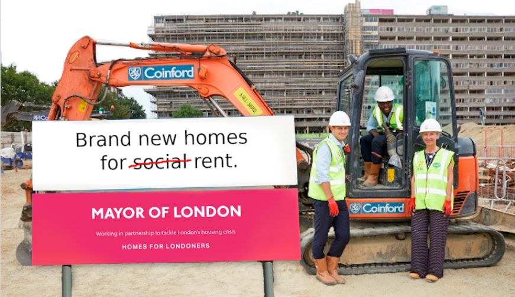
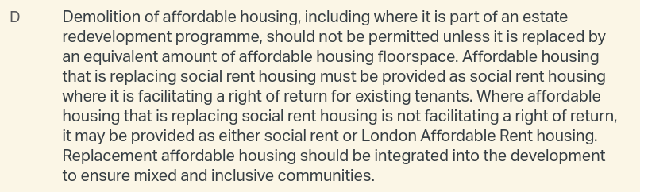
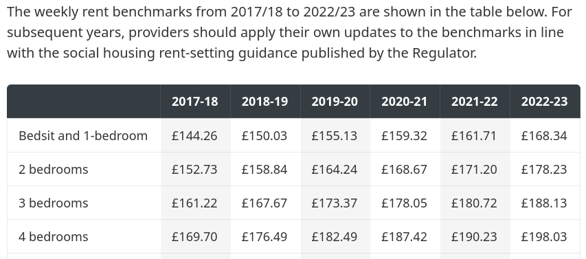
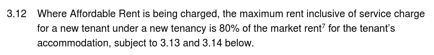
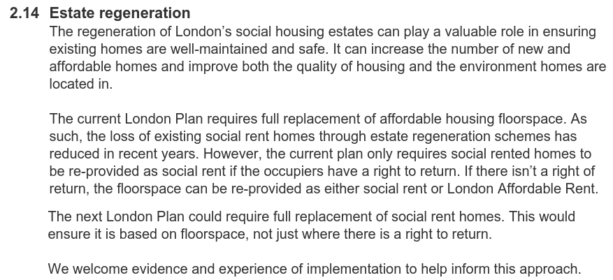

The [current London Plan](https://www.london.gov.uk/sites/default/files/the_london_plan_2021.pdf) contains a loophole that allows estate redevelopments to reprovide social rented housing only where a former tenant has exercised a right to return: 

The remainder can be provided as a tenure that the Mayor calls 'London Affordable Rent', which was an affordable housing tenure that the Mayor introduced in 2017 and supposed to be set according to 'benchmarks' published every year by the GLA:

But in 2023 the Mayor decided to discontinue this tenure and stop publishing the benchmarks. The Mayor's website says that _"For subsequent years, providers should apply their own updates to the benchmarks in line with the social housing rent-setting guidance published by the Regulator."_ 

This is all good and well except that the Regulator's [rent-setting guidance](https://assets.publishing.service.gov.uk/media/65e73fe83f6945a00603608e/Rent_Standard_-_April_2020__1_.pdf) allows affordable rent to be set at up to 80% of market rent:

Whilst the guidance says that rent for existing tenancies cannot be increased by more than CPI+1%, how this applies to re-lets or schemes yet to complete is not clear.

What is clear is that the confusion around affordable housing tenures has been a problem for some time now and section 106 agreements often afford developers further wriggle room to define those them as they see fit.

Here is how London Affordable Rent is defined in the [section 106 agreement](../estates/src/images/gascoignes106.pdf) for the [Gascoigne estate redevelopment](https://estatewatch.london/estates/gascoigne/):

The [New London Plan](https://www.london.gov.uk/programmes-strategies/planning/planning-consultations/towards-new-london-plan) proposes to close this loophole and require all social rented housing demolished to be replaced by social rented housing:

We welcome this long-overdue change in policy and look forward to [having our say](https://justspace.org.uk/towards/) on what else should be included in the next London Plan. This will first and foremost include a [policy presumption against estate redevelopment](https://estatewatch.london/blog/Retrofirst/) and other suggestions from our [Alternative Good Practice Guide](https://estatewatch.london/img/alternative-good-practice-guide-to-estate-regeneration.pdf) - WATCH THIS SPACE!