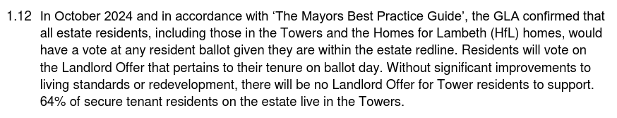

The Westbury estate in Lambeth belongs to a growing list of stalled estate regeneration schemes.

Works have been halted since the completion of a pilot phase of the scheme providing 64 new homes.

This was due to Lambeth's [decision](https://www.insidehousing.co.uk/news/london-council-plans-to-deliver-at-least-500-new-homes-by-2030-85865) to shut down its in-house development company (Homes for Lambeth), after a review criticised its “very poor delivery” and [financial difficulties](https://www.brixtonbuzz.com/2025/05/still-on-the-payroll-homes-for-lambeth-refuses-to-die-quietly-or-cheaply/).

This week, Lambeth Council issued a [press release](https://love.lambeth.gov.uk/lambeth-an-extra-300-new-homes-could-be-added-to-council-estate/) saying that it was now looking to sell the remainder of the estate for redevelopment by a housing association or developer. 

It also announced that it would be enlarging the scheme to encompass a further 160 homes in the two high-rise towers on the estate (Amesbury and Durrington Towers - pictured above).

The [Council report](https://moderngov.lambeth.gov.uk/documents/s165728/CMDDR%20Westbury%20Estate%20Renewal%20Durrington%20and%20Amesbury%20Towers%20Part%20I.pdf) confirming the decision (delegated officer decision) is scant on detail, particularly regards any consultation with residents of the two towers now to be included in the demolition plans. It is nevertheless clear on why the two towers need to be included:

In short; the Mayor has told Lambeth that if it wants grant funding then it must hold a ballot (Lambeth wasn't previously intending to ballot residents on the demolition of their homes). The Mayor has additionally stated that *all* residents living on the estate must be part of the ballot, regardless of whether their homes are part of the demolition plans (as per his [policy requirements](https://www.london.gov.uk/sites/default/files/gla_cfg_section_8._resident_ballots_-_18_july_2018.pdf)). I.e - if the tower blocks' residents don't have any skin in the game, they're unlikely to vote for redevelopment.

The report goes on to explain that following the Mayor's October 2024 letter, the Council comissioned building surveyors to survey the fabric of the two towers the following month. This said that _"intrusive testing was also undertaken by a specialist. The study reported the structural frame to be in reasonable condition."_ It went on to conclude however that _"electrical systems, lifts, pipework, and risers, are likely to require renewal in the short to medium term to maintain reliable performance."_

The report then refers to a cost appraisal study which estimates the cost of refurbishing the two towers at a staggering £54m (excl. VAT) - that's £338k per flat for each of the 160 flats in the towers. It provides a second option which involves a _"30-year programme of planned maintenance, and other cyclical replacement and/or responsive repairs"_ at a cost of £55m over 30 years. 

In 2015, an independent review of Southwark's refurbishment estimate for the Aylesbury estate _"found it ‘impossible to track down’ most of the cost for ‘external works’"_. This cost made up half of the £314 million total estimate for refurbishment.

The third and final option is demolition and redevelopment, which the appraisal study estimates at just £5m, this representing the cost of responsive repairs and keeping the towers maintained until their demolition. There is no information about the cost to the council of decanting and demolishing the towers, the cost of rehousing tenants or the cost of compensating leaseholders. 

Neither has it been considered that retaining the towers provides the Council with an asset bringing in an ongoing stream of rental income or that there are various sources of funding available for retrofitting social housing.

In fact, whether it has failed to consider important factors or has exagerated refurbishment costs is impossible to know because neither the cost appraisal study or the structural survey have been made public. To make matters worse the decision has been taken by a delegated officer decision rather than a committee, so any scrutiny is impossible.

Another thing missing from the appraisal is any consideration of the carbon costs of redevelopment. The Council report says that _"the successful Development Partner will be required to provide a whole lifecycle carbon assessment during the planning process."_ Evidence if it were ever needed, that these lifecycle carbon assessments are simply a tick-box exercise!

As if the report couldn't get any worse it goes on to acknowledge the Mayor's policy requirement for minimum 50% affordable housing but goes on to say it will accept 35%: _"This procurement process recognises the different market conditions that now apply, together with the site-specific circumstances here, in setting a minimum 35% affordable housing requirement."_ (para 1.19)

This is confirmed in the [published invitation to tender](https://www.theconstructionindex.co.uk/tenders/view/26195) - _"The Council requires a minimum provision of 35% affordable housing"_.

