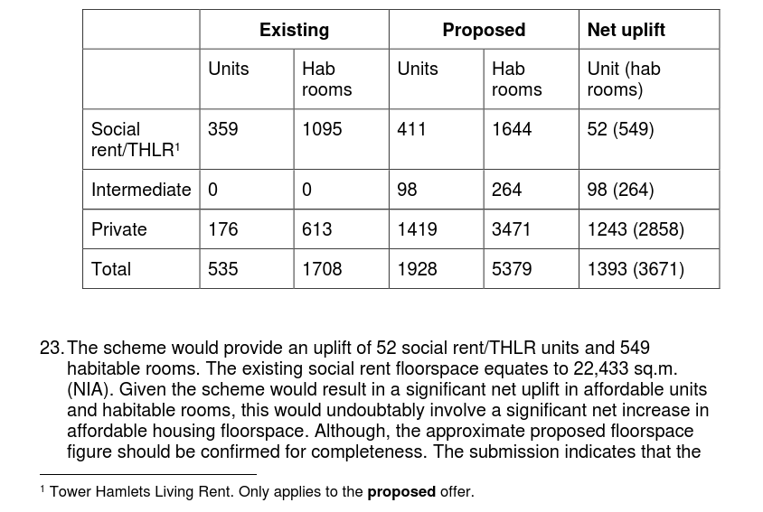
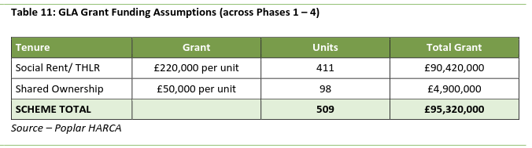

A planning application was submitted in June this year, for demolition of the [Teviot estate](estates/teviot) in Poplar and construction of 1928 new homes of which 411 social or London Living Rent, 98 intermediate affordable and 1419 private homes.

The planning application says that the 411 replacement social will be provided either as social rent or THLR (Tower Hamlets Living Rent) which is around three times more expensive than social rent.

This is breach of the Mayor's own policy which says that social rented homes must be replaced with like-for-like tenure. The Mayor's [stage 1 report](https://development.towerhamlets.gov.uk/online-applications/files/844BA29DA92775EF861EA51FC8D34223/pdf/PA_24_00922_A1-GLA_STAGE_1_REPORT-2102510.pdf) for the planning application brushes over this and is silent on the fact that the 35% affordable housing proposed falls short of his 50% minimum policy requirement for estate regenerations.

*Extract from the Mayor's Stage 1 report*

The scheme's failure to provide the minimum 50% affordable housing requirement is justified by a an [FVA](../estates/src/images/teviotfva.pdf) (Financial Viability Appraisal) submitted by Poplar HARCA. 

The appraisal argues that providing more than 35% affordable housing would make the scheme 'unviable' but brushes over the fact that a 16% protected profit margin for Poplar HARCA has been written in to the appraisal as a cost - i.e. Poplar HARCA is guaranteed a £131m profit before any surplus available for affordable housing is calculated.

We argue in our [Alternative Good Practice Guide to Estate Regeneration](img/alternative-good-practice-guide-to-estate-regeneration.pdf) that housing associations should not be allowed to profit from estate redevelopment - especially when they are receiving grant funding.

The appraisal also counts on £95m grant funding from the Mayor despite the Mayor's policy of funding only *additional* social housing on estate redevelopments and not *replacement* social housing!

This is just the latest in a long list of schemes ignoring the Mayor's estate regeneration policies on 50% minimum affordable housing reprovision and like-for-like tenure.

* [High Path estate](https://www.estatewatch.london/estates/highpath/) - 20% affordable with all replacement social housing at up to 80% market rent.
* [Eastfields estate](https://www.estatewatch.london/estates/eastfields/) - 31% affordable with replacement social housing at up to 80% market rent.
* [Gascoigne estate](https://www.estatewatch.london/estates/gascoigne/) - 42% affordable with all replacement social housing at up to 80% market rent.
* [Thamesmead estate](https://www.estatewatch.london/estates/thamesmeadsouth/) - 39% affordable with all replacement social housing at up to 80% market rent.
* [Westbury estate](https://www.estatewatch.london/estates/westbury/) - 38% affordable housing
* [New Avenue estate](https://www.estatewatch.london/estates/newavenue/) - 34% affordable housing
* [Waterloo Road estate](https://www.estatewatch.london/estates/waterlooroad/) - 40% affordable housing
* [Douglas Bader Park estate](https://www.estatewatch.london/estates/douglasbaderpark/) - 28% affordable housing by unit/40% by habitable room
* [Lansbury South estate](https://www.estatewatch.london/estates/lansbury/) - 36% affordable housing
* [Cambridge Road estate](https://www.estatewatch.london/estates/cambridgeroad/) - 36% affordable housing
* [Aberfeldy estate](/estates/aberfeldy/) - 38% affordable housing
* [Alma estate](estates/almaestate/) - 31.7% affordable housing and just 246 of 1,402 new homes social rent!

The application is yet to be approved. Will the Mayor once again turn a blind eye and allow the Teviot regeneration to join the growing list of schemes that routinely flout his policies? WATCH THIS SPACE!
