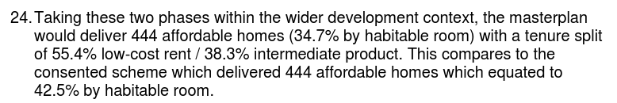
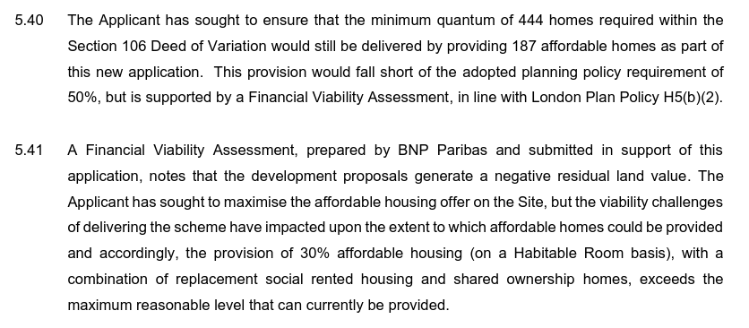

Countryside Properties (part of the Vistry Group of developers which [posted £487m profits](https://www.vistrygroup.co.uk/sites/vistrygroup/files/2024-03/Vistry-Group-Full-Year-Results-Presentation-14.03.24-FINAL.pdf) last year) has applied to Enfield Council to increase the number of homes on the remaining phases of the Alma estate regeneration, whilst reducing the proportion of affordable housing.

Having signed a joint-venture agreement with Enfield in 2014, Countryside has demolished three of the estate's four tower blocks and completed the first 376 homes of the scheme, but says that it needs to revise the housing mix for the remaining phases in order to balance the books.

Outline planning permission for 993 new homes was granted in September 2015 of which 399 affordable (200 at social rent).

Following this, several Section 73 and Section 96A amendments to the permission increased the total number of homes to 1,080 and the number of affordable homes to 444 (with 222 social rent).

Countryside has now applied to increase the number of homes in remaining phases bringing the total from 1,080 to 1,402 - with the number of affordable homes remaining at 444 but within this a small increase in the number of social rent from 222 to 246. 

If approved, this would lead to a reduction of the overall affordable housing provision from 42.5% to 34.7% (by habitable room - 31.7% by unit) as acknowledged in the Mayor's [stage 1 report](https://planapps.london.gov.uk/planningapps/24-02608-FUL) for the application:

*Extract from the Mayor's stage 1 report for the revised masterplan application*

In its [planning statement](https://planningandbuildingcontrol.enfield.gov.uk/online-applications/files/229DEC099F1BA5271919E4E38B7D2BC8/pdf/24_02608_FUL-Alma_Phases_2B_and_3_Planning_and_Affordable_Housing_Statement-2959283.pdf) for the revised application, Countryside cites the following as the reason behind the need to revise the scheme:

> "Economic and market conditions have changed significantly since the original masterplan permission was granted. Construction and material costs have increased up to 40% in some circumstances, which has presented significant challenges to development viability as the wider masterplan project has progressed. Bringing forward an optimised scheme for the final phases of the Alma Estate redevelopment would therefore ensure that these phases are viable".

The statement goes on to acknowledge that the affordable housing offer fails to comply with the Mayor's 50% minimum requirement but says this is justified by a Financial Viability Assessment undertaken by BNP Paribas:

However, despite the Mayor's [policy requirement for viability assessments to be made public](https://www.london.gov.uk/programmes-strategies/planning/implementing-london-plan/london-plan-guidance/affordable-housing-and-viability-supplementary-planning-guidance-spg) this one remains condfidential and has not been made public.

The application is yet to be approved. Will the Mayor once again turn a blind eye and allow the Alma estate redevelopment to join the growing list of schemes that have watered down and flouted his affordable housing policies? WATCH THIS SPACE!