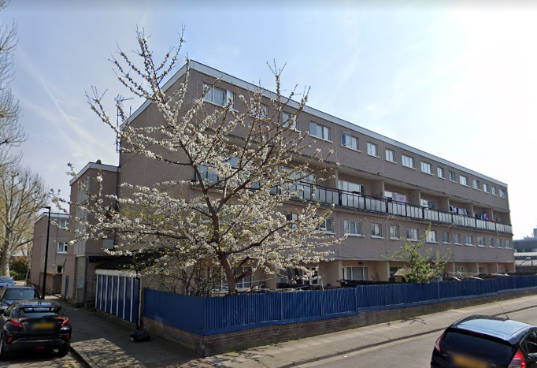
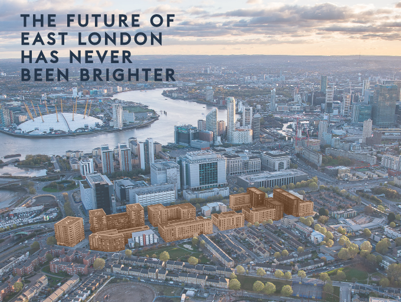
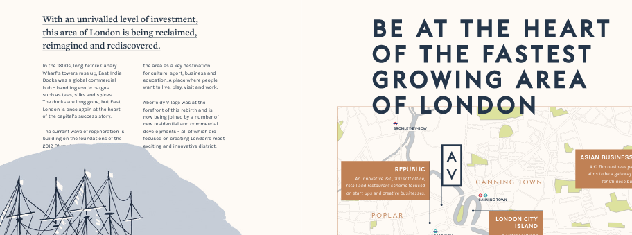
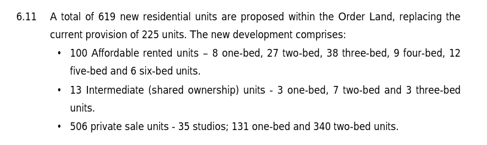

225 homes remain under threat of demolition at Poplar HARCA's redevelopment of the Aberfeldy estate in Tower Hamlets.

The estate was transferred from Tower Hamlets to Poplar HARCA in 2007 under a stock transfer agreement.

The estate borders the River Lea to the East, Balfron Tower to the West and the Robin Hood Gardens estate to the South. Poplar HARCA have already come under [criticism](https://www.theguardian.com/cities/2019/sep/19/balfron-20-how-goldfingers-utopian-tower-became-luxury-flats) for its privatisation of Balfron Tower.

The scheme is part of Poplar HARCA's [‘Poplar Reshaping’ masterplan](https://www.architectsjournal.co.uk/download?ac=1222139) which envisaged the redevelopment of ten estates: Aberfeldy, Brownfield, Bow Bridge, Coventry Cross, Burdett, Devons, Lansbury, Leopold, Lincoln and Teviot.

13 residential blocks, 24 shops, a mosque and a community hall are set for demolition in remaining phases 3-6 of what has now been [re-branded](https://ecoworldlondon.com/media/1288/aberfeldy-village-host-brochure.pdf) 'Aberfeldy Village' or 'Aberfeldy West'.

The scheme is being progressed in six phases in a joint venture with Malaysian investor, Ecoworld and will create 1176 new homes in total.

The estate originally comprised 297 homes but 72 homes were demolished in phases 1-3, which are currently approaching completion.

A ballot for the remaining 3 phases or 'Aberfeldy West' was approved in October 2020, with the majority of eligible residents voting in favour of full redevelopment. The scheme is being [funded](https://www.london.gov.uk/programmes-strategies/housing-and-land/homes-londoners/estate-regeneration/estate-regeneration-data) by the Mayor.

Compulsory purchase orders were [issued in 2016](https://www.towerhamlets.gov.uk/Documents/Planning-and-building-control/Aberfeldy_SoR_140616.pdf) and confirmed in 2017 for the remaining three phases.

The [compulsory purchase order documents](https://www.towerhamlets.gov.uk/Documents/Planning-and-building-control/Aberfeldy_SoR_140616.pdf) confirm that 619 new homes will replace the 225 being demolished and that 100 will be affordable rent, the remainder being provided as predominantly mainly private housing.

In August 2021, [pre-application advice](https://democracy.towerhamlets.gov.uk/documents/s189892/Aberfeldy%20Village%20SDC%20Pre-app%20Report%20Final.pdf) was sought on a revised masterplan for the remainder of the estate. This proposes to  provide 1608 new homes of which 1181 units would be for private sale, 81 units of intermediate tenure and 346 units as affordable rent (i.e. up to 80% market rent).

This resulted in a planning application which was refused by Tower Hamlets in 2022 on the basis that the affordable housing offer of 38% was too low. In May 2023, the Mayor called in the application for him to determine himself.

Despite failing to conform with his minimum policy requirement for 50% affordable in estate redevelopments, the Mayor granted final planning approval in January 2024. It remains unclear what the final tenure mix will be. The Mayor's stage 2 report says that 89.2% of the 38% affordable housing will be _'low cost rented accommodation (comprising a mix of social rent, London Affordable Rent, Tower Hamlets Living Rent)_' and the remainder will be intermediate tenures (including shared ownership). 

---
__Links:__
[Mayor's stage 1 and stage 2 reports](https://planapps.london.gov.uk/planningapps/PA-21-02377)

[Planning application documents (phases 1-3)](https://development.towerhamlets.gov.uk/online-applications/applicationDetails.do?activeTab=documents&keyVal=DCAPR_100784)

[Poplar HARCA's web page for Aberfeldy West](https://www.poplarharca.co.uk/new-homes-regeneration/development-projects/project/aberfeldy-west/)

Poplar HARCA's [Landlord Offer](/images/Aberfeldy-West-Landlords-Offer.pdf)

---

<!------------THE CODE BELOW RENDERS THE MAP - DO NOT EDIT! ---------------------------->

---
