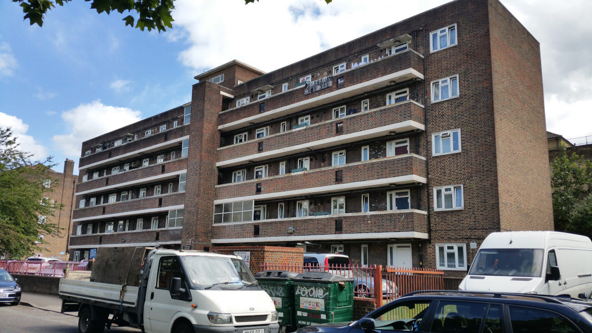
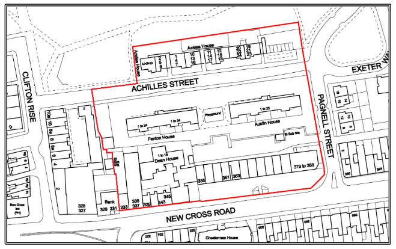
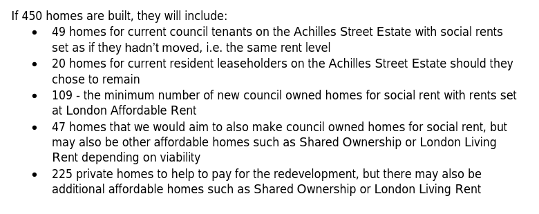
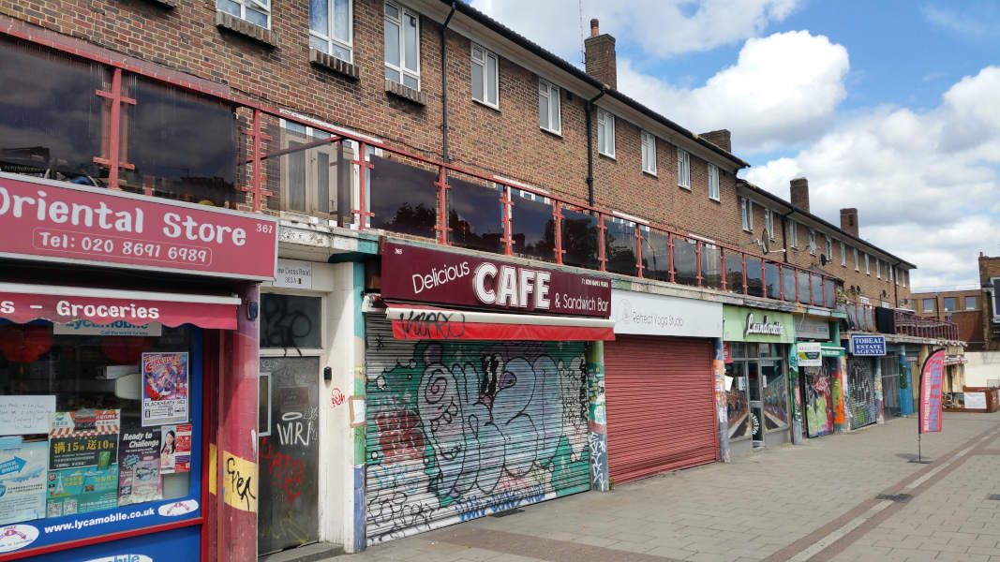
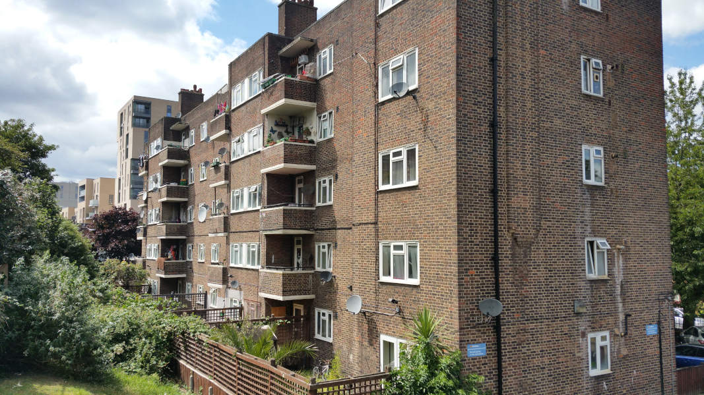
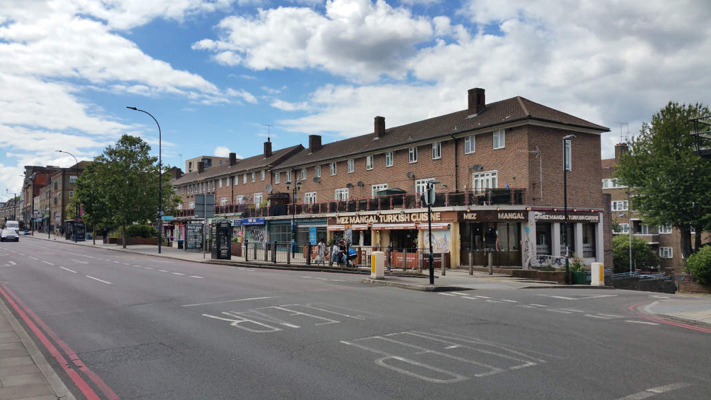

87 homes and 17 shops are earmarked for demolition as part of Lewisham's regeneration of the Achilles Street area in New Cross.

The ballot of residents held in October 2019, [failed](https://achillesstreetstopandlisten.wordpress.com/2019/10/22/no-vote-for-business-owners-regarding-the-demolition-of-their-businesses-on-new-cross-road/) to give the 17 business owners a say in the plans and [failed](https://achillesstreetstopandlisten.wordpress.com/2019/10/10/for-immediate-release/) to offer refurbishment as an option. 

Campaingers have also [revealed](https://achillesstreetstopandlisten.wordpress.com/2019/10/10/for-immediate-release/) that over the past 6 years the Council has spent less than 10% of its rental income from the affected tenants and businesses on maintaining their buildings.  

59 of the 89 eligible residents voted in favour of redevelopment. Temporary tenants were included as eligible to vote and were [offered](https://achillesstreetstopandlisten.files.wordpress.com/2019/09/appendix-a-achilles-street-landlord-offer.pdf) secure tenancies if they voted in favour of the scheme. The homes and shops affected are shown in the plan below:

The Council's ['Landlord Offer'](http://councilmeetings.lewisham.gov.uk/documents/s67637/Appendix%20A%20-%20Achilles%20Street%20Landlord%20Offer.pdf) describes the proposed tenure mix of the 450 new homes to built on the site as follows:

In December 2023, Lewisham Council was [reported](https://www.insidehousing.co.uk/news/council-puts-development-programme-sites-on-hold-amid-challenging-conditions-84505) to have put a number of its development sites on hold following financing issues highlighted by a review.

Whilst the Achilles St scheme itself wasn't put on hold, the review report highlighted risks associated with the redevelopment of the Achilles Street estate. 

---

__Links:__

The Council's [Achilles St Landlord offer](http://councilmeetings.lewisham.gov.uk/documents/s67637/Appendix%20A%20-%20Achilles%20Street%20Landlord%20Offer.pdf)

[Local campaign website - Achilles Stop and Listen](https://achillesstreetstopandlisten.wordpress.com/)

[Deptford is Changing](https://www.yumpu.com/en/document/view/63260301/deptford-is-changing-a-creative-exploration-of-gentrification) book by local resident and PhD student Anita Strasser.

[Lewisham Council's web page for the scheme](https://lewisham.gov.uk/organizations/achilles-street-redevelopment)

---

<!------------THE CODE BELOW RENDERS THE MAP - DO NOT EDIT! ---------------------------->

---

