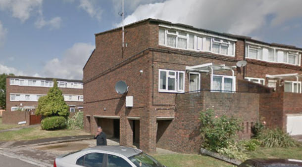
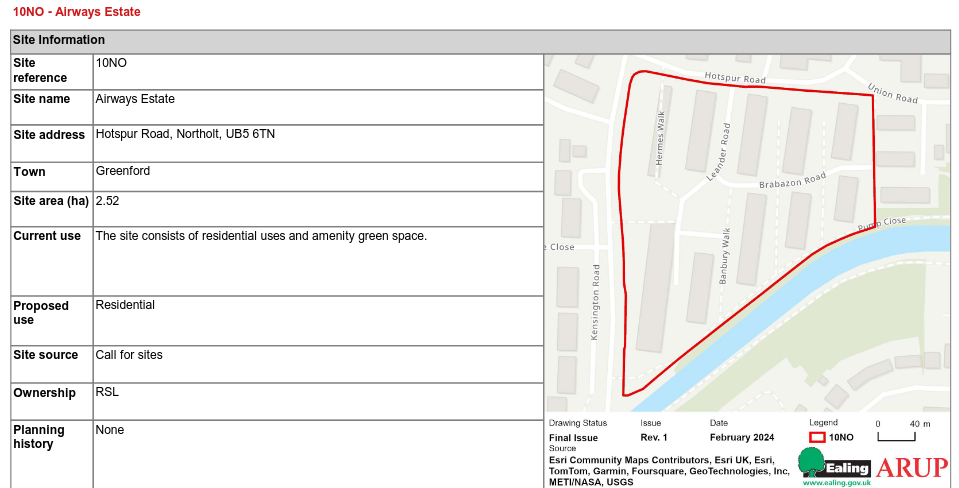

Circa 150 homes at the Airways estate in Northolt have been earmarked for potential redevelopment in Ealing's [2024 Local Plan](https://www.ealing.gov.uk/download/downloads/id/19587/appendix_e_-_results.pdf).

The site allocation states: _"The site was submitted through the Call for Sites, is in single ownership (Housing Association). Proposals are for a comprehensive estate regeneration. Development should come forward within 6-15 years."_

It is not known if residents have been made aware of the designation. 

---

<!------------THE CODE BELOW RENDERS THE MAP - DO NOT EDIT! ---------------------------->

---