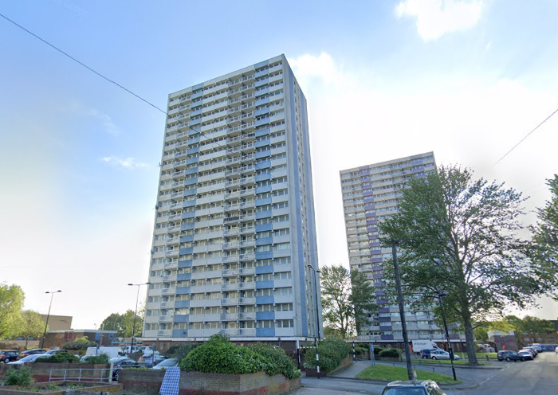
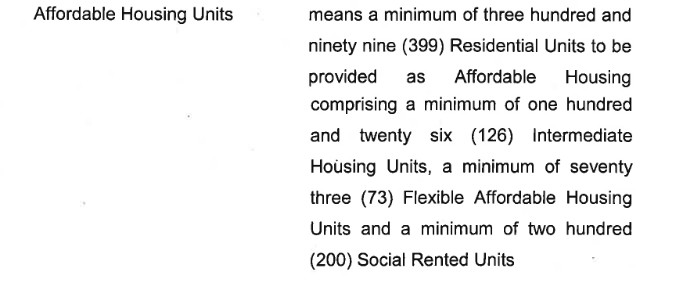
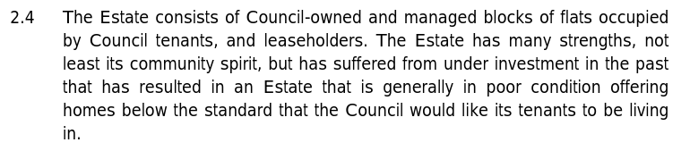

746 homes (717 council & 29 leasehold) have been approved for demolition on Enfield's Alma estate at Ponders End.

The estate spanned 7.8 hectares of land near Ponders End Train Station, comprising four high rise tower blocks (each 23 storeys), and a number of low rise maisonette and flatted blocks.

Only one of these towers remains standing and is due to be demolished by 2025 as it sits on the site of the final phase of the estate’s redevelopment.

459 new homes already built across the site in South Street and Alma Road, and 220 are currently under construction.

Planning permission is being sought for 725 homes on the final phase of the scheme, the precise tenure of which is yet to be established.

Enfield council has been criticised for not fully replacing the original number of social rent homes, with only 41% (444) of the currently-approved 1,080 homes designated ‘affordable’ and, of those, half (222) being earmarked as social rent.

Enfield Council signed a joint-venture agreement with developer Countryside Properties for the redevelopment of the estate in November 2014. 

Despite its failure to comply with the Mayor's affordable housing policies, the scheme is being [funded](https://www.london.gov.uk/programmes-strategies/housing-and-land/homes-londoners/estate-regeneration/estate-regeneration-data) by the Mayor and [exempted](https://www.london.gov.uk/programmes-strategies/housing-and-land/homes-londoners/estate-regeneration/estate-regeneration-data) from his requirement to ballot residents on the demolition of their homes.

Phase one of the four stage scheme has been demolished and is nearing completion. Remaining phases are still occupied.

Outline planning permission was granted in September 2015 but subject to the signing of a section 106 agreement when the first detailed application came forward. In June 2017 a [section 106 agreement was signed](/images/almas106.pdf) which guaranteed just 200 of the 993 replacement homes as social rent:

In its [Statement of Reasons](/images/almacpo.pdf) justifying the Compulsory Purchase Order. Enfield relies on its own neglect of the estate as justification for its demolition:

---
__Links:__

Enfield's [planning application documents](https://planningandbuildingcontrol.enfield.gov.uk/online-applications/applicationDetails.do?activeTab=documents&keyVal=NO8O9NJN28000)

The Mayor's [stage 1 and stage 2 reports](https://www.london.gov.uk/sites/default/files/public%3A//public%3A//PAWS/media_id_285804///alma_estate_report.pdf)

---

<!------------THE CODE BELOW RENDERS THE MAP - DO NOT EDIT! ---------------------------->

---

