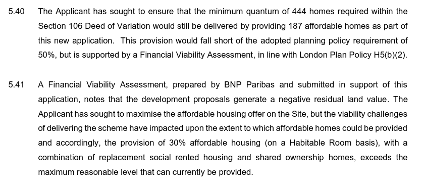

746 homes (717 council & 29 leasehold) have been approved for demolition on Enfield's Alma estate at Ponders End.

The estate spans 7.8 hectares of land near Ponders End Train Station, comprising four high rise tower blocks (each 23 storeys), and a number of low rise maisonette and flatted blocks.

Only one of these towers (Curlew House) remains standing along with several maisonette blocks which are in the final phases of the estate’s redevelopment.

Enfield Council signed a joint-venture agreement with developer Countryside Properties for the redevelopment of the estate in November 2014. 

Despite its failure to comply with the Mayor's minimum affordable housing requirements, the scheme is being [funded](https://www.london.gov.uk/programmes-strategies/housing-and-land/homes-londoners/estate-regeneration/estate-regeneration-data) by the Mayor and [exempted](https://www.london.gov.uk/programmes-strategies/housing-and-land/homes-londoners/estate-regeneration/estate-regeneration-data) from his requirement to ballot residents on the demolition of their homes.

Outline planning permission for 993 new homes was granted in September 2015 of which 399 affordable but subject to the signing of a section 106 agreement when the first detailed application came forward. In June 2017 a [section 106 agreement was signed](/images/almas106.pdf) which guaranteed just 200 of the new homes as social rent:

Following this, several S73 and S96A applications were submitted increasing the total number of homes to 1,080 homes and increasing the number of affordable homes to 444 (with 222 social rent).

In 2016 Enfield issued a compulsory purchase order for homes on the estate. In its [Statement of Reasons](/images/almacpo.pdf) justifying the Order, Enfield relies on its own neglect of the estate as justification for its demolition:

In 2024, having completed the first 376 homes of the scheme, developer Countryside applied to increase the number of homes in remaining phases bringing the total from 1,080 to 1,402 - with the number of affordable homes remaining at 444 but within this a small increase in the number of social rent from 222 to 246. 

The application was approved by Enfield Council in March 2025, leading to a reduction of the overall affordable housing provision from 42.5% 34.7% (31.7% by unit) as acknowledged in the Mayor's [stage 1 report](https://planapps.london.gov.uk/planningapps/24-02608-FUL):

*Extract from the Mayor's stage 1 report for the revised masterplan application*

In its [planning statement](https://planningandbuildingcontrol.enfield.gov.uk/online-applications/files/229DEC099F1BA5271919E4E38B7D2BC8/pdf/24_02608_FUL-Alma_Phases_2B_and_3_Planning_and_Affordable_Housing_Statement-2959283.pdf) for the revised application, Countryside cites the following as the reason behind the need to revise the scheme:

> "Economic and market conditions have changed significantly since the original masterplan permission was granted. Construction and material costs have increased up to 40% in some circumstances, which has presented significant challenges to development viability as the wider masterplan project has progressed. Bringing forward an optimised scheme for the final phases of the Alma Estate redevelopment would therefore ensure that these phases are viable".

The statement goes on to acknowledge that affordable housing offer fails to comply with the Mayor's 50% minimum requirement but says this is justified by a Financial Viability Assessment undertaken by BNP Paribas:

However, despite the Mayor's [policy requirement for viability assessments to be made public](https://www.london.gov.uk/programmes-strategies/planning/implementing-london-plan/london-plan-guidance/affordable-housing-and-viability-supplementary-planning-guidance-spg) this one remains hidden behind closed doors..

The application is yet to receive Mayoral approval. Will the Mayor once again turn a blind eye and allow the Alma estate scheme to join the growing list of schemes that have watered down and flouted his affordable housing policies? WATCH THIS SPACE!

---
__Links:__

Enfield's [planning application documents](https://planningandbuildingcontrol.enfield.gov.uk/online-applications/applicationDetails.do?activeTab=documents&keyVal=NO8O9NJN28000)

The Mayor's [stage 1 and stage 2 reports](https://www.london.gov.uk/sites/default/files/public%3A//public%3A//PAWS/media_id_285804///alma_estate_report.pdf)

[Countryside's 2024 revised masterplan application docs](https://planningandbuildingcontrol.enfield.gov.uk/online-applications/applicationDetails.do?activeTab=documents&keyVal=SHJP8HJNHFA00)

The Mayor's [stage 1 report](https://planapps.london.gov.uk/planningapps/24-02608-FUL) for the revised masterplan application.

---

<!------------THE CODE BELOW RENDERS THE MAP - DO NOT EDIT! ---------------------------->

---

