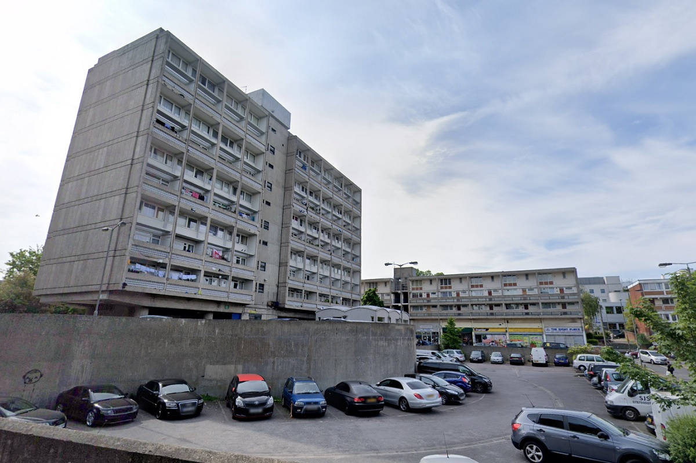
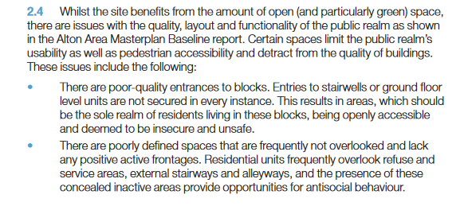
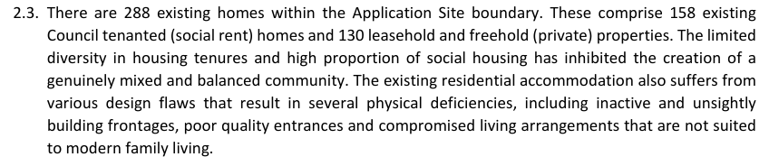
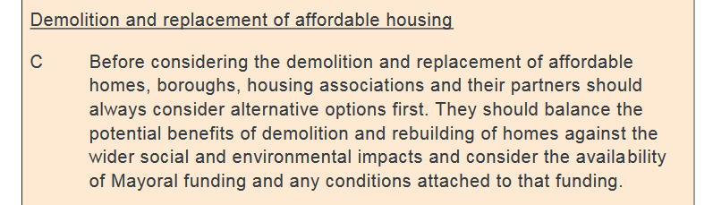
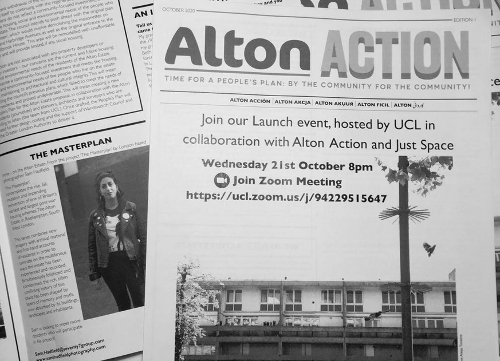
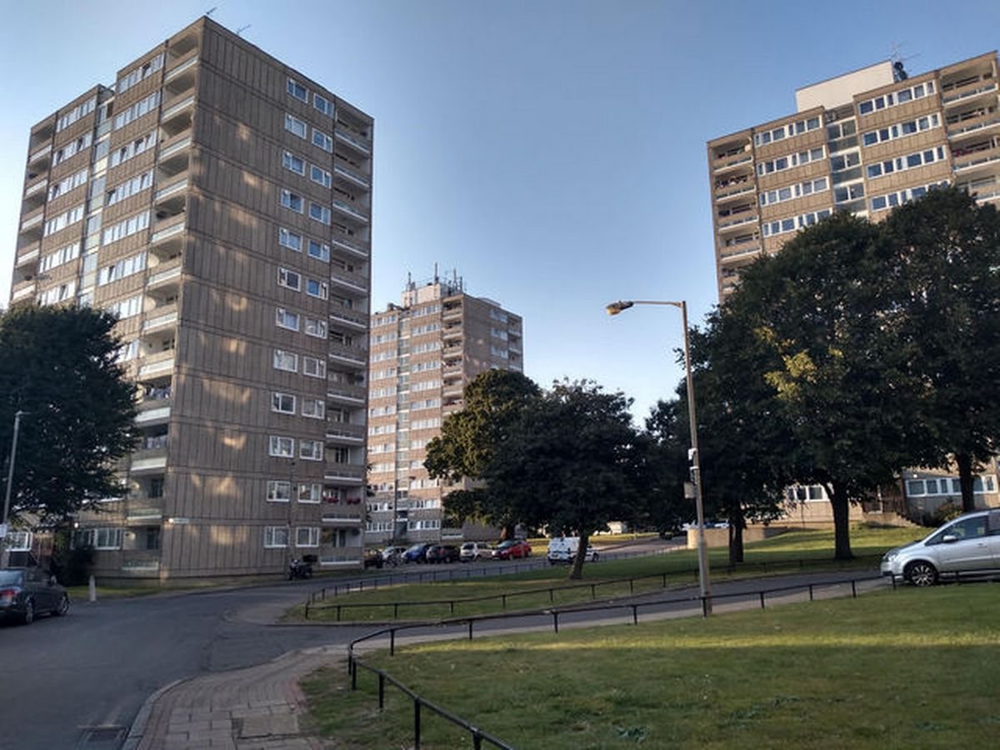

288 homes are earmarked for demolition on Wandsworth's Alton estate in Roehampton.

Wandsworth Council [claims](https://www.wandsworth.gov.uk/media/1627/roehampton_adopted_spd_oct_2015.pdf) that demolition is necessary because the design of the buildings is poor and encourages anti-social behaviour:

In 2017, Wandsworth signed a joint venture agreement with developer Redrow for the redevelopment of the estate.

Despite the existing estate comprising an almost even split of social rented and private homes (leaseholders and freeholders), it is [claimed](https://planning2.wandsworth.gov.uk/iam/IAMCache/5300271/5300271.pdf) that *"the limited diversity in housing tenures and high proportion of social housing has inhibited the creation of a genuinely mixed and balanced community"*.

Redrow submitted a planning application in late 2019, but in August 2020 it announced that it was pulling out of the scheme. Wandsworth Council went ahead and approved the application despite this in October 2020, giving consent for demolition and construction of 1,108 new homes of which 261 affordable (201 social rent). 

In his [stage 1 response](https://www.london.gov.uk/sites/default/files/public%3A//public%3A//PAWS/media_id_471293///alton_estate_report.pdf) to the planning application, the Mayor highlighted concerns about lack of consultation (para 36), quantum and rent levels of replacement 'social housing' (para 27) and the failure to apply for grant funding (para 39) and the failure to explore alternatives to demolition (para 20).

The requirement for the demolition of housing estates only to be considered as a last resort, is enshrined both in the Mayor's [Estate Regeneration Guidance](https://www.london.gov.uk/sites/default/files/better-homes-for-local-people-the-mayors-good-practice-guide-to-estate-regeneration.pdf) and the [London Plan itself](https://www.london.gov.uk/sites/default/files/intend_to_publish_-_clean.pdf):

Despite these concerns, the Mayor's stage 2 report concluded that on balance the Mayor is happy with Wandsworth's decision to approve its planning application for the redevelopment of the estate.

In the meantime, estate residents got themselves [organised](https://twitter.com/AltonAction/status/1322956962439507971) and have received funding to co-produce an alternative Community Plan, exploring alternatives to demolition assisted by a group of researchers from [University College London](www.ucl.ac.uk) and the [Just Space network](www.justspace.org.uk).

In September 2022, demolition plans were put on hold under proposals to review schemes following a change of political administration from conservative to a Labour administration.

In July 2024, Wandsworth Council [announced](https://www.wandsworth.gov.uk/news/news-july-2024/alton-renewal-gets-underway-with-new-council-investment-across-the-estate/) consultation on a revised 'renewal plan' for the estate, in which it wishes to consult on different options. The announcement said that _"There is a case for some housing blocks to be considered for demolition and proposals to improve existing homes will be explored, including retrofit options."_

In June 2025, Wandsworth Council announced a ballot on the new Masterplan, under which 167 homes on the estate would be replaced with 614 new homes, with 57% 'affordable' housing.

---

**Links:**   
[Roehampton (Alton estate) SPD Oct 2015](https://www.wandsworth.gov.uk/media/1627/roehampton_adopted_spd_oct_2015.pdf)

[Mayor's stage 1 report](https://www.london.gov.uk/what-we-do/planning/planning-applications-and-decisions/planning-application-search/alton-estate)

[Link to the revised planning application docs (ref:2019/2156)](https://planning1.wandsworth.gov.uk/Northgate/PlanningExplorer/Generic/StdDetails.aspx?PT=Planning%20Applications%20On-Line&TYPE=PL/PlanningPK.xml&PARAM0=977340&XSLT=/Northgate/PlanningExplorer/SiteFiles/Skins/Wandsworth/xslt/PL/PLDetails.xslt&FT=Planning%20Application%20Details&PUBLIC=Y&XMLSIDE=/Northgate/PlanningExplorer/SiteFiles/Skins/Wandsworth/Menus/PL.xml&DAURI=PLANNING)

---

<!------------THE CODE BELOW RENDERS THE MAP - DO NOT EDIT! ---------------------------->

---

