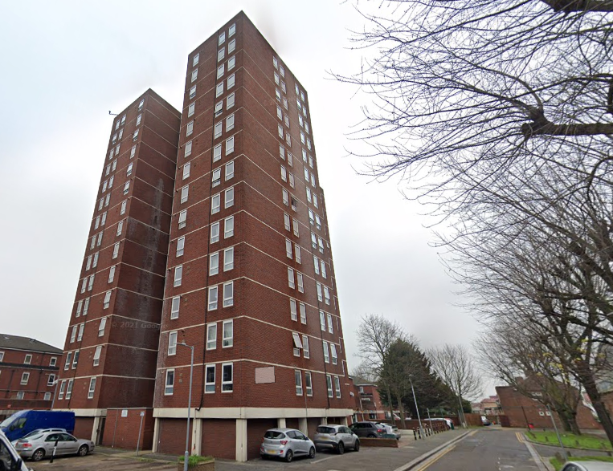
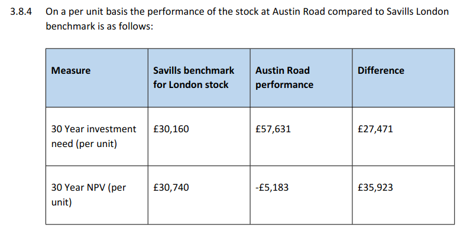
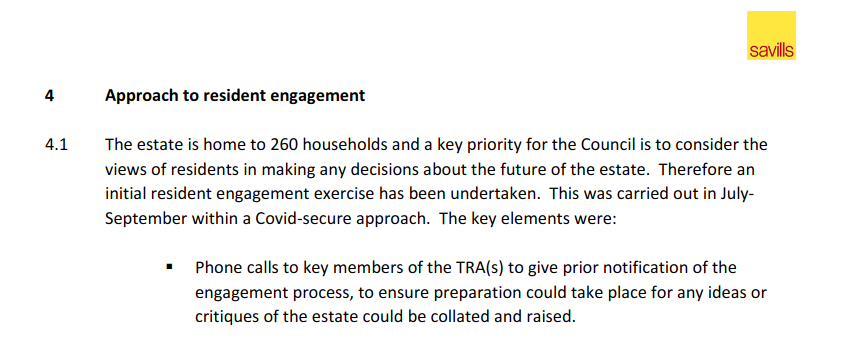
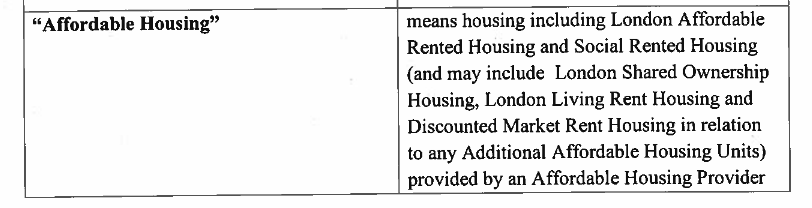
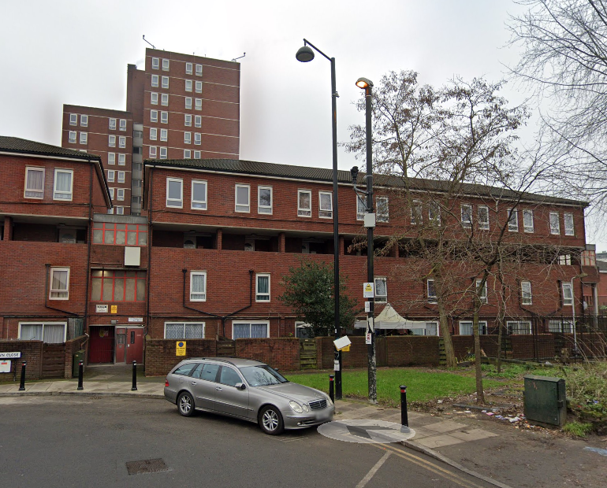
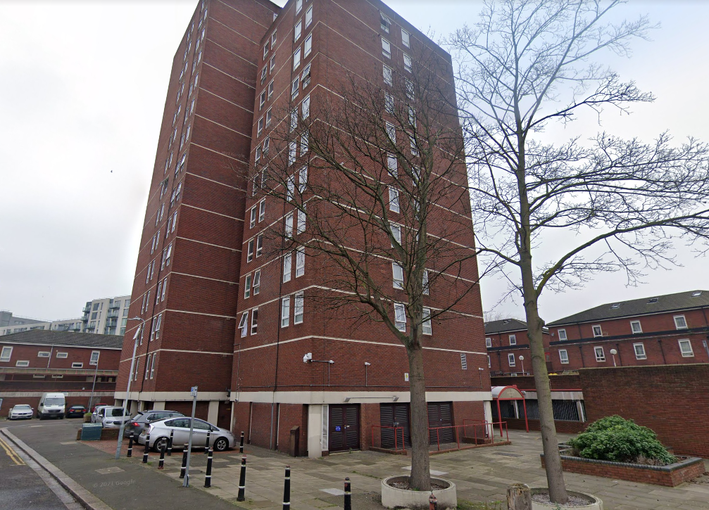

260 homes are under threat on Hillingdon's Austin Road estate in Hayes (182 Council and 78 leasehold).

The estate consists of medium rise flats and maisonettes with a   high-rise point block of 15 storeys and overlooks the Grand Union Canal. Hayes and Harlington train station is a 5 minute walk and is one of the planned Crossrail stations.

In March 2016, Hillingdon Council [applied](https://modgov.hillingdon.gov.uk/ieIssueDetails.aspx?IId=21017&Opt=3) to the Mayor to establish Hayes Town Centre as a 'Housing Zone'. The application contained a list of potential development sites for new housing (appendix 5). The Austin Road estate was listed as one of them along with the Avondale Drive estate.

Four years later, in 2020, Hillingdon commissioned Savills to undertake an [options appraisal study](https://modgov.hillingdon.gov.uk/documents/s49499/Appendix%201%20-%20Appraisal%20Report%20Austin%20Road.pdf) to consider options for the redevelopment of the estate.

The Savills report recommended demolition and rebuild on the basis that the estate has high investment needs, requiring an estimated expenditure of £57,631 (per unit) in maintenance costs over the next 30 years compared to a London average of £30,160. 

But the £57,631 figure includes 'additional expenditure' of £11,603 per unit for other works like installing sprinkler systems.

The report also highlighted that it had carried out a 'resident satisfaction survey' which found that the majority of residents didn't like living on the estate because of anti-social behaviour, crime and lack of cleanliness. But it doesn't say how many of the estate's 260 households were surveyed. The report goes on to explain that prior to the survey, 'key members' of the TRA had been contacted so that _'critiques of the estate could be collated and raised'._  

On 22 October 2020, Hillingdon Council [resolved](https://modgov.hillingdon.gov.uk/ieListDocuments.aspx?CId=115&MeetingId=3834) to proceed with a residents' ballot on demolition in line with the recommendations of the Savills report.

The ballot was held in March 2021, with 79% voting in favour of redevelopment on a 90% turnout. The Council subsequently signed a partnership agreement with developer Higgins for the redevelopment of the estate.

Planning permission was granted in 2022 for a total of 420 new homes of which 50% affordable. As the Council was the applicant for the planning permission there is no section 106 agreement for the scheme. Instead there is a [Statement of Intent](https://planning.hillingdon.gov.uk/OcellaWeb/viewDocument?file=dv_pl_files%5C76550_APP_2021_4499%5C%5BAustin+Road%5D+Statement+of+Intent+28.09.2022_Redacted.pdf&module=pl). This leaves the precise tenures and mix of affordable housing open to the Council: 

---
__Links__  

[Landlord Offer](/images/HTC_Estate_Landlord_Offer.pdf)

GLA [planning reports](https://planning.london.gov.uk/pr/s/planning-application/a0i4J000006cAjLQAU/20211258?tabset-c2f3b=2)

---

<!------------THE CODE BELOW RENDERS THE MAP - DO NOT EDIT! ---------------------------->

---

