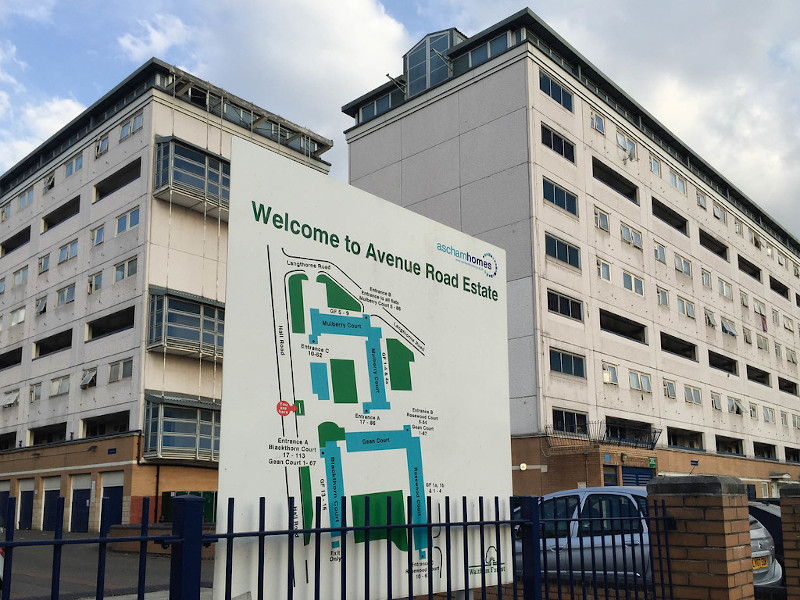
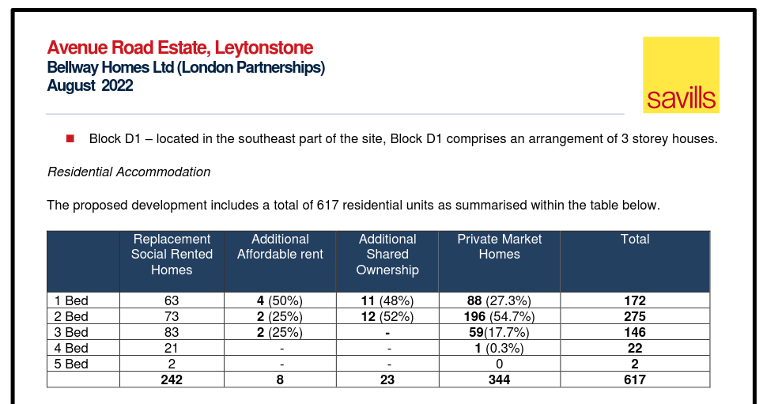

258 homes in 4 blocks of the Avenue Road estate have been <a href="https://walthamforest.gov.uk/content/regeneration-avenue-road-estate-leytonstone">earmarked</a> for demolition (Blackthorn Ct, Gean Ct, Mulberry Ct, Rosewood Ct).

The estate was one of 11 estates [identified](https://democracy.walthamforest.gov.uk/documents/s10654/4.2.%20LSP%20report%20-%20Estates%20Review.pdf) for possible redevelopment in a 2010 Estates Capacity Study.

The Council appointed a residents' advisor to the scheme in 2019 (Newman Francis). Newman Francis has also been [involved in Lambeth's estate regeneration schemes](http://newmanfrancis.org/projects/westbury-lambeth/).

In April 2020, the Council [resolved](https://democracy.walthamforest.gov.uk/documents/s72449/Avenue%20Road%20Estate%20Regeneration%20report.pdf) to proceed with redevelopment on the basis of an options appraisal study but witheld publication of the study on grounds of 'commercial sensitivity.

In January 2021, Waltham Forest Council held a ballot in which 161 of the 269 eligible residents voted in favour of redevelopment. As with many such ballots, refurbishment of the estate was not an option on the ballot paper. Neither was proposed tenure mix stated, which is a requirement of the Mayor's [Ballot Funding Conditions](https://www.london.gov.uk/sites/default/files/gla_cfg_section_8._resident_ballots_-_18_july_2018.pdf). 

In February 2021, the Council [resolved](https://democracy.walthamforest.gov.uk/documents/s77115/Avenue%20Road%20Estate%20Regeneration%20Project%20Update%20Report.pdf) to initiate CPO proceedings and serve a demolition notice. Again, the appendix to this report setting out the financial implications of the scheme were witheld on grounds of commercial sensitivity.

In 2023, the Council approved its application for demolition and construction of 617 new homes of which just 242 for social rent. There will be 8 affordable rent and 23 shared ownership and the remainder private for sale homes.

In October 2023, it was [confirmed](https://www.london.gov.uk/who-we-are/what-london-assembly-does/questions-mayor/find-an-answer/bellway-homes-and-avenue-road-estate-e11-1) that Bellway Homes had pulled out of the scheme and that Waltham Forest was in the process of _'assessing alternative routes to deliver the scheme'_.

---

## Links
<a href="https://democracy.walthamforest.gov.uk/documents/s68553/Avenue%20Rd%20Regeneration%20Update%20Final.pdf">July 2019 Council report</a>.

[Feb 2020 Council briefing report](https://democracy.walthamforest.gov.uk/documents/s71385/4%20-%20Avenue%20Road%20Regeneration%20Final%2029-01-20%20v5.pdf) update to the Council's Housing Scrutiny Committee.

[March 2020 Council briefing update](https://democracy.walthamforest.gov.uk/documents/s72245/4%20-%20Report%20Scrutiny%20Committee%20_24%20March%202020%20final.pdf). 

[April 2020 Cabinet report](https://democracy.walthamforest.gov.uk/documents/s72449/Avenue%20Road%20Estate%20Regeneration%20report.pdf).

[February 2021 Cabinet report](https://democracy.walthamforest.gov.uk/documents/s77115/Avenue%20Road%20Estate%20Regeneration%20Project%20Update%20Report.pdf).

Waltham Forest's [Landlord Offer](https://www.avenue-road-estate-regeneration.co.uk/storage/app/media/lwf-arl-hta-g-landlord-offer-main-webspreads.pdf) to residents ahead of the ballot.

[Planning application documents](https://builtenvironment.walthamforest.gov.uk/planning/index.html?fa=getApplication&id=110198)

---

<!------------THE CODE BELOW RENDERS THE MAP - DO NOT EDIT! ---------------------------->

---

![Avenue rd estate image](src/images/Avenue_R5.jpg", "image of Avenue Road estate" %}
