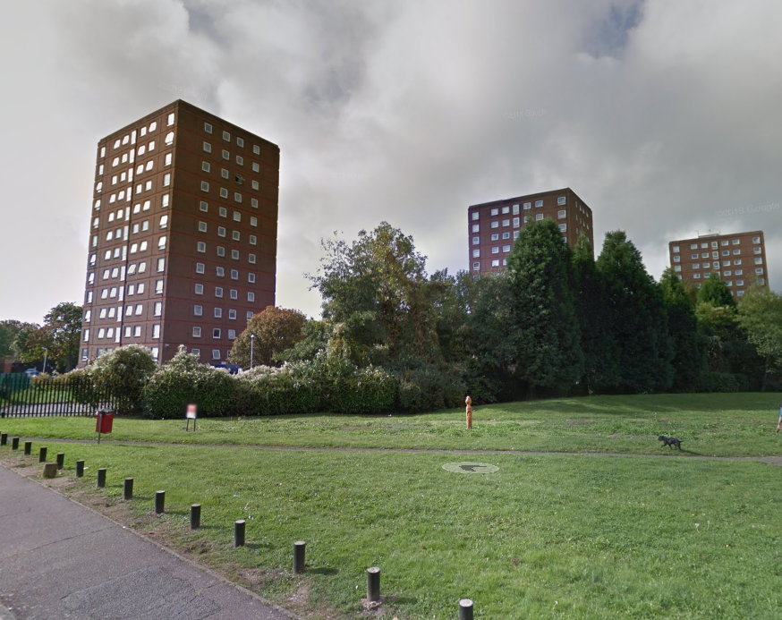
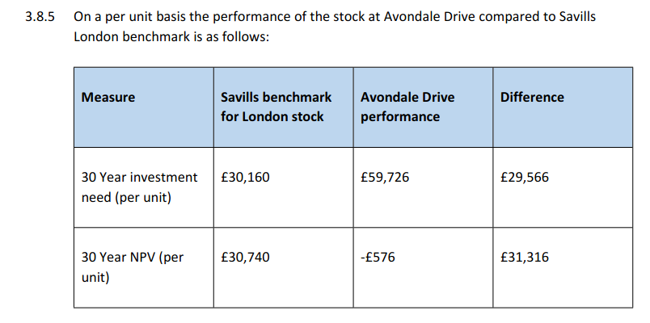
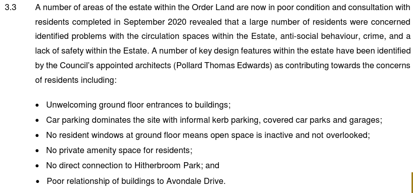

144 homes are under threat on Hillingdon's Avondale Drive estate in Hayes (117 Council and 27 leasehold).

The estate consists of three 12 storey point blocks located adjacent to Hitherbourne Park around 1 mile North of Hayes & Hillingdon train station (new crossrail station).

In March 2016, Hillingdon Council [applied](https://modgov.hillingdon.gov.uk/ieIssueDetails.aspx?IId=21017&Opt=3) to the Mayor to establish Hayes Town Centre as a 'Housing Zone'. The application contained a list of potential development sites for new housing (appendix 5). The Avondale Drive estate was listed as one of them along with the Austin Road estate.

Four years later, in 2020, Hillingdon commissioned Savills to undertake an [options appraisal study](https://modgov.hillingdon.gov.uk/documents/s49499/Appendix%201%20-%20Appraisal%20Report%20Austin%20Road.pdf) to consider options for the redevelopment of the estate.

The Savills report recommended demolition and rebuild on the basis that the estate has high investment needs, requiring an estimated expenditure of £59,726 (per unit) in maintenance costs over the next 30 years compared to a London average of £30,160. 

But the £57,631 figure includes 'additional expenditure' of £11,603 per unit for other works like installing sprinkler systems.

On 22 October 2020, Hillingdon Council [resolved](https://modgov.hillingdon.gov.uk/ieListDocuments.aspx?CId=115&MeetingId=3834) to proceed with a residents' ballot on demolition in line with the recommendations of the Savills report.

The ballot was held in March 2021, with 94% in favour of redevelopment on an 85% turnout.

In 2022, Hillingdon granted itself planning permission for a total of 240 new homes in its redevelopment of the estate, 54% of which 'affordable' but only 117 will be social rented homes.

Hillingdon subsequently signed a joint venture agreement with developer Higgins for the redevelopment of the estate.

The Council then served a Compulsory Purchase Order on the estate's residents, which was confirmed in March 2022. The CPO's [Statement of Reasons](https://www.hillingdon.gov.uk/media/7717/Statement-of-Reasons/pdf/6aStatement_of_Reasons_-_Avondale_Drive_-_c.pdf?m=1638202424067) states the following reasons for justifying demolition of the estate:

---

__Links:__  
[Landlord Offer document](/images/AD_Estate_Landlord_Offer.pdf)

GLA [planning reports](https://planapps.london.gov.uk/planningapps/76551-APP-2021-4502)

---

<!------------THE CODE BELOW RENDERS THE MAP - DO NOT EDIT! ---------------------------->

---