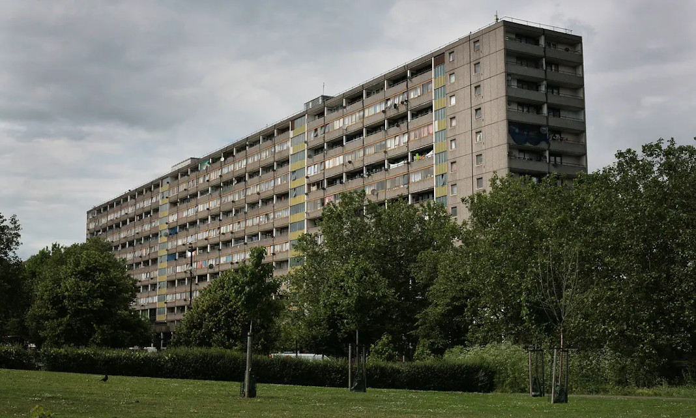
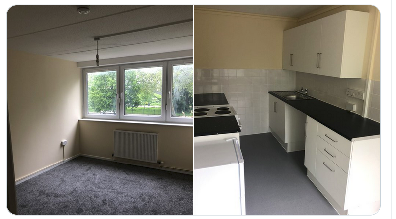

Circa 2,000 homes remain earmarked for demolition on the remaining 3 phases of Southwark's Aylesbury estate redevelopment.

Two early 'demonstration' phases were completed in 2014 on the corner of the estate. Demolition of the first main phase was completed in June 2020 and is now under construction.

Phase 2 (of 4 phases in total) is approximately two years behind schedule and there is still no planning application submitted. 

The original estate was completed in 1977, providing 2,758 homes. In 1999 the Aylesbury estate received £56m as part of Labour’s New Deal for Communities (NDC) programme. 

The NDC finished in 2010 and the  Aylesbury Area Action Plan (AAAP) was formally adopted. The AAAP outlined the estate’s regeneration, involving phased demolition of all existing buildings and new-build re-development, increasing density to 3,575 homes. The first new homes were completed in 2012 and the Council appointed Notting Hill Genesis Housing Association as its development partner. The further works will happen in four phases, leading to an incremental decant and demolition of the estate, with the overall regeneration estimated to be completed in 2036.

The scheme is being [funded](https://www.london.gov.uk/sites/default/files/2021.03.18._estate_regen_projects_approved_before_18_july_2018_march_2021.pdf) by the Mayor and has been granted an [exemption](https://www.london.gov.uk/sites/default/files/list_of_exemptions_-_27_november_2020.pdf) from his requirement to ballot residents on the demolition of their homes.

Despite Southwark Council's aim to replace all of the existing social rented housing, Notting Hill Genesis' [planning application](http://planbuild.southwark.gov.uk/documents/?GetDocument=%7b%7b%7b!clWxEC35adJ29O7pMe62Bg%3d%3d!%7d%7d%7d) describes the replacement 'social housing' as a mix of 'target and affordable rent' and acknowledges that in any event there will be an overall net loss of 931 social rented homes.

In February 2015 a group of protesters [occupied](https://www.theguardian.com/society/2015/feb/18/six-arrested-as-police-help-in-evictions-from-london-estate) the first development site in protest at the loss of council homes and residents [disenfranchised](/images/SNWolverton.pdf) by the scheme. 

In September 2016, after a [protracted public inquiry](http://35percent.org/2016-09-18-aylesbury-compulsory-purchase-order-rejected/) the Secretary of State [rejected](https://www.theguardian.com/society/2016/sep/16/government-blocks-controversial-plan-to-force-out-housing-estate-residents) Southwark Council's application to remove remaining leaseholders with a compulsory purchase order on the grounds that rehousing offers to leaseholders wouldn't enable them to stay in the area. This subsequently led to a [policy change](/images/SN19April2018.pdf) which improved the rehousing offer.

In July 2020, Southwark resolved to step in and [stump up £193m](http://35percent.org/2020-07-12-aylesbury-estate-fds-variation/) to help its development partner complete the first phase of the Aylesbury estate redevelopment, in what has been [termed as a bail out](https://www.southwarknews.co.uk/news/housing-chief-denies-aylesbury-estate-deal-is-bail-out-for-notting-hill-genesis/) after its development partner was [forced to scale back its development plans](https://www.insidehousing.co.uk/news/news/notting-hill-genesis-scales-back-development-plans-amid-changing-market-conditions-62506) by the Social Housing Regulator.

In 2021, Southwark replaced the boilers and upgraded the estate's district heating network (often cited as one of the reasons to demolish the estate) and its [Cabinet member for Climate Emergency and Sustainable Development](https://www.southwark.gov.uk/council-and-democracy/councillors-and-mps/leader-of-the-council-and-cabinet-members?chapter=6) [announced](https://twitter.com/helendennis80/status/1395336950962327552) that 80 homes on remaining phases of the [Aylesbury estate](https://www.estatewatch.london/estates/southwark/aylesbury/) have been [refurbished to be let out as temporary accommodation](https://www.southwark.gov.uk/news/2021/may/southwark-council-to-provide-temporary-housing-for-80-homeless-people-on-aylesbury-estate-while-581-council-homes-are-being-built) to families on the Council's housing waiting list.

The homes have been refurbished to [Southwark Good Homes Standard](https://www.southwark.gov.uk/news/2021/mar/new-southwark-council-good-homes-standard-for-temporary-accommodation) and will be available to let from July until the phase of the estate is 'decanted'. The Aylesbury estate is London's largest estate redevelopment and is set to take 15 years to complete. Approximately 700 of the estate's 2,759 homes have been demolished to date and phase 1 of 4 is currently under construction.

This begs an obvious question: if remaining homes on the estate can be refurbished to acceptable standards for habitation for [under £10k per dwelling](https://www.whatdotheyknow.com/request/830572/response/2021635/attach/3/FOI%201820226%20Southwak%20Response%20letter.pdf), why are they still earmarked demolition?

---

__Links:__

[LA - Planning application documents](https://planning.southwark.gov.uk/online-applications/applicationDetails.do?keyVal=ZZZV1BKBWR660&activeTab=summary)

[GLA - Planning reports](https://planapps.london.gov.uk/?planAppFilters=%255B%257B%2522or%2522%253A%255B%257B%2522name%2522%253A%257B%2522iRgx%2522%253A%2522aylesbury%2520estate%2522%257D%257D%252C%257B%2522glaReference%2522%253A%257B%2522iRgx%2522%253A%2522aylesbury%2520estate%2522%257D%257D%252C%257B%2522reference%2522%253A%257B%2522iRgx%2522%253A%2522aylesbury%2520estate%2522%257D%257D%252C%257B%2522postcode%2522%253A%257B%2522iRgx%2522%253A%2522aylesbury%2520estate%2522%257D%257D%255D%257D%252C%257B%2522project_id%2522%253A%257B%2522eq%2522%253A%2522637e245db0b8894bb2cb3034%2522%257D%257D%255D%2526planAppValues%253D%257B%2522general%2522%253A%2522aylesbury%2520estate%2522%257D)

---

<!------------THE CODE BELOW RENDERS THE MAP - DO NOT EDIT! ---------------------------->

---

![Aylesbury estate image](src/images/fdsgreenspace.jpg", "Aylesbury estate FDS green space" %}

![Aylesbury estate image](src/images/aylesburyident.png", "Aylesbury estate alternative ident" %}
