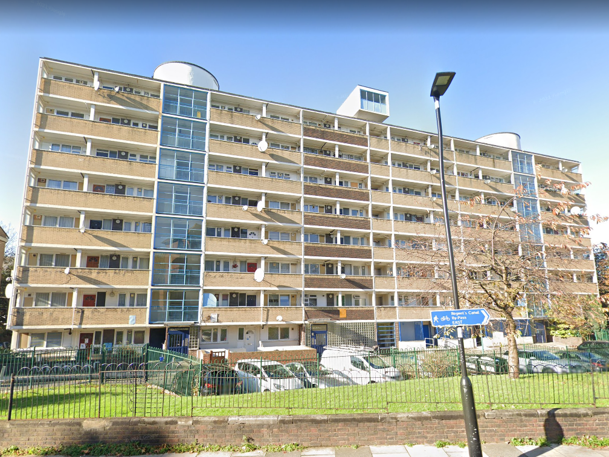
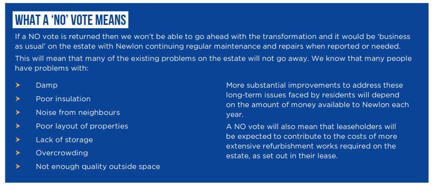
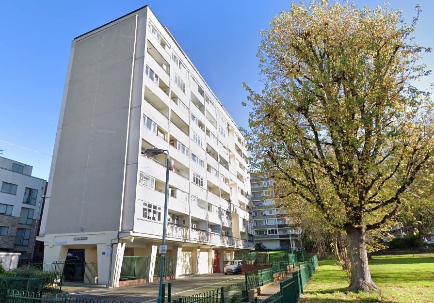
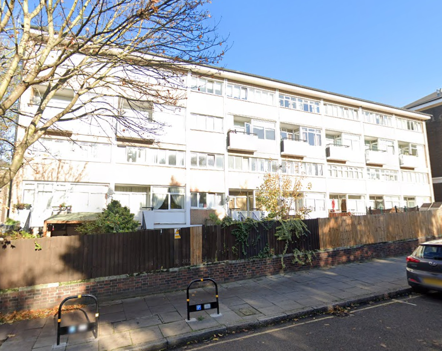
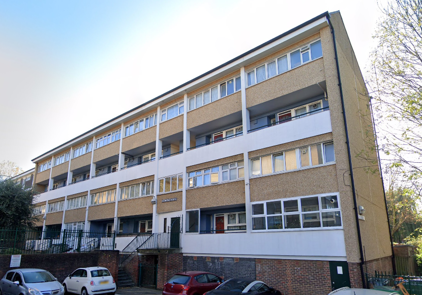

371 homes are under threat of demolition on Islington's Barnsbury estate.

The former Council estate was transferred to Newlon Housing association in 1999 under Islington's stock transfer policy.

In a joint venture with developer Mount Anvil, Newlon plans to demolish the 1970s blocks on the estate between Charlotte Terrace and Caledonian Road, including the two blocks next to the canal on Carnegie Street.

In March 2021, a residents ballot was held in which 73% of those who voted supported the proposals on a 79% turnout.

Newlon's formal [Landlord Offer](/images/BarnsburyOffer.pdf) made it clear that if residents voted against redevelopment then it wouldn't tackle the ongoing symptoms of the estate's neglect. 

This is an a recurring element in resident ballots, where residents are forced to choose between redevelopment or ongoing neglect. More examples can be found [here](/ballots).

In 2018, residents [accused](https://www.islingtongazette.co.uk/news/has-newlon-housing-trust-left-barnsbury-estate-to-rot-3795818) Newlon of neglecting the estate and _'running it into the ground'_.

Planning permission was granted in 2022 for 950 new homes of which 50% affordable.

In April 2023, Islington Council [resolved](https://democracy.islington.gov.uk/documents/s32602/Barnsbury%20disposal%20of%20land%20and%20release%20of%20restrictive%20covenant.pdf) to use CPO powers on behalf of Newlon Housing Association to reclaim homes owned by leaseholders.

Newlon Housing Trust and developer Mount Anvil, had been set to retrofit nearly 600 existing homes on the estate as part of the scheme. The first phase, refitting 134 homes, was approved by Islington Council in November 2024.

But in March 2025, it was [reported](https://www.architectsjournal.co.uk/news/pte-slams-impractical-funding-models-as-estate-overhaul-stalls) that the retrofit can’t go ahead because of changes in the viability of the scheme. Architect PTE is arguing for government funding to be allocated, saying that _‘current funding models do not support the realities of retrofitting historic buildings'._

---

__Links:__  

Newlon's website for the scheme: [https://betterbarnsbury.org.uk](https://betterbarnsbury.org.uk)

Newlon's [Landlord Offer](/images/BansburyOffer.pdf)

GLA [planning report](https://planning.london.gov.uk/pr/s/planning-application/a0i4J000006ceumQAA/20220438?tabset-c2f3b=2)

---

<!------------THE CODE BELOW RENDERS THE MAP - DO NOT EDIT! ---------------------------->

---

