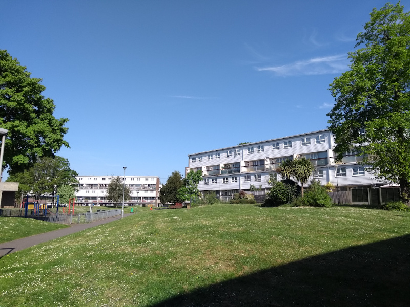
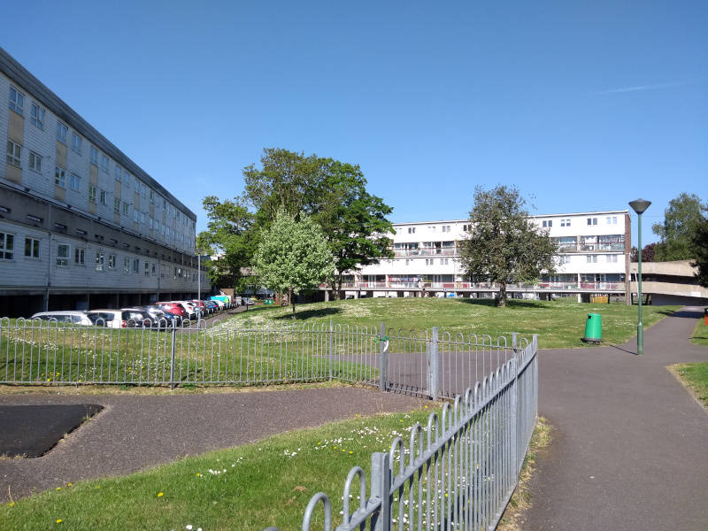
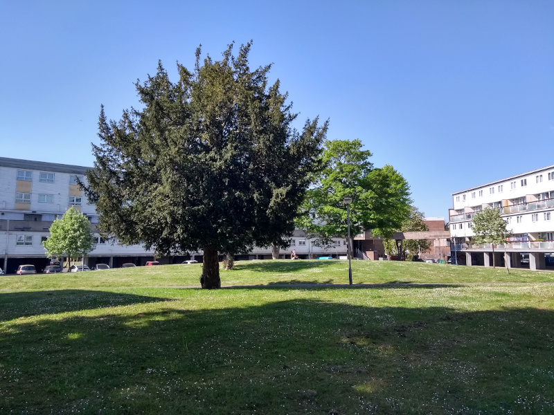
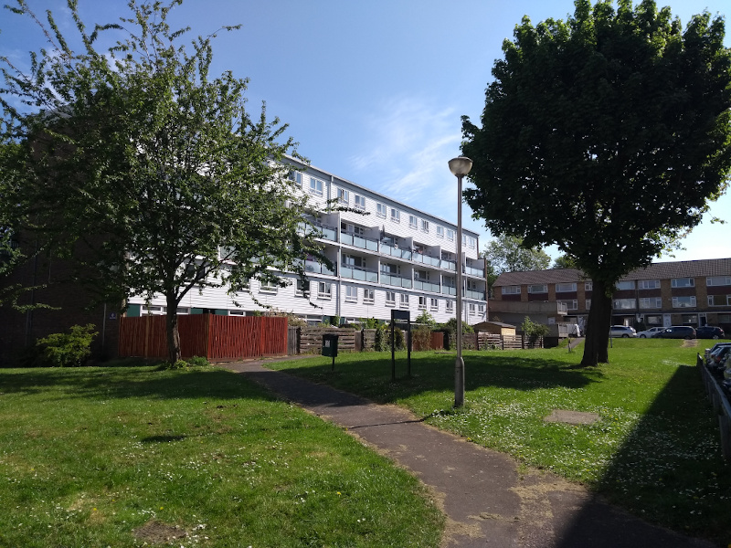
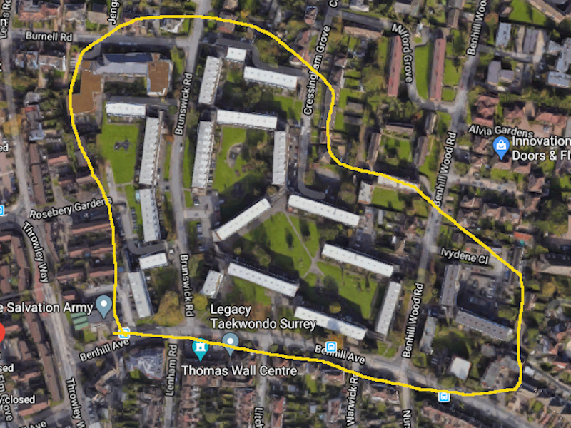

429 homes have been earmarked for potential development on Sutton's Benhill estate.

The Benhill estate comprising 429 homes near Sutton High Street, is one of seven estates listed in [Sutton's Local Plan (2018)](https://drive.google.com/file/d/1MdX6GlaHDoBdG6CTsvjFaIuPtIa9id5O/view) for potential redevelopment:

There is little information about the scheme in the public realm.

According to [this June newsletter](https://www.sutton.gov.uk/documents/20124/453607/SUT-BEN_RegenNewsletter_JUNE_edition_web_AW.pdf/bec92b34-34b2-130f-2e60-f7425e4a70c2?t=1654609076766) a ballot has been held:

>In March 2022, residents of Elm Grove voted ‘Yes’ to regeneration in what was Sutton’s first estate regeneration ballot. 78.6% of residents supported plans for a new neighbourhood with modern homes and improved amenities for current and future residents to enjoy.

It is not however clear what residents were balloted on. There is no Landlord Offer in the public domain. The scheme is not listed in the Mayor's [list](https://www.london.gov.uk/sites/default/files/2023-10/list-of-positive-ballot-9-October%202023.pdf) of schemes where there have been positive ballot results.

The estate remains identified in Sutton's [draft 2024 Local Plan](https://www.sutton.gov.uk/documents/d/guest/local-plan-issues-and-preferred-options-2024-) as a site for redevelopment.

---

<!------------THE CODE BELOW RENDERS THE MAP - DO NOT EDIT! ---------------------------->

---

