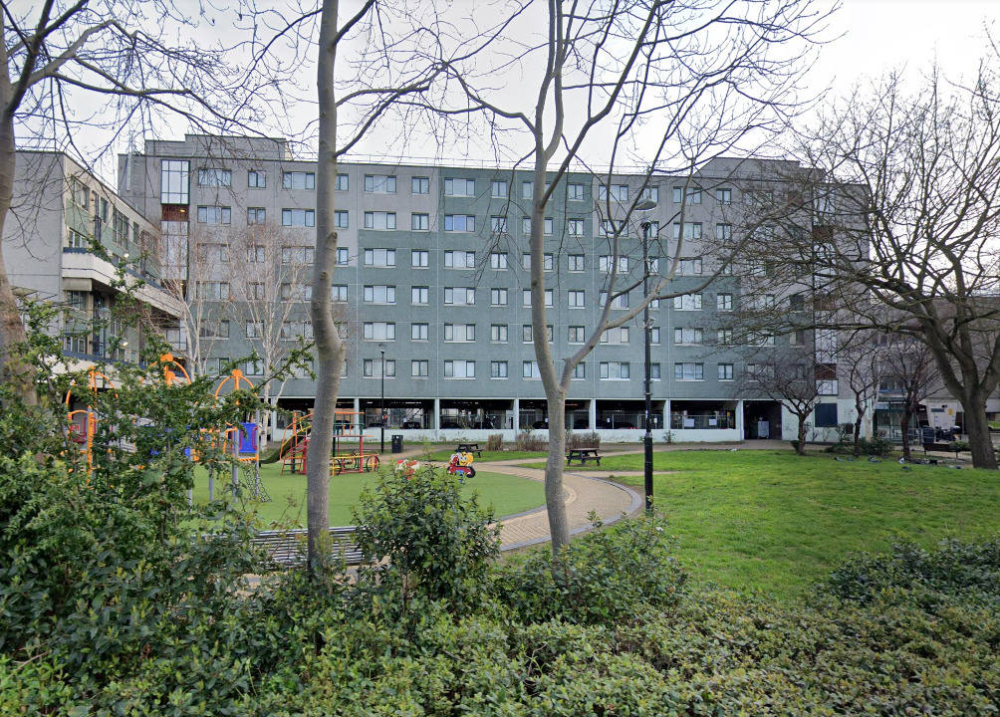
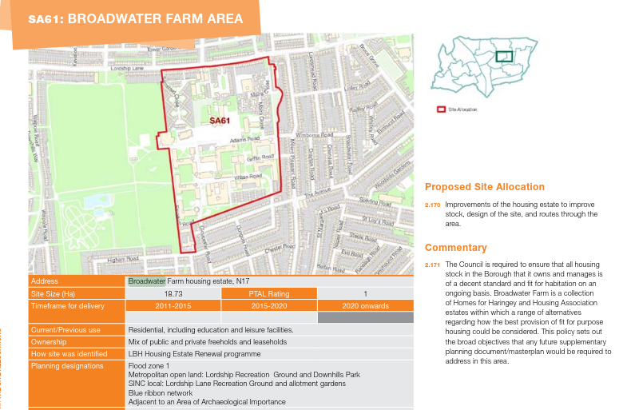
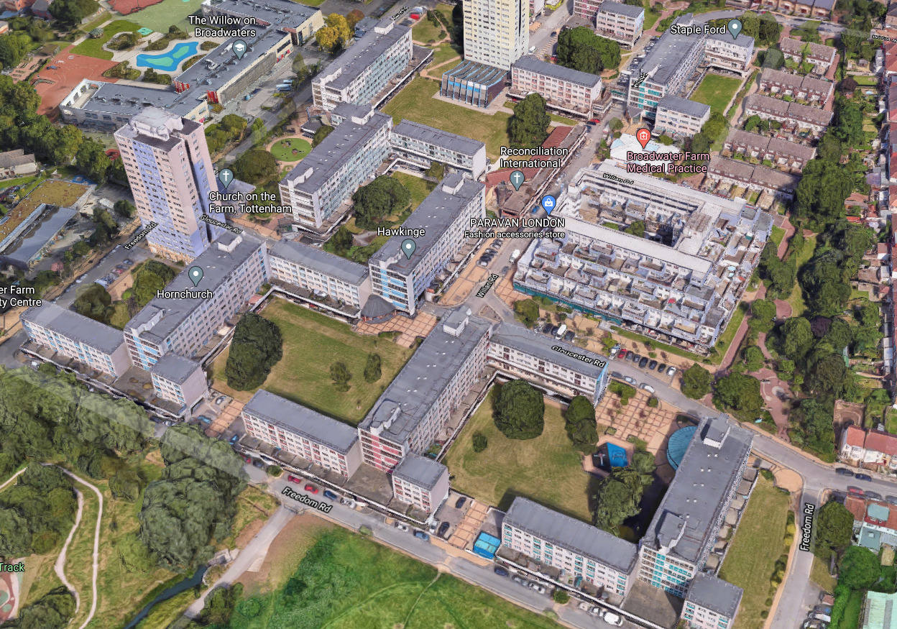
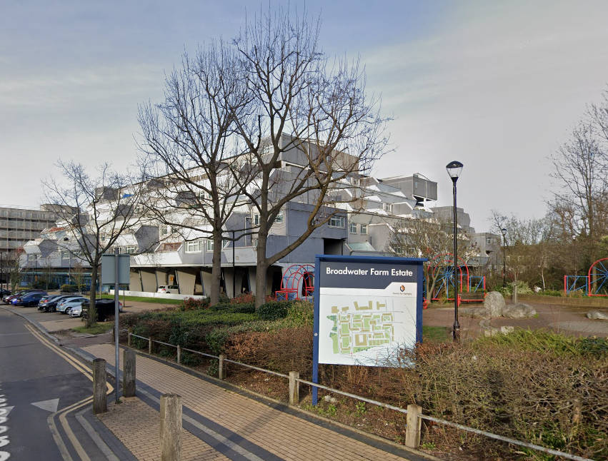

At least 200 of the 1075 homes on Haringey's Broadwater Farm estate are under threat of demolition.

The Estate is comprised of 12 different blocks containing 1051 properties and 24 houses. In summer 2017 Haringey undertook a number of structural surveys on the estate following the Grenfell disaster. These studies highlighted safety issues with two of the blocks; Tangmere and Northolt. A number of temporary mitigation measures were implemented until a decision on the long term future of these two blocks is made.

The entire estate was subsequently designated as a potential development site in Haringey's [Local Plan](https://www.haringey.gov.uk/sites/haringeygovuk/files/final_haringey_site_allocations_dtp_online.pdf) (site SA61).

Haringey's January 2020 update on its [website](https://www.haringey.gov.uk/housing/broadwater-farm) says the Council has _"commissioned architects to undertake a capacity study on the Broadwater Farm estate. The study looked at the capacity of sites where the Tangmere and Northolt blocks currently stand. It also looked at three additional sites on the periphery of the estate. The study was commissioned to help inform the council’s decision making process regarding the potential demolition of Tangmere and Northolt blocks."_

It goes on to clarify that _"the study is not a plan for the future and was designed to provide indicative numbers around capacity only. Plans for new homes will be developed in consultation with residents on the estate and will be subject to a resident ballot."_.

A ballot was held in Spring 2022, in which 85% voted in favour of redevelopment on a turnout of 55% of eligible voters.

Haringey's [shared equity offer](https://www.haringey.gov.uk/sites/haringeygovuk/files/broadwater_farm_rehousing_and_payments_policy.pdf) for leaseholders requires them to be able to afford a 60% share in any replacement home, which may require them to take out a second mortgage or invest personal savings. It also prohibits descendants from inheriting the equity share, which means the leaseholder can't pass their home on to their children.

A planning application was approved in 2022 for a total of 294 new homes, all supposedly council homes at council rents.

---

<!------------THE CODE BELOW RENDERS THE MAP - DO NOT EDIT! ---------------------------->

---

