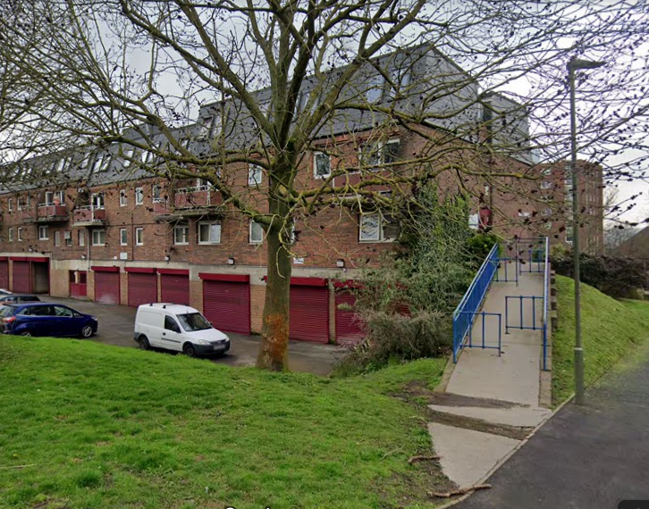
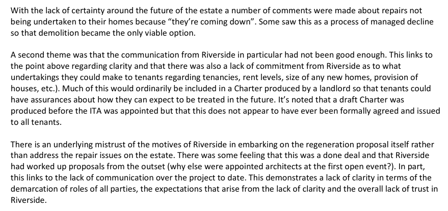

Circa 150 homes are earmarked for potential demolition on Bromley's Calverley Close estate in Beckenham.

The estate comprises 2-4 storey low-rise maisonette blocks overlooking Beckenham Place Park.

In 2017, Riverside Housing Association (which manages Bromley's council housing) appointed architects to investigate options for the redevelopment of the Calverley Close estate.

In May 2019 Riverside instructed Tpas, an independent body which advises social landlords on effective tenant engagement, to review its tenant engagement on the estate after the Residents Steering Group openly opposed the redevelopment proposals.

Tpas visited residents at Calverley Close to ask for their thoughts and opinions about the redevelopment proposals and produced a [report](/images/tpasreport.pdf) with some interesting findings:

The Mayor agreed funding in principle for the redevelopment in November 2018.

A ballot was held in July 2021, with a majority of residents voting in favour of redevelopment.

Planning permission was granted in 2023 for 275 new homes, of which 179 'affordable'.

More information is available on Riverside's website here: [https://www.riverside.org.uk/redevelopment-projects/calverley-close-revitalising-your-neighbourhood/](https://www.riverside.org.uk/redevelopment-projects/calverley-close-revitalising-your-neighbourhood/)

---

<!------------THE CODE BELOW RENDERS THE MAP - DO NOT EDIT! ---------------------------->

---

![Calverly Close estate image](src/images/cal1.png", "Calverley Close estate" %}
![Calverly Close estate image](src/images/cal3.png", "Calverley Close estate" %}
![Calverly Close estate image](src/images/cal5.png", "Calverley Close estate" %}

