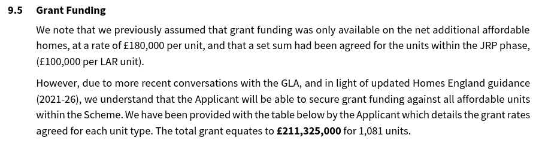
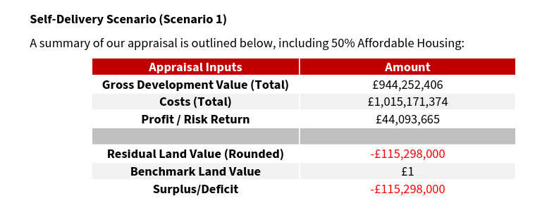

710 homes are under threat of demolition on Newham's Carpenters estate in Stratford. The estate comprises an number of low-rise terraces and three tower blocks - Lund Point, Dennison Point and James Riley Point.

Plans for the estate's regeneration have been under consideration since 2000, with several buildings earmarked for demolition and the decanting of residents having started in 2005/06. In 2025 it was [reported](https://www.bbc.co.uk/news/articles/ckgzz1z1epxo) that less than half of the estate's 710 homes were being occupied.

To save the estate from demolition, <a href="https://savecarpenters.wordpress.com/about/">Carpenters Against Regeneration Plans (CARP)</a> was formed by residents of the estate in 2011.  <a href="/images/ccplan.pdf">Carpenters Community Plan</a> was published in 2013 and the <a href="https://greatercarpenterscouk.files.wordpress.com/2019/06/np-june-2019-submission-version.pdf">Greater Carpenters Neighbourhood Plan</a> in 2019, both of which propose a bottom-up community based approach to planning the future of the estate.

From 2005 to 2010, redevelopment proposals focused on the demolition of the high rise blocks and some central low rise blocks to be replaced with alternative housing. Then came failed discussions with the University College London to develop the estate and Newham Council ceased the procurement of a joint venture partner, as there was limited evidence that residents had been fully engaged with redevelopment proposals. Newham Council then implemented a programme of consultation and engagement with residents based on redeveloping the estate itself rather than in a joint venture. Newham has since set up its own in-house development arm ['Populo Living'](https://www.populoliving.co.uk/), which has taken over responsibility for the development plans.

In October 2020, a [council report](https://mgov.newham.gov.uk/documents/s139593/Appraisal%20of%20Tower%20Blocks%20on%20the%20Carpenters%20Estate%20Stratford%20-%20update%20and%20next%20steps%20V8%20Cabint%20issu.pdf) submitted to Newham’s cabinet committee suggested one of the neighbourhood’s existing towers – James Riley Point – could be retained and refurbished before the start of any wider redevelopment that would require a residents’ ballot.

James Riley Point was almost entirely decanted along with Dennison Point and Lund Point as part of the previous regeneration approach which was abandoned in 2018.

In July 2021, Newham's Cabinet approved proposals to refurbish existing homes at James Riley Point, Lund Point and Biggerstaff Terrace (subject to ballot).

Homes and buildings in Dennison Point, Gibbins Road, Doran Walk, Jupp Road, Kennard Road, Rosher Close, Warton Road and Wilmer Lea Close would be demolished and rebuilt.

A ballot was held in December 2021, 73% of eligible residents voting in favour of redevelopment on a 66% turnout.

A planning application was submitted in December 2022 and approved in February 2024. This permitted the construction of 1890 new homes of which 817 social rent and the refurbishment of 132 existing council homes in JRP (James Riley Point) tower. 

Newham's [rehousing offer](https://mgov.newham.gov.uk/documents/s144070/Appenidx%201%20-%20LBN%20Estate%20Regeneration%20Housing%20Offer%20the%20Housing%20Offer.pdf) promises a new council home at the same rent level to secure tenants. Temporary tenants will be offered a secure tenancy on the redeveloped estate but will be charged an 'affordable rent':  

_'Your rent will be an affordable rent, in accordance with the definitions set by the Mayor of London._'

The policy for leaseholders is less clear:

The Landlord Offer says:
_"You will be offered a range of options to continue to own a new home in the Custom House Phase One area, depending on your financial circumstances._"

The Mayor's [stage 1 report](https://planapps.london.gov.uk/planningapps/22-00360-OUT) for the application says that only shared ownership is being offered to the estate's leaseholders - i.e. paying rent on the unowned share.

The [Financial Viability Assessment](src/images/carpentersfva.pdf) submitted in support of the planning application, confirms that the Mayor has agreed to allocate £211m in grant funding to the scheme and fund replacement social housing, despite his policy of only funding additional social housing in estate regenerations.

The Mayor's grant funding policy says that he will only fund replacement social housing in 'exceptional circumstances' but it appears that almost every estate regeneration scheme is becoming an exception. 

It is also noteworthy that the Mayor is allocating £24.7m of the funding to the refurbishment of the 132 council homes in the JRP tower (see page 26). This opens up the question of why the Mayor isn't allocating funding for refurbishment instead of demolition in general.

The viability appraisal has also included a profit of £44m for Newham Council, added as a cost to the scheme before the 'viable' level of affordable housing is calculated as a residual value.

We argue in our [Alternative Good Practice Guide to Estate Regeneration](img/alternative-good-practice-guide-to-estate-regeneration.pdf) that councils and housing associations should not be allowed to profit from estate redevelopment and that any profit should go towards increasing the level of replacement social housing.

In February 2025, the BBC [reported](https://www.bbc.co.uk/news/articles/ckgzz1z1epxo) that the Council was revising its plans after councillors had raised financial concerns for the project after the estimated borrowing costs jumped from £845m to £1.4bn, as a result of inflation and costs on new building safety requirements.

The Council's Overview and Scrutiny Committee decided to send the original decision back to cabinet for reconsideration, and came up with a list of recommendations which included considering different funding strategies such as selling some or part of the estate.

---

__Links:__

[Consultation website - https://thecarpentersestate.commonplace.is](https://thecarpentersestate.commonplace.is/)

[Planning Application Supporting Documents](https://planning.agileapplications.co.uk/lldc/application-details/10234#documents) - (ref:22/00360/OUT)

[GLA Stage 1 report](https://planapps.london.gov.uk/planningapps/22-00360-OUT)

---

<!------------THE CODE BELOW RENDERS THE MAP - DO NOT EDIT! ---------------------------->

---

