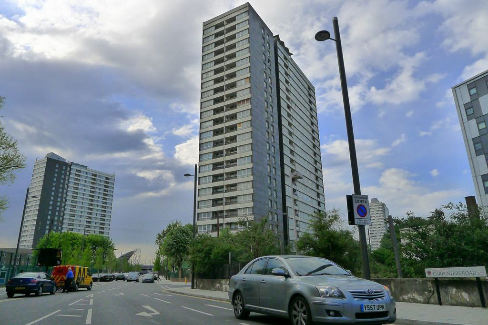
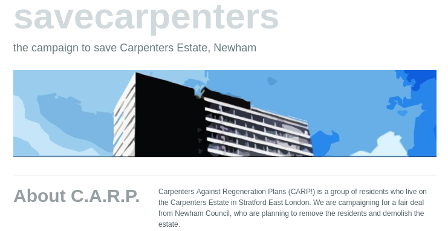
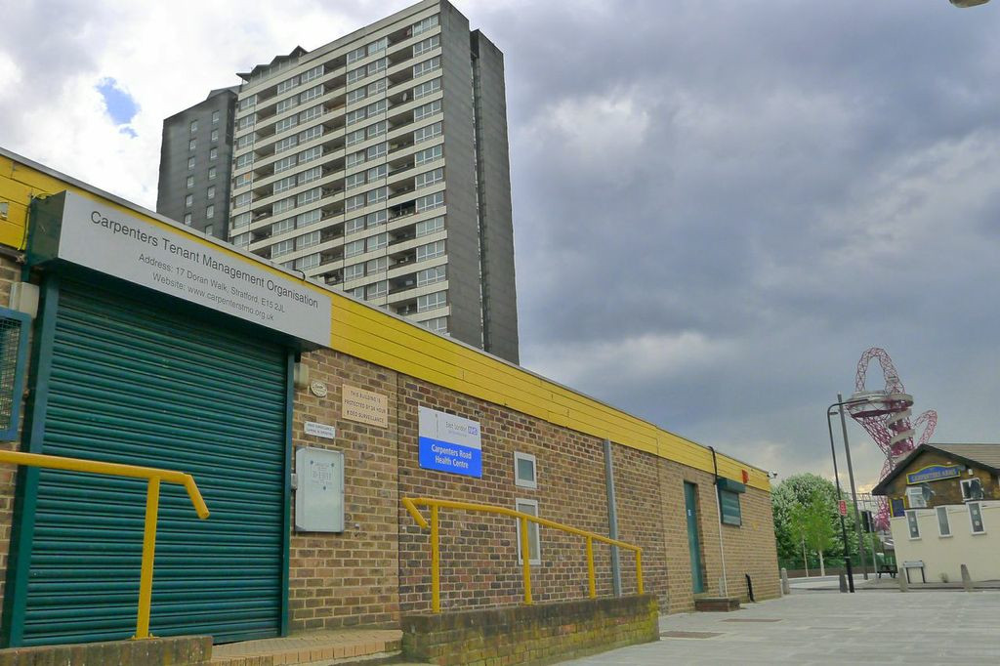
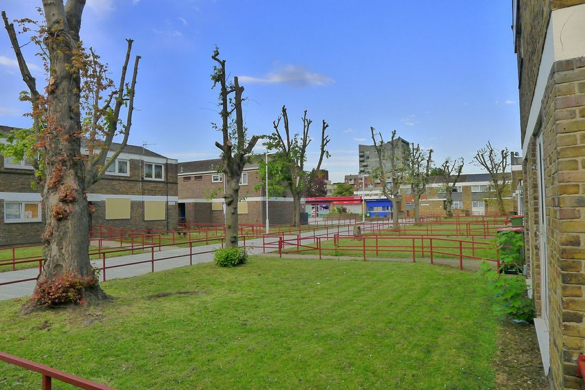

710 homes are under threat of demolition on Newham's Carpenters estate in Stratford.

Plans for the estate's regeneration have been under consideration since 2000, with several buildings earmarked for demolition and the decanting of residents having started in 2005/06.  Three tower blocks on the estate have been emptied of council tenants, though some leaseholders remain.  The lower rise buildings continue to be occupied by a mixed community of council tenants, leaseholders and freeholders and this remains a strong and supportive community. 

To save the estate from demolition, <a href="https://savecarpenters.wordpress.com/about/">Carpenters Against Regeneration Plans (CARP)</a> was formed by residents of the estate in 2011.  <a href="/images/ccplan.pdf">Carpenters Community Plan</a> was published in 2013 and the <a href="https://greatercarpenterscouk.files.wordpress.com/2019/06/np-june-2019-submission-version.pdf">Greater Carpenters Neighbourhood Plan</a> in 2019, both of which propose a bottom-up community based approach to planning the future of the estate.

Newham Council is carrying out an options appraisal with residents on the estate, each option involving a varying degree of demolition.  A ballot is due to be held some time in 2021.

The [Planning Inspector’s report](https://www.queenelizabetholympicpark.co.uk/-/media/lldc/local-plan/examination-2019/inspectors-reports/appendix-1_inspectors-lldc-revised-lp_final-report.ashx?la=en) on the Local Plan (London Legacy Development Corporation) published in April 2020 found against the demolition of the Carpenters estate and said:
<i><strong>
“Although the formal residents ballot is yet to take place, it is highly likely from all the written representations and spoken contributions at the hearing sessions, that most residents in the Greater Carpenters area are expressing the wish to remain where they live now and would resist comprehensive redevelopment and the inevitable disruption and community displacement....”
</strong></i>

Newham Council's [website](https://www.newham.gov.uk/regeneration-1/regeneration-project-carpenters-estate/2?documentId=343&categoryId=20140) says the following about its regeneration of the Carpenters estate:

> "From 2005 to 2010, redevelopment proposals focused on the demolition of the high rise blocks and some central low rise blocks to be replaced with alternative housing. Then came failed discussions with the University College London to develop the estate and Newham Council ceased the procurement of a joint venture partner, as there was limited evidence that residents had been fully engaged with redevelopment proposals. Newham Council is now committed to implementing a programme of consultation and engagement with residents which will inform the Carpenters Estate redevelopment options."

> "In February 2020 the Council gave approval for Red Door Ventures (RDV) to provide development management services for the next stage of work for the restoration of the estate. RDV are a developer of private and affordable homes and are solely owned by the Council. RDV, working closely, with the council, now leads on discussions with residents to co-design a viable and deliverable development option."  

> "RDV and the Council are working closely with residents to create a detailed vision for the Carpenters Estate and turn this into a financially viable masterplan. This plan will contain a clear ambition for the future of the estate, looking at how it will ensure it is restored as a neighbourhood and how it will connect to the wider Stratford area." 

In October 2020, a [council report](https://mgov.newham.gov.uk/documents/s139593/Appraisal%20of%20Tower%20Blocks%20on%20the%20Carpenters%20Estate%20Stratford%20-%20update%20and%20next%20steps%20V8%20Cabint%20issu.pdf) submitted to Newham’s cabinet committee suggested one of the neighbourhood’s existing towers – James Riley Point – could be retained and refurbished before the start of any wider redevelopment that would require a residents’ ballot.

James Riley Point was almost entirely decanted along with Dennison Point and Lund Point as part of the previous regeneration approach which was abandoned in 2018.

In July 2021, Newham's Cabinet approved proposals to refurbish existing homes at James Riley Point, Lund Point and Biggerstaff Terrace (subject to ballot).

Homes and buildings in Dennison Point, Gibbins Road, Doran Walk, Jupp Road, Kennard Road, Rosher Close, Warton Road and Wilmer Lea Close would be demolished and rebuilt.

Newham estimates renewing the estate will provide about 2,000 new and 300 refurbished homes of which it promises at least 50% at social rent levels, while 44% of existing homes are to be refurbished.

A ballot was held in December 2021, 73% of eligible residents voting in favour of redevelopment on a 66% turnout.

A planning application was submitted in December 2022 for up to 2,000 new homes.

Newham's [rehousing offer](https://mgov.newham.gov.uk/documents/s144070/Appenidx%201%20-%20LBN%20Estate%20Regeneration%20Housing%20Offer%20the%20Housing%20Offer.pdf) promises a new council home at the same rent level to secure tenants. Temporary tenants will be offered a secure tenancy on the redeveloped estate but will be charged an 'affordable rent':  

_'Your rent will be an affordable rent, in accordance with the definitions set by the Mayor of London._'

The policy for leaseholders is less clear:

The Landlord Offer says:
_"You will be offered a range of options to continue to own a new home in the Custom House Phase One area, depending on your financial circumstances._"

Whilst both shared ownership and shared equity are both listed as possible options, small print in the Council's policy says:
_"Eligibility criteria will be worked out via co-production within the legal powers available to the Council."_

This leaves the door open to Newham 'gatekeeping' the shared equity offer as has been seen in other schemes where leaseholders are required to undergo a financial assessment and are subsequently told that they don't qualify for shared equity and are offered only shared ownership (i.e. paying rent on the unowned part of their homes.)

---

__Links:__

[Consultation website - https://thecarpentersestate.commonplace.is](https://thecarpentersestate.commonplace.is/)

---

<!------------THE CODE BELOW RENDERS THE MAP - DO NOT EDIT! ---------------------------->

---

