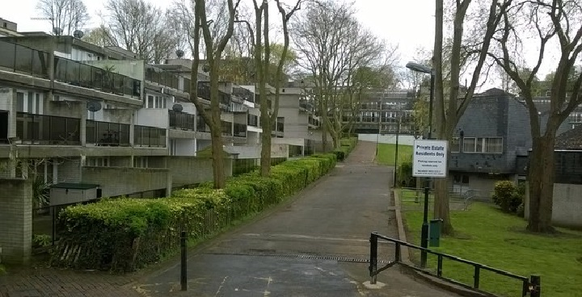
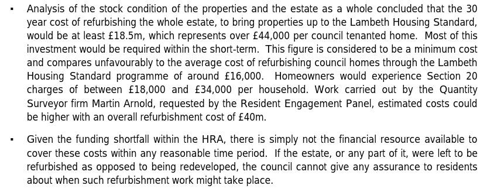
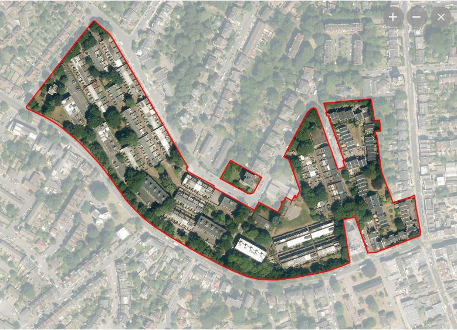

476 homes are earmarked for demolition on Lambeth's Central Hill estate.

Central Hill is the largest of Lambeth's [five estates](/underthreat/lambeth) earmarked for demolition.

It was first earmarked for potential redevelopment in a [December 2014 Cabinet decision](https://moderngov.lambeth.gov.uk/documents/s70441/03_Lambeth%20Estate%20Regeneration%20and%20Housing%20Delivery%20-%20December%202014%20v3%20docx.pdf).

Lambeth [says](https://moderngov.lambeth.gov.uk/documents/s87425/Cabinet%20Report%20-%20Central%20Hill%20-%20March%202017%20-%20final%20clean%204%20RD.pdf) that it is demolishing the estate because the cost of refurbishing the existing homes is £44,000 per dwelling when its average cost for other estates is only £16,000 and that the Council simply doesn't have the £18.5m required.

In 2019, an [FOI request revealed](https://www.whatdotheyknow.com/request/581698/response/1393236/attach/3/Attachment.pdf) that Lambeth is estimated to be spending £94m alone on buying back leasehold properties across its 5 estate demolitions.  

Whilst the decant and re-housing programme started in 2016, the estate remains fully occupied with [void units being let out at full market rents or as temporary accommodation at LHA rates](https://www.whatdotheyknow.com/request/581698/response/1393236/attach/4/Attachment%202.pdf).

The estate is not one of those listed as having agreed [grant funding](/approved/funding) from the mayor or that has been [exempted](https://www.london.gov.uk/programmes-strategies/housing-and-land/homes-londoners/estate-regeneration/estate-regeneration-data) from his requirement to ballot residents on the demolition of their homes.

In November 2020, Lambeth approved a 'kick-start' initial phase of redevelopment involving a decanted block previously used for temporary housing. 

In early 2023, Lambeth Council announced that is was pausing the redevelopment of Central Hill and two other estates (Fenwick and Cressingham Gardens) after a critical report recommended a ‘fundamental reset’ to the way it handles the long-running projects.

In September 2024, Lambeth published a report highlighting the Council’s plans to reset key estate renewal projects and regain control of properties previously under HfL’s management.

The Kerslake Review, which took place in December 2022, was a pivotal moment for the Council’s housing strategy.

Two primary recommendations emerged: first, to dissolve Homes for Lambeth and return the Council’s social housing delivery to in-house management, and second, to address long-standing failures in engaging with residents.

These recommendations have led to a fundamental reshaping of Lambeth’s estate regeneration plans, effectively putting many estates back to square one.

The Overview and Scrutiny report indicates that estates such as Central Hill, Cressingham Gardens, and Fenwick are facing a complete reset.

In December 2024, it was [reported](https://londonnewsonline.co.uk/news/lambeth-to-take-stock-of-gipsy-hill-estate-before-deciding-whether-to-stick-or-twist/) that the Council is to undertake a stock condition survey of the estate to inform a further options appraisal.

---

<!------------THE CODE BELOW RENDERS THE MAP - DO NOT EDIT! ---------------------------->

---

