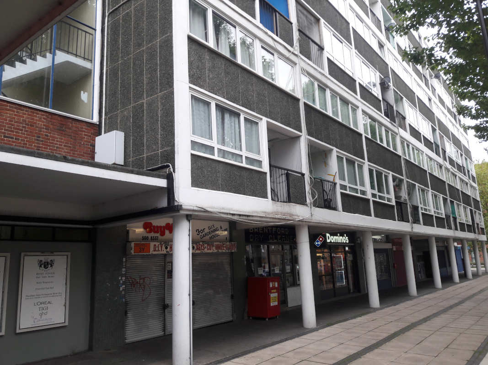

Circa 100 homes have been earmarked for demolition at Hounslow's Charlton House and Albany Parade in Brentford.

In January 2020, Hounslow's Cabinet [agreed a comprehensive review](https://democraticservices.hounslow.gov.uk/documents/s157644/CEX432%20Housing%20Estate%20Regeneration%20Programme.pdf) of its 171 council estates with a view to infill or redevelopment.

In the [Cabinet report](https://democraticservices.hounslow.gov.uk/documents/s157644/CEX432%20Housing%20Estate%20Regeneration%20Programme.pdf) it was agreed that six estates had already been identified as 'poor performing estates' and that these would be considered for early redevelopment.

The six estates are: the Brabazon estate; the Brookwood estate; Charlton House; the Convent Way estate; the Norman Crescent estate and the Oriel estate.

In March 2021, residents were balloted on the redevelopment of Charlton House, Albany House and Albany Parade. 87% of eligible residents voted in favour of the proposals.

Planning permission was granted in February 2023 for 209 new flats, which are to be 100% 'affordable'.

---

__Links:__  

Hounslow's [website](https://www.hounslow.gov.uk/news/article/2311/residents_overwhelmingly_voted_yes_to_the_exciting_plans_to_transform_their_estate)

---

<!------------THE CODE BELOW RENDERS THE MAP - DO NOT EDIT! ---------------------------->

---

 ![Charlton house estate image](src/images/ch2.jpg", "charlton house" %}
 ![Charlton house estate image](src/images/ch3.jpg", "charlton house" %}
 ![Charlton house estate image](src/images/ch4.jpg", "charlton house" %}
 ![Charlton house estate image](src/images/ch5.jpg", "charlton house" %}
 ![Charlton house estate image](src/images/ch6.jpg", "charlton house" %}