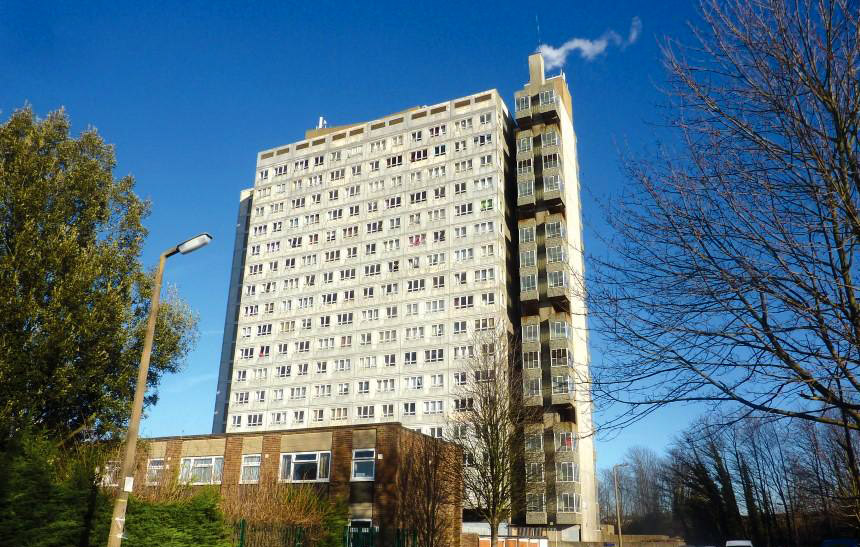
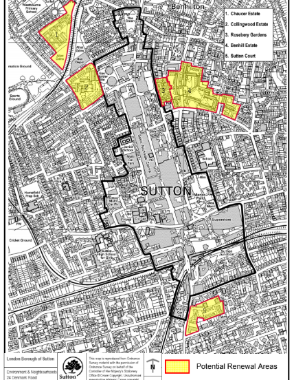
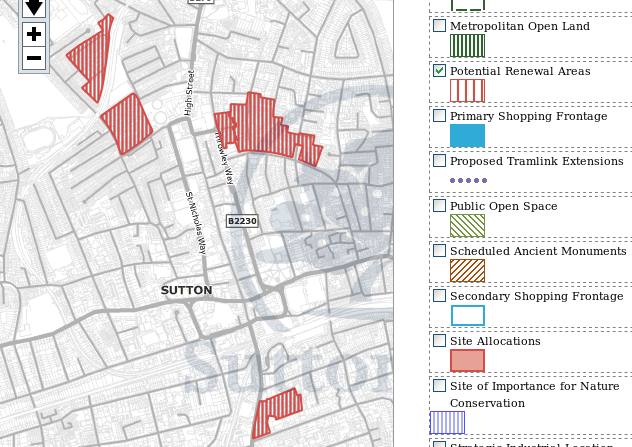

Circa 250 homes have been earmarked for potential demolition on Sutton's Chaucer Gardens estate.

The Chaucer estate comprises one 16-storey high-rise block (Chaucer House) surrounded by a dozen 2-4 storey maisonette blocks, situated behind Sutton High Street, near Collingwood park and West Sutton train station. 

In 2013, the high-rise block on the estate was clad with a light-blue Aluminium composite material. In 2017, after the investigations following the Grenfell disaster, it was [revealed](https://www.yourlocalguardian.co.uk/news/15387026.sutton-housing-partnership-sutton-council-and-sutton-fire-commander-meet-concerned-residents-living-in-chaucer-house-sutton/) that the cladding had failed safety tests.

In 2018, the Chaucer estate was one of seven estates listed in [Sutton's Local Plan (2018)](https://drive.google.com/file/d/1MdX6GlaHDoBdG6CTsvjFaIuPtIa9id5O/view) for potential redevelopment:

It is also earmarked in Sutton's [Policy Map](http://sutton.addresscafe.com/app/exploreit/) as a potential renewal area:

The nearby [Collingwood estate](/estates/sutton/collingwoodestate/) was clad with the same material and also numbers among the five estates earmarked for potential redevelopment.

The estate remains identified in Sutton's [draft 2024 Local Plan](https://www.sutton.gov.uk/documents/d/guest/local-plan-issues-and-preferred-options-2024-) as a site for redevelopment.

---

<!------------THE CODE BELOW RENDERS THE MAP - DO NOT EDIT! ---------------------------->

---

 ![Chaucer Gardens estate image](src/images/chaucer1.jpg", "chaucer gardens estate" %}
 ![Chaucer Gardens estate image](src/images/chaucer2.jpg", "chaucer gardens estate" %}
 ![Chaucer Gardens estate image](src/images/chaucer3.jpg", "chaucer gardens estate" %}
 ![Chaucer Gardens estate image](src/images/chaucer6.jpg", "chaucer gardens estate" %}
 ![Chaucer Gardens estate image](src/images/chaucer7.jpg", "chaucer gardens estate" %}

