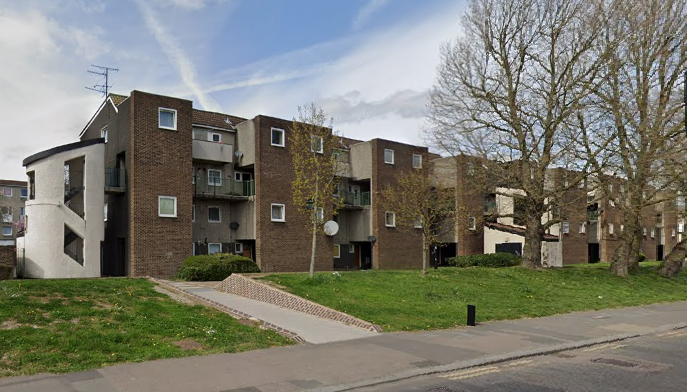
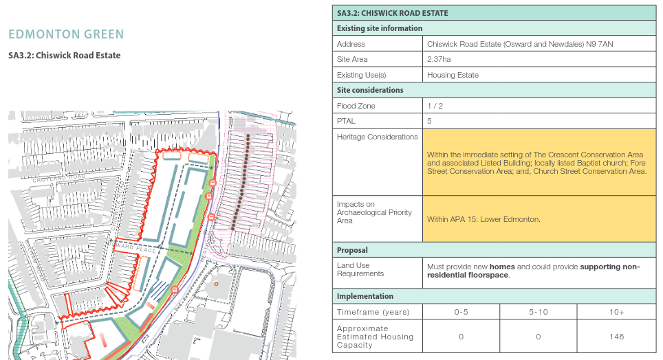

Circa 150 homes are under threat of demolition on the Chiswick Road estate in Enfield. The estate has been listed in Enfield's 2024 Local Plan [site allocations document](src/images/ELP-Appendix-C-Site-Allocations.pdf) as a potential site for redevelopment.

Whilst the site allocation suggests that development could simply comprise infill, it also suggests the possibility of partial redevelopment of the estate: 

---

## Links
Enfield's 2024 Local Plan [site allocations document](src/images/ELP-Appendix-C-Site-Allocations.pdf)

---

<!------------THE CODE BELOW RENDERS THE MAP - DO NOT EDIT! ---------------------------->

---

