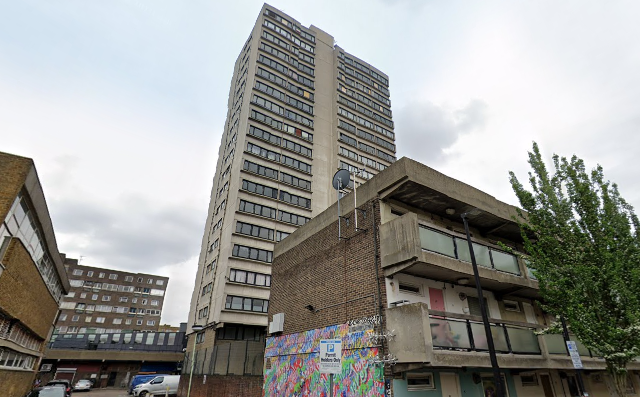

169 homes are under threat of demolition on the Lansbury estate in Bromley-by-Bow. 

The homes, managed by [Poplar Harca]() housing association have been earmarked for redevelopment as part of the Chrisp Street market regeneration scheme and include the LCC-built 20-storey Fitzgerald House.

Tower Hamlets issued a [Compulsory Purchase Order](https://www.towerhamlets.gov.uk/Documents/Chrisp-St-CPO/D26.-Signed-Site-Notice-02.02.2021.pdf) in 2021, which confirmed the buildings to be demolished in order to make way for the scheme:

Poplar Harca's [website for the scheme](https://www.poplarharca.co.uk/new-homes-regeneration/development-projects/project/chrisp-street-market/) says that the scheme will provide 761 new homes: 202 for affordable rent, 23 shared ownership and 536 private sale. 

Planning for the scheme was approved in 2018 but Poplar Harca's website says that the scheme _"is currently on pause while we make improvements to the plans to make sure they meet the Government’s new fire safety regulations."_

---

__Links:__

[GLA planning reports](https://planapps.london.gov.uk/planningapps/PA-22-01488)

<https://municipaldreams.wordpress.com/2013/08/20/the-lansbury-estate-poplar-part-2/>

---

<!------------THE CODE BELOW RENDERS THE MAP - DO NOT EDIT! ---------------------------->

---

