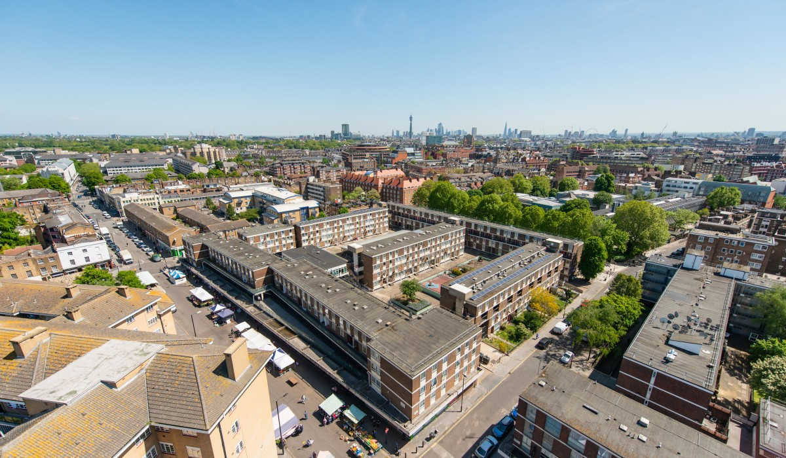
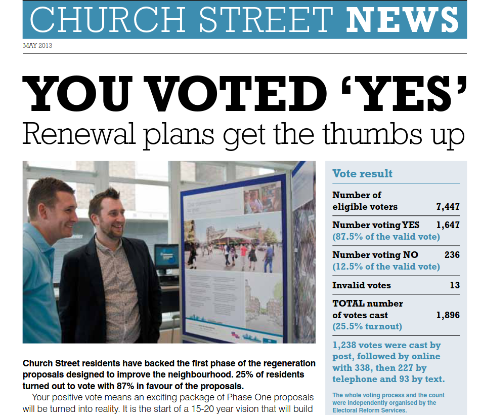
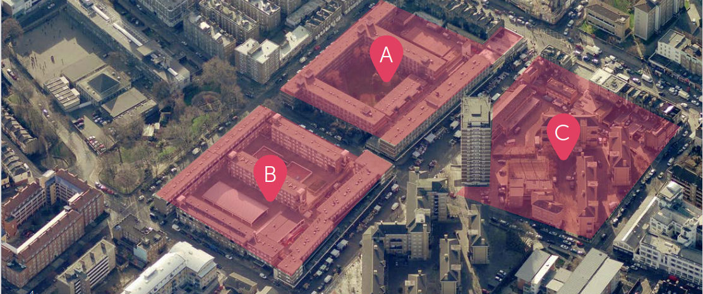
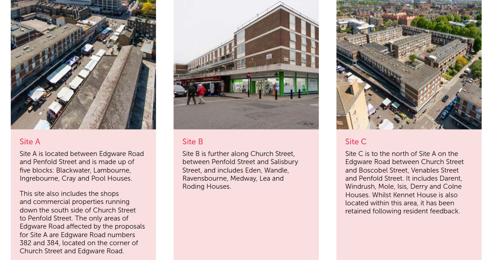

300 homes on three estates in Westminster's Church Street Area are under threat of demolition.

Church street Area is located in Maida Vale, situated beside the Regent's Canal and in close proximity of Regent's Park.
It was [designated](https://lbhf.maps.arcgis.com/apps/webappviewer/index.html?id=7cab3cdf6e344a0fb24df59ed6b9bdc5) as being situated within a __Housing Renewal__ zone in Westminster's [draft 2019-2040 Local Plan](https://www.westminster.gov.uk/cityplan2040).

It is also within the boundary of the __Edgeware Road Housing Zone__, one of [30 special housing zones](https://www.london.gov.uk/what-we-do/housing-and-land/increasing-housing-supply/housing-zones#acc-i-42741) designated by the Mayor to deliver accelerated housing development. The Edgeware Road zone is expected to deliver 1700 new homes of which this site will provide 1167. 

Residents of Westminster's [Church street](https://www.estatewatch.london/estates/westminster/churchstreet/) estate were [balloted](https://www.estatewatch.london/images/church_street_news_may.pdf) in 2013, with 87% of eligible residents voting in favour of redevelopment - albeit only 25% of residents turned out for the vote.

The scheme underlying the ballot was then shelved in 2015 a new masterplan was drawn up. In 2018, Westminster Council announced that it would not be holding any more ballots for further phases of the scheme. This was met by [protest](https://www.westminsterextra.co.uk/article/council-chiefs-at-war-with-mayor-khan-over-estate-demolition-vote) from the Mayor who threatened to withdraw £23m of funding.

After a change of administration, residents were balloted again in December 2022. 73% of residents voted in favour of the scheme but it is not known how many turned out for the ballot.

The 400 homes under threat are located in what has been labelled sites A, B and C:

A planning application was approved in 2023 for demolition of the existing homes and construction of up to 1,120 new homes of which 50% 'affordable'.

In February 2021, Westminster Council came under fire after it was [reported](https://londonnewsonline.co.uk/residents-petrified-that-housing-development-could-destroy-businesses/) that retailers had been served with notices to quit in the next phase of the Council's redevelopment of the [Church Street area estates](https://estatewatch.london/estates/westminster/churchstreet/).

In February 2024, Westminster appointed Mount Anvil as developers for phase 1 of the scheme. The Council's [website](https://www.westminster.gov.uk/news/westminster-approves-partner-first-phase-church-street-regeneration) says: _"A total of 429 new homes will be built at Site A, 171 of which will be for social rent including the reprovision of 98 that were existing at social rent levels."_

Westminster's [policy for leaseholder re-housing](https://www.westminster.gov.uk/housing-policy-and-strategy/leaseholder-policy-housing-renewal-areas) requires leaseholders to take out a new mortgage if they want to take up the Council's shared equity offer on a new home being built as part of the scheme. 

---

__Links:__
Westminster Council has a [dedicated website](https://churchstreet.org/) for the Church Street regeneration.

[Pre-application consultation booklet](https://churchstreet.org/assets/Documents/140_55-WCC-Church-Street-ABC-consultation-stage-2_Booklet_web_AW2.pdf)

[Resident consulation report](https://churchstreet.org/assets/Documents/Church-St-Consultation-Report.pdf)

[Planning application documents, ref:021/08160/COOUT](https://idoxpa.westminster.gov.uk/online-applications/applicationDetails.do?activeTab=documents&keyVal=R3DM1ZRP02T00)

Westminster's [Landlord Offer](/images/ChurchStreetLandlordOffer.pdf) to residents ahead of the 2022 ballot.

---

<!------------THE CODE BELOW RENDERS THE MAP - DO NOT EDIT! ---------------------------->

---
