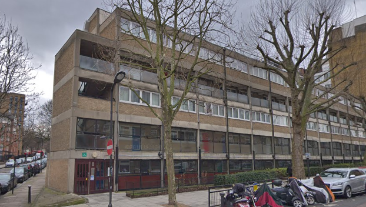
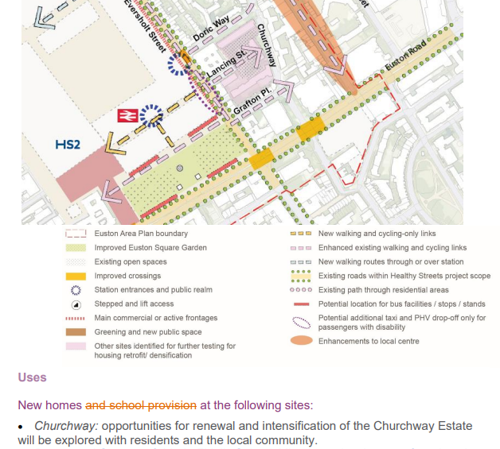

Circa 180 homes are earmarked for potential demolition on Camden's Church Way estate near Euston Station.

The estate has been identified in Camden's [draft Euston Area Plan](https://camden.moderngov.co.uk/mgConvert2PDF.aspx?ID=128529) and says that residents are being consulted on options for the future of the estate:

---

<!------------THE CODE BELOW RENDERS THE MAP - DO NOT EDIT! ---------------------------->

---
