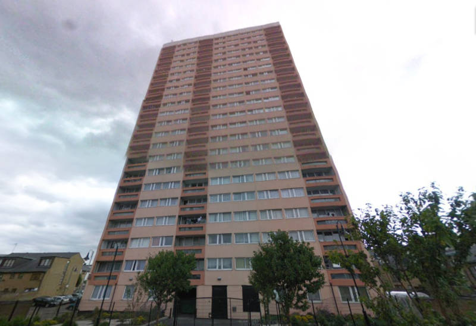

Clare House is a 22-storey tower block with 129 flats in Tower Hamlets. It was built in 1968 using the Long Panel System (LPS) construction method. It was originally one of a group of three identical towers that previously formed part of the Monteith Road Estate. The other two blocks were demolished in 2002 as part of a regeneration masterplan.

The Ronan Point collapse in 1968 showed that some LPS systems were unsafe, but successive governments failed to ensure strengthening works were carried out. Investigations following the Grenfell Tower fire have resulted in several LPS buildings being deemed unsafe, for example the [Ledbury estate](https://www.estatewatch.london/estates/southwark/ledbury/) in Southwark.

Clare House was also found to have been cladded with combustible materials during a refurbishment in the mid 2000's. On the basis of an undisclosed fire safety report, landlord Clarion Housing Association announced the imminent evacuation of the building in September 2021. 

In October 2024, Clarion applied for permission to demolish the block and replace it with a development, consisting of two part four and part five storey buildings alongside a central 27-storey tower, and would provide 145 new social rent flats.

---

__Links:__  
[Clarion's website - https://www.myclarionhousing.com/my-community/regeneration-projects/clare-house-tower-hamlets](https://www.myclarionhousing.com/my-community/regeneration-projects/clare-house-tower-hamlets)

[2024 Planning application supporting documents](https://development.towerhamlets.gov.uk/online-applications/applicationDetails.do?activeTab=documents&keyVal=DCAPR_146314) (ref:PA/24/01755/A2)

---

<!------------THE CODE BELOW RENDERS THE MAP - DO NOT EDIT! ---------------------------->

---