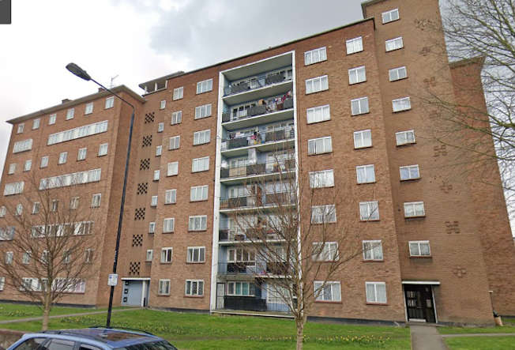
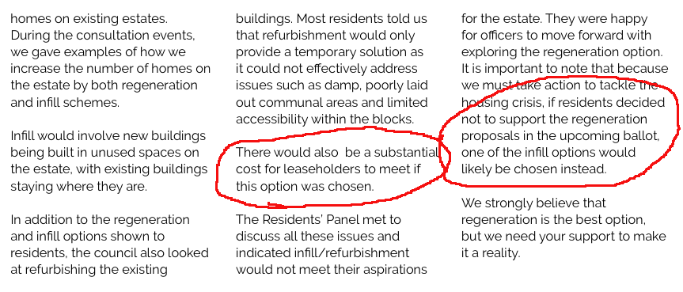
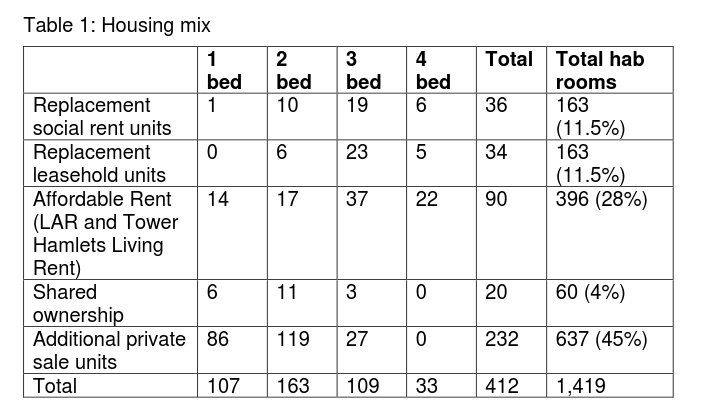
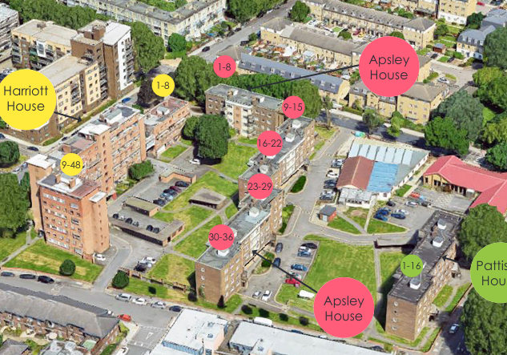

Circa 100 homes on Stepney's Clichy estate have been [earmarked for demolition earmarked for redevelopment](https://www.towerhamlets.gov.uk/lgnl/council_and_democracy/consultations/Housing-consultations/HAP_Houses.aspx) by Tower Hamlets Council.

In April 2020, the ballot of 'eligible' residents on Stepney's [Clichy estate](https://estatewatch.github.io/estates/towerhamlets/clichyestate/) went ahead despite [consultation sessions being cancelled due to the Coronavirus](https://www.towerhamlets.gov.uk/lgnl/council_and_democracy/consultations/Housing-consultations/HAP_Houses.aspx) and resulted in a 98% vote in favour of redevelopment on a [90% turnout](https://www.housingtoday.co.uk/news/tower-hamlets-estate-regeneration-plan-wins-resident-approval/5105879.article).

Residents had previously been consulted on an 'infill' option as well as full redevelopment. But the [info pack](https://www.whatdotheyknow.com/request/clichy_estate_ballot_paper_accom?nocache=incoming-1565802#incoming-1565802) sent to residents with the ballot papers asked only whether they wanted full redevelopment or not. Leaseholders were [told](https://www.whatdotheyknow.com/request/658746/response/1565802/attach/4/Ballot%20information%20requested%201.pdf) if they voted against redevelopment then they would be faced with major bills. Residents were told that if they don't vote for full redevelopment then they will likely be faced with the infill option anyway:  

*Extract from the <a href="https://www.whatdotheyknow.com/request/658746/response/1565802/attach/4/Ballot%20information%20requested%201.pdf">info-pack</a> sent to residents with the ballot paper.*

The appointed architects <a href="https://www.prp-co.uk/">PRP</a> drew up plans for the redevelopment, which were approved by Newham's planning committee in April 2022.

The Mayor's [stage 2 report](https://planapps.london.gov.uk/planningapps/PA-21-02703) confirms that of the 412 new homes approved, only 36 will be social rent. A further 90 will be affordable rent up to Tower Hamlets Living Rent levels (around twice as much as social rent), 20 will be shared ownership and the remainder private for sale homes.

Newham's [rehousing offer](https://mgov.newham.gov.uk/documents/s144070/Appenidx%201%20-%20LBN%20Estate%20Regeneration%20Housing%20Offer%20the%20Housing%20Offer.pdf) promises a new council home at the same rent level to secure tenants. Temporary tenants will be offered a secure tenancy on the redeveloped estate but will be charged an 'affordable rent':  

_'Your rent will be an affordable rent, in accordance with the definitions set by the Mayor of London._'

The policy for leaseholders is less clear:

The Landlord Offer says:
_"You will be offered a range of options to continue to own a new home in the Custom House Phase One area, depending on your financial circumstances._"

Whilst both shared ownership and shared equity are both listed as possible options, small print in the Council's policy says:
_"Eligibility criteria will be worked out via co-production within the legal powers available to the Council."_

This leaves the door open to Newham 'gatekeeping' the shared equity offer as has been seen in other schemes where leaseholders are required to undergo a financial assessment and are subsequently told that they don't qualify for shared equity and are offered only shared ownership (i.e. paying rent on the unowned part of their homes.)

---

__Links:__
GLA Stage 1 report:
[https://gla.force.com/pr/s/planning-application/a0i4J000006cArbQAE/20211263?tabset-c2f3b=2](https://gla.force.com/pr/s/planning-application/a0i4J000006cArbQAE/20211263?tabset-c2f3b=2)

The Mayor's [stage 2 planning report](https://planapps.london.gov.uk/planningapps/PA-21-02703)

---

<!------------THE CODE BELOW RENDERS THE MAP - DO NOT EDIT! ---------------------------->

---

