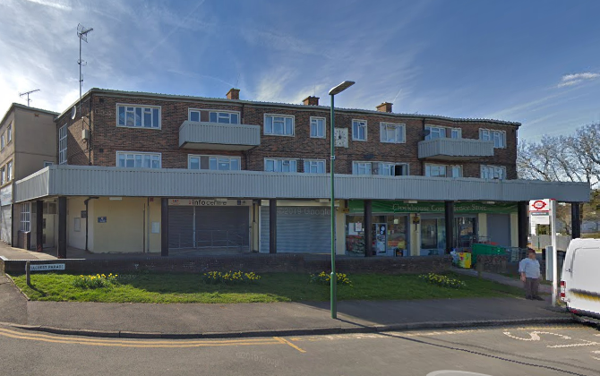
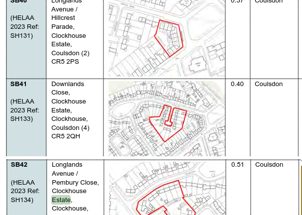

Circa 50 council homes have been earmarked for potential redevelopment on Sutton's Clockhouse estate in Coulsdon.

The estate has been identified in Sutton's [draft 2024 Local Plan](https://www.sutton.gov.uk/documents/d/guest/local-plan-issues-and-preferred-options-2024-) as a potential site for redevelopment.

---

<!------------THE CODE BELOW RENDERS THE MAP - DO NOT EDIT! ---------------------------->

---