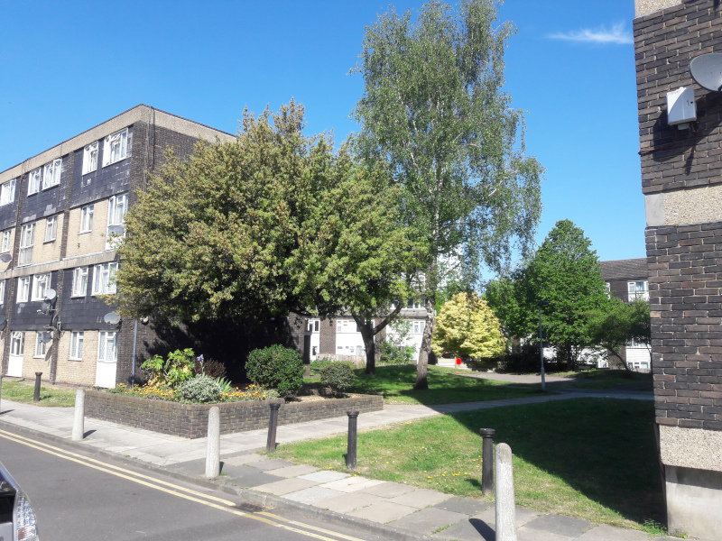
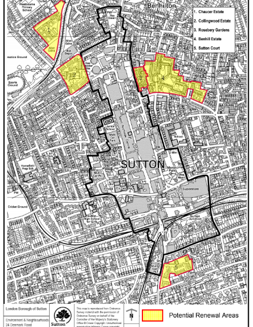
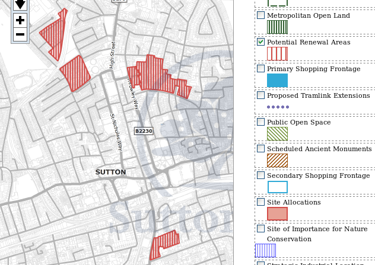
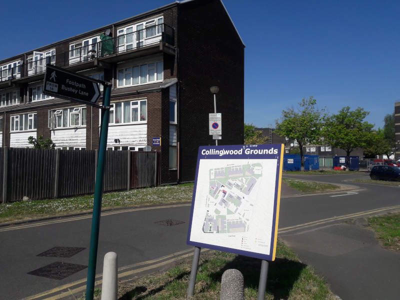
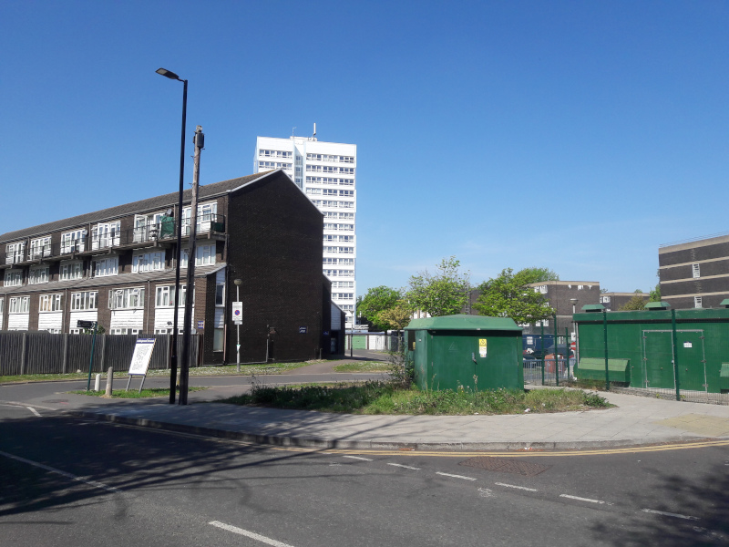
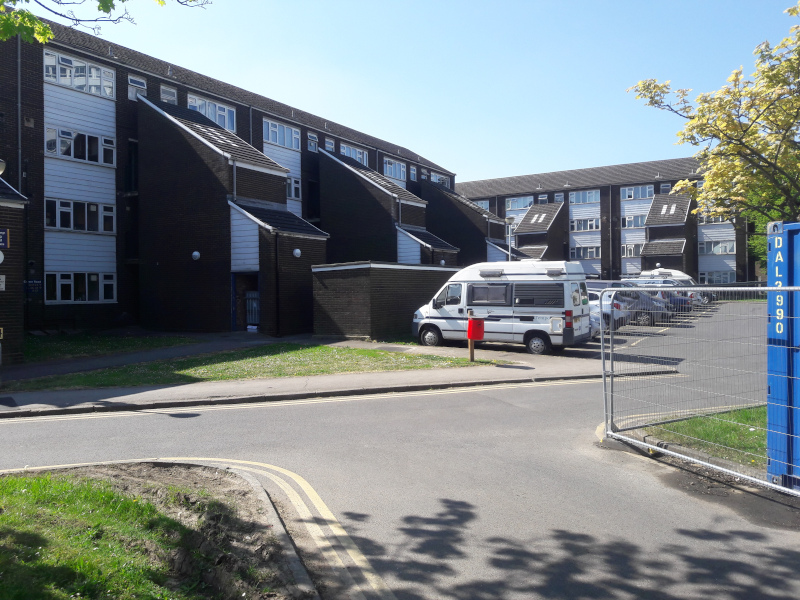
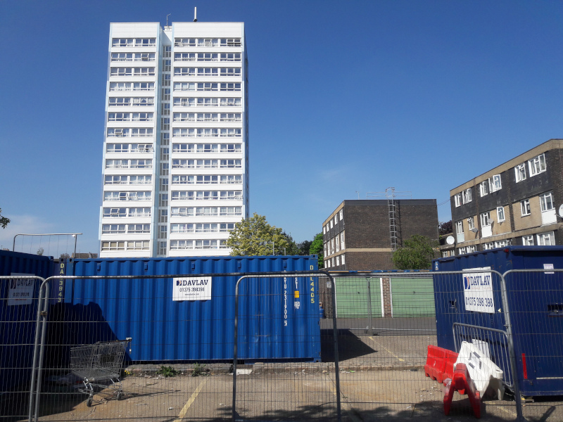
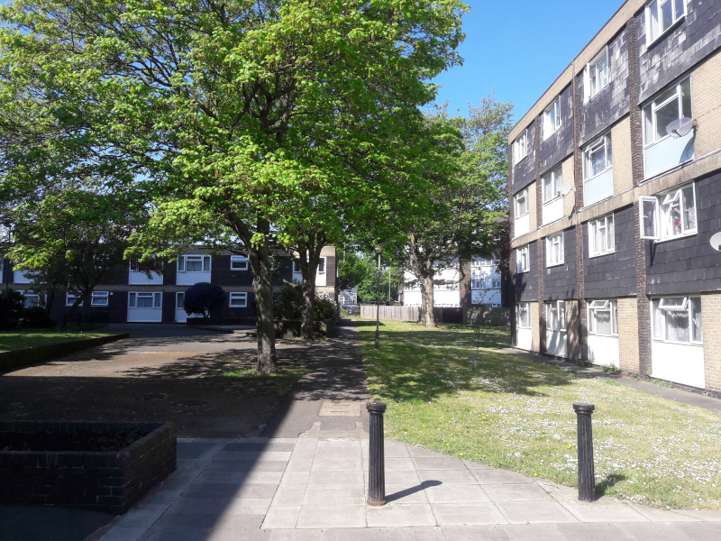
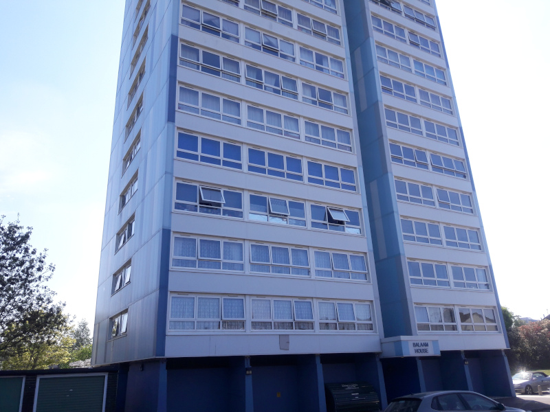
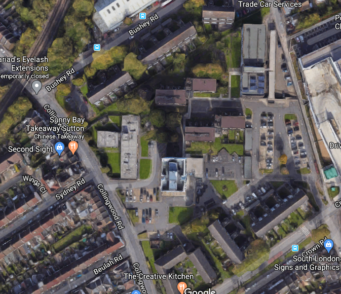

Circa 250 homes are under threat of potential demolition on Sutton's Collingwood estate.

The Collingwood estate comprises one high-rise block surrounded by a dozen 4-6 storey maisonette blocks, situated behind Sutton High Street, near Collingwood park and West Sutton train station. 

In 2013, the high-rise block on the estate (Balaam House) was clad with a light-blue aluminiumn composite material. In 2017, following the investigations as a result of the Grenfell disaster, it was [revealed](https://www.yourlocalguardian.co.uk/news/15372936.we-feel-so-unsafe-sutton-tower-block-residents-at-balaam-house-say-they-are-living-in-fear-after-grenfell-to/) that the cladding had failed safety tests.

In 2018, the Collingwood estate was one of seven estates listed in [Sutton's Local Plan (2018)](https://drive.google.com/file/d/1MdX6GlaHDoBdG6CTsvjFaIuPtIa9id5O/view) for potential redevelopment:

It is also earmarked in Sutton's [Policy Map](http://sutton.addresscafe.com/app/exploreit/) as a potential renewal area:

The nearby [Chaucer estate](/estates/sutton/chaucerestate/) was clad with the same material and has also been listed as one of Sutton's five estates earmarked for renewal.

The estate remains identified in Sutton's [draft 2024 Local Plan](https://www.sutton.gov.uk/documents/d/guest/local-plan-issues-and-preferred-options-2024-) as a site for redevelopment.

---

<!------------THE CODE BELOW RENDERS THE MAP - DO NOT EDIT! ---------------------------->

---

 

