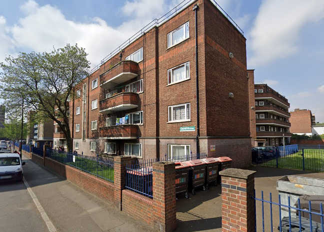

Circa 200 homes remain earmarked for demolition on Hackney's Colville estate.

The estate is situated between the Regents canal to the North and Shoreditch Park to the South. It originally comprised 432 homes around half of which have now been demolished.

Phases 1, 2 and 3 of the scheme are nearing completion. At the end of 2023, Hackney announced that it was revising the masterplan for the remaining phases 4-7 of the redevelopment.

> "The Masterplan for Colville was originally put together in 2012. Since then, a lot has changed both within the borough and the industry and we now need to work with our design team to bring the masterplan up-to-date for the remaining Phases 4-7 which cover all of the remaining older blocks.

The scheme is being [funded](https://www.london.gov.uk/programmes-strategies/housing-and-land/homes-londoners/estate-regeneration/estate-regeneration-data) by the Mayor and [exempted](https://www.london.gov.uk/programmes-strategies/housing-and-land/homes-londoners/estate-regeneration/estate-regeneration-data) from his requirement to ballot residents on the demolition of their homes.

In August 2019, it was [reported](https://www.hackneygazette.co.uk/news/bridport-house-tenants-told-hoxton-block-could-be-demolished-rather-than-repaired-1-6243329) that one of the first buildings completed in the regeneration may be demolished because of structural defects.

Hackney Council subsequently decided on remediation works which are estimated to cost £6m. In January 2022, it was [reported](https://www.insidehousing.co.uk/news/news/london-council-warns-all-options-remain-open-to-recoup-costs-on-defect-ridden-block-as-repairs-start-73949) that the Council is considering legal action to recover the cost of these works.

Hackney's [web page](https://hackney.gov.uk/colville-estate) for the scheme says that _"the masterplan needs updating to ensure it reflects the needs of the community and new building standards. Working with Colville Estate residents on the Regeneration Steering Group, we’ve appointed a new design team to work with us and residents to update the masterplan. Design work began in 2024."_

---

<!------------THE CODE BELOW RENDERS THE MAP - DO NOT EDIT! ---------------------------->

---
