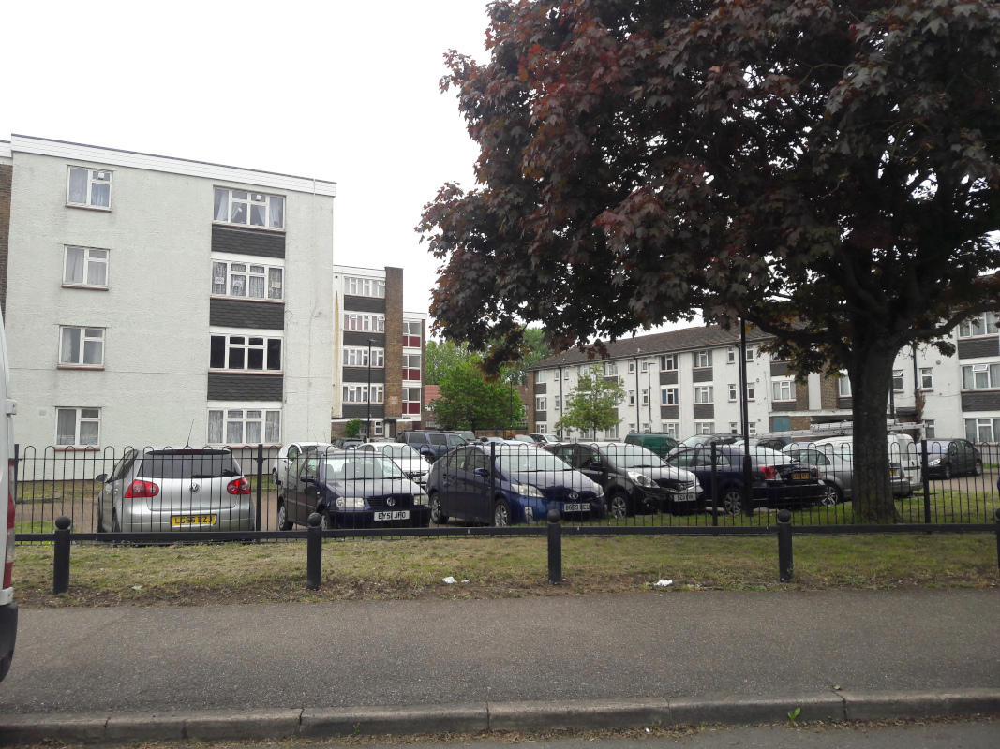
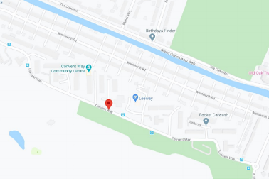
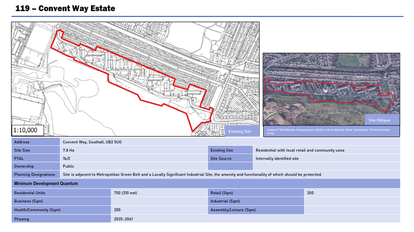
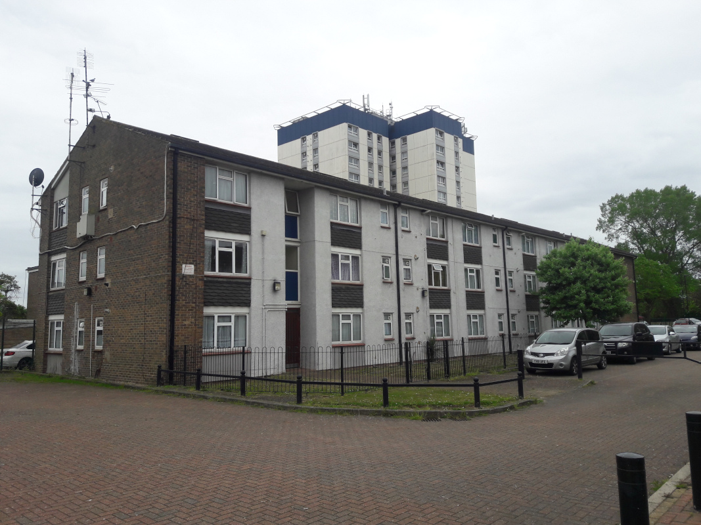
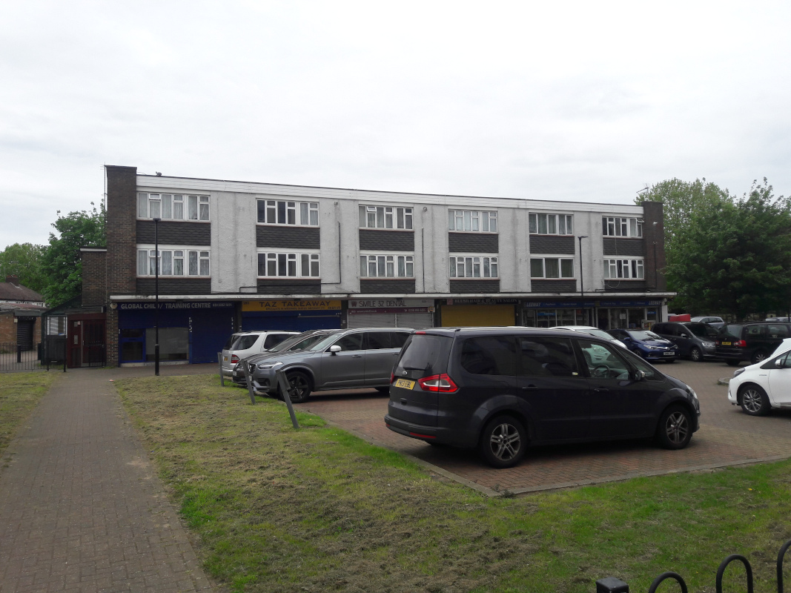

440 homes are earmarked for demolition on Hounslow's Convent Way estate.

In January 2020, Hounslow's Cabinet [agreed a comprehensive review](https://democraticservices.hounslow.gov.uk/documents/s157644/CEX432%20Housing%20Estate%20Regeneration%20Programme.pdf) of its 171 council estates with a view to infill or redevelopment.

In the [Cabinet report](https://democraticservices.hounslow.gov.uk/documents/s157644/CEX432%20Housing%20Estate%20Regeneration%20Programme.pdf) it was agreed that six estates had already been identified as 'poor performing estates'. 

The six estates are: the Brabazon estate; the Brookwood estate; Charlton House; the Convent Way estate; the Norman Crescent estate and the Oriel estate.

The Convent Way estate was identified as the most likely of these 'poor performing estates' that would benefit from early regeneration.

The estate was originally built in 1967. It comprises of one 12 storytower block, 16 medium rise (3 to 5 storey) blocks. In total the estate comprises 440 homes. In addition, the estate contains a health centre, community centre, and a small shopping parade.

The Council's [2020 Cabinet report](https://democraticservices.hounslow.gov.uk/documents/s157644/CEX432%20Housing%20Estate%20Regeneration%20Programme.pdf) explains that the estate was chosen after an audit showed it faced increasing bills for maintenance as well as concerns over nuisance behaviour like fly-tipping.

In April 2021, Hounslow started [consulting](https://haveyoursay.hounslow.gov.uk/housing/conventfeedback/) on its [Landlord Offer](/images/Landlord_Offer_Convent_Way.pdf) to residents ahead of an expected ballot.

85% of residents subsquently voted in favour of redevelopment. It is not known how many residents turned out for the vote.

A planning application was approved in 2022 for 967 new homes of which 50% affordable rent (up to 80% market rent). All of the new homes are proposed to be constructed to Passive House standards.

As of October 2024, the planning application doesn't appear to have yet been implemented. The estate is listed in Hounslow's [2024 Local Plan Review](https://lbhounslow.sharepoint.com/sites/InternetLinks/pp/Shared%20Documents/Forms/AllItems.aspx?id=%2Fsites%2FInternetLinks%2Fpp%2FShared%20Documents%2FOther%20%28NOT%20on%20website%29%2FReg%2019%20Local%20Plan%202020%2D2041%20Site%20Allocations%20for%20consultation%20link%20from%20interactive%20Local%20Plan%2FHounslow%20Local%20Plan%202020%2D2041%20Chapter%2012%20%2D%20Site%20Allocations%20%28Reg%2019%29%2Epdf&parent=%2Fsites%2FInternetLinks%2Fpp%2FShared%20Documents%2FOther%20%28NOT%20on%20website%29%2FReg%2019%20Local%20Plan%202020%2D2041%20Site%20Allocations%20for%20consultation%20link%20from%20interactive%20Local%20Plan&p=true&ga=1) as estimated phasing 2035-41.

---

<!------------THE CODE BELOW RENDERS THE MAP - DO NOT EDIT! ---------------------------->

---

