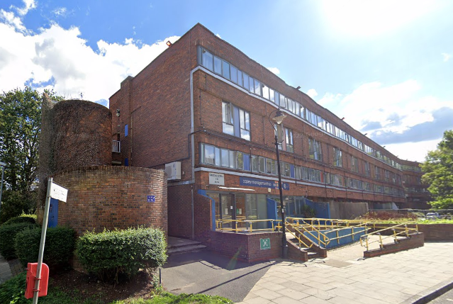
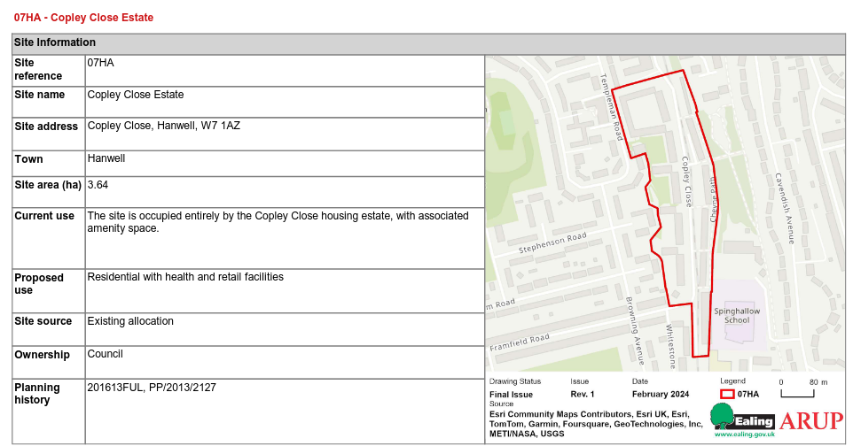

Originally consisting of 636 homes, Copley Close is a 1km long 1970’s estate in Hanwell, Ealing.
Ealing council are, as of 2026, midway through carrying out a major regeneration of Copley Close.

The overarching regeneration project aims to build 279 new homes and refurbish 469 others over the course of 7 phases through partial demolition and infill. 
As of Feb 2026, phases 1, 2, 3, 4 and 6 are completed, with 5 still in progress and 7 having been paused.

A 2023 Council [report](https://ealing.moderngov.co.uk/documents/s6352/SP4%20-%20Chairs%20Site%20Visit%20Feedback%20-%20Appendix%202.pdf) suggests that at least some of the new homes have been let to key workers at Discounted Market Rent (ie. up to 80% market rent) rather than social rent.

Phase 7 (refurbishment of 333 existing flats and construction of six new homes) is unlikely to be affordable within the council’s current budget ([as highlighted in recent reports](https://ealing.moderngov.co.uk/documents/s18496/Housing+Development+and+Regeneration+Report+to+Scrutiny.pdf)) and has thus been put into dormancy pending review.

As such, redevelopment has now been listed as an option in the [2024 Local Plan](https://www.ealing.gov.uk/download/downloads/id/19587/appendix_e_-_results.pdf) site allocation and the final decision has yet to be made as to whether to continue with phase 7's original plan to refurbish the existing flats, or to instead demolish them and redevelop the site.

It is not known if residents have been made aware of the 2024 designation.

Full detials on the other phases of the project are listed below:

**Phase 1 Worcester Court:** Construction of 5 new build houses and refurbishment of 18 flats. _Completed in December 2016_

**Phase 2 Alton Court:** 33 new‐build homes for private sale and shared ownership on the site of former Anglesey Court. _Practical completion achieved in January 2018_

**Phase 3 Warwick Court:** 3 new‐build flats and 18 refurbished flats._ Completed in 2025_

**Phase 4 Copley Central:** 2 new‐build houses and 29 new flats located on and around the site of the former warden’s flat (86a & b Copley Close). _Completed in February 2019_

**Phase 5 Copley Central Refurbishment:** 100 flats – 67 tenanted and 33 leasehold. Blocks in this phase are: Denbigh, Devon, Dorset, Glamorgan and Gloucester Courts. _Work on this is in progress as of 2026_

**Phase 6 Copley Central:** Construction of 201 new build homes on the site of Hereford and Merrioneth Courts. _Completed summer 2023_

**Phase 7 Greater Copley:** The existing plan is for 6 new-build homes, plus the refurbishment of 333 flats at Monmouth, Oxford, Paddington, Pembroke, Radnor, Shropshire, Somerset and Stafford courts. _Currently dormant as of 2026_

---

<!------------THE CODE BELOW RENDERS THE MAP - DO NOT EDIT! ---------------------------->

---
