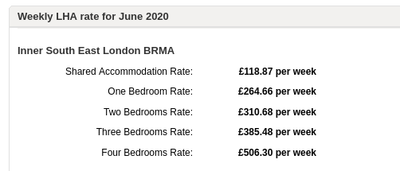

306 homes are earmarked for demolition on Lambeth's Cressingham Gardens estate at Brockwell Park.

In 2016, Lambeth Council [took the decision](https://moderngov.lambeth.gov.uk/documents/s80093/Cabinet%20Report%20-%20March%202016%20v8.pdf) to demolish the estate based on fact that refurbishment estimates were £14,000 higher per dwelling than the rest of its estates and this represents 'poor value for money':

Lambeth also claims that the redevelopment of the estate will result in the provision of more 'affordable' housing to address the housing crisis. It plans to reprovide the existing council homes and provide an extra 27 at council rent plus a further 48 at 'no higher than LHA rates':

[LHA rates for Lambeth](https://lha-direct.voa.gov.uk/SearchResults.aspx?LocalAuthorityId=22&LHACategory=999&Month=6&Year=2020&SearchPageParameters=true) are currently as follows:

The estate is one of [four estates](/underthreat/lambeth/) earmarked for demolition in Lambeth's estate renewal programme.

The estate was initially awarded grant funding by the Mayor and exempted from his requirement to ballot residents. In September 2020, the Mayor announced that funding had been [withdrawn from the scheme](https://www.insidehousing.co.uk/news/news/gla-funding-withdrawn-for-three-major-council-estate-regeneration-schemes-68045), but Lambeth vowed to proceed with demolition regardless using its own funds.

There is an active [campaign group](https://savecressingham.wordpress.com) created by residents on the estate. In 2016 they launched ['Cressingham People's Plan - http://cressinghampeoplesplan.org.uk/](http://cressinghampeoplesplan.org.uk/) which offers a viable alternative to demolition.

In July 2019, they [had their application approved](http://www.brixtonbuzz.com/2019/07/cressingham-gardens-residents-win-right-to-transfer/) for the Right To Transfer (RTT) ownership of the estate into a community-owned company outside of council control.

Lambeth's [shared equity](https://moderngov.lambeth.gov.uk/documents/s87368/Appendix%20A2%20-%20HOMEOWNERS%20v5%20B.pdf) offer for leaseholders requires a minimum 60% equity, which may result in them having to invest personal savings or take out mortgages. This was [deemed unlawful](https://www.theguardian.com/society/2016/sep/16/government-blocks-controversial-plan-to-force-out-housing-estate-residents) by the Secretary of State at the 2015 Aylesbury estate CPO inquiry and required Southwark to [amend its policy](http://moderngov.southwarksites.com/documents/s74901/Report%20Amending%20the%20shared%20equity%20rehousing%20policy%20for%20qualifying%20homeowners%20affected%20by%20regenerati.pdf) and reduce the requirement from 50% to 25%.

In early 2023, Lambeth Council announced that is was pausing the redevelopment of Cressingham Gardens and two other estates (Fenwick and Central Hill) after a critical report recommended a ‘fundamental reset’ to the way it handles the long-running projects.

In September 2024, Lambeth published a report highlighting the Council’s plans to reset key estate renewal projects and regain control of properties previously under HfL’s management.

The Kerslake Review, which took place in December 2022, was a pivotal moment for the Council’s housing strategy.

Two primary recommendations emerged: first, to dissolve Homes for Lambeth and return the Council’s social housing delivery to in-house management, and second, to address long-standing failures in engaging with residents.

These recommendations have led to a fundamental reshaping of Lambeth’s estate regeneration plans, effectively putting many estates back to square one.

The Overview and Scrutiny report indicates that estates such as Central Hill, Cressingham Gardens, and Fenwick are facing a complete reset.

---

__Links:__

[Save Cressingham campaign website - https://savecressingham.wordpress.com](https://savecressingham.wordpress.com)

[Lambeth Cabinet report 21 March 2016](https://moderngov.lambeth.gov.uk/documents/s80093/Cabinet%20Report%20-%20March%202016%20v8.pdf)

---

<!------------THE CODE BELOW RENDERS THE MAP - DO NOT EDIT! ---------------------------->

---
