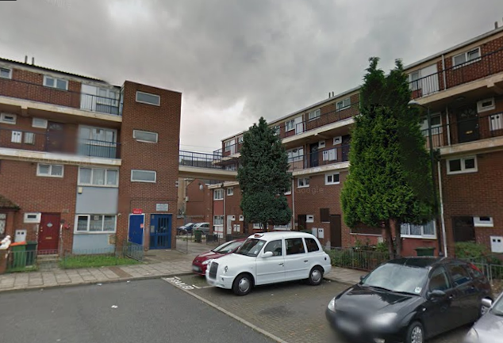
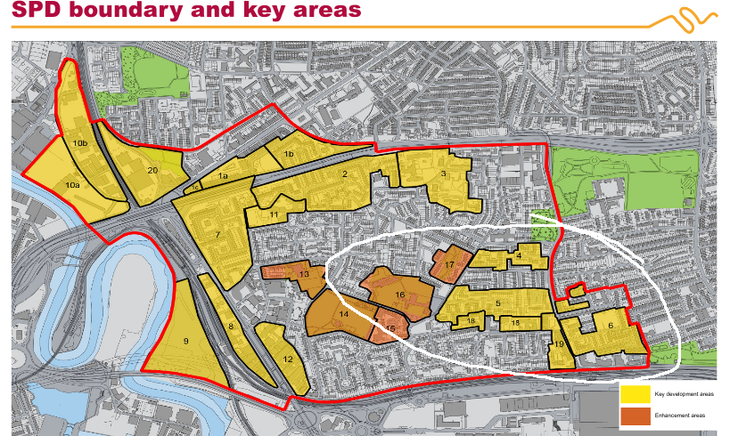
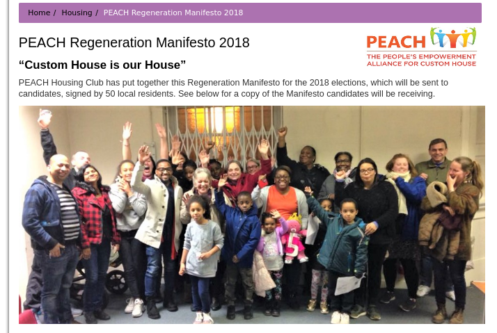
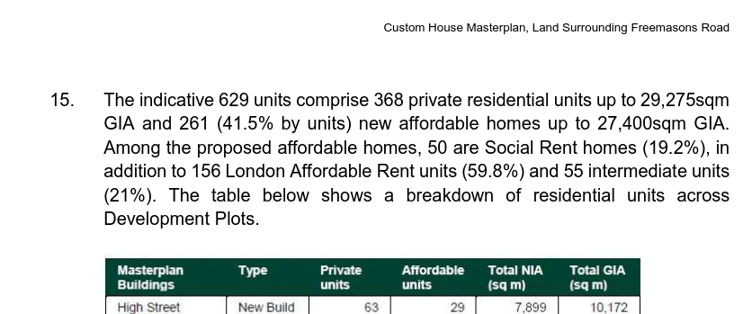
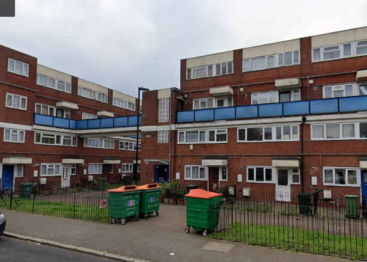
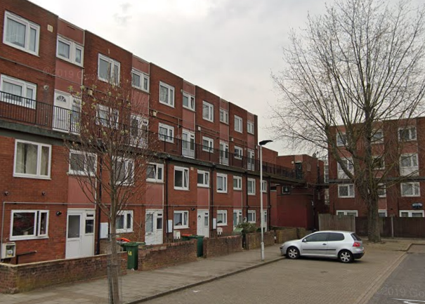

Circa 300 homes remain under threat of demolition as part of Newham's regeneration of the Custom House area.

A number of council estates were earmarked for redevelopment in Newham's [Custom House & Canning Town regeneration masterplan](https://www.newham.gov.uk/Documents/Environment%20and%20planning/CanningTownCustomHouseAdoptedSPD2008%5B1%5D.pdf), which set out 20 development sites.

The Canning Town side of the scheme is nearing completion but the Custom House estates are yet to be redeveloped. These are marked out on the South-west corner of the masterplan map below.

[This July 2019 update](https://www.newham.gov.uk/Documents/Environment%20and%20planning/CustomHouseRegenerationFAQs.pdf) from Newham confirms that the Council is in the process of rehousing tenants from Area 6 and Area 9 but that Areas 4,5 and 18 will not be decanted in the short term. 

In February 2017, Area 16 (previously designated for enhancement) was [designated](https://www.newham.gov.uk/Documents/Environment%20and%20planning/LPRIssuesOptionPart2.pdf) as an extension to the Area 5 development site.

In 2018, the [PEACH group - Peoples Empowerment Alliance for Custom House](http://www.peach-e16.org.uk) launched its own [regeneration manifesto](http://www.peach-e16.org.uk/index.php/housing/109-peach-regeneration-manifesto-2018) for the regeneration of the Custom House area:

There is a detailed chapter written about the PEACH group's involvement in the regeneration included in a book [published](https://www.uclpress.co.uk/products/125696) under the title: 'Community-led regeneration, a toolkit for residents and planners'

Newham's [rehousing offer](https://mgov.newham.gov.uk/documents/s144070/Appenidx%201%20-%20LBN%20Estate%20Regeneration%20Housing%20Offer%20the%20Housing%20Offer.pdf) promises a new council home at the same rent level to secure tenants. Temporary tenants will be offered a secure tenancy on the redeveloped estate but will be charged an 'affordable rent':  

_'Your rent will be an affordable rent, in accordance with the definitions set by the Mayor of London._'

The policy for leaseholders is less clear:

The Landlord Offer says:
_"You will be offered a range of options to continue to own a new home in the Custom House Phase One area, depending on your financial circumstances._"

Whilst both shared ownership and shared equity are both listed as possible options, small print in the Council's policy says:
_"Eligibility criteria will be worked out via co-production within the legal powers available to the Council."_

This leaves the door open to Newham 'gatekeeping' the shared equity offer as has been seen in other schemes where leaseholders are required to undergo a financial assessment and are subsequently told that they don't qualify for shared equity and are offered only shared ownership (i.e. paying rent on the unowned part of their homes.)

The estate's 'eligible' residents were balloted in December 2022 and a turnout of 62 percent saw just 53 percent of these vote ‘yes’ to demolition, while 47% voted against. 

In Autumn 2023, The Custom House Strategic Masterplan was approved by Tower Hamlets' planning committee, comprising four of the five sub-phases of the scheme (phases 2-5).

The application [approved](https://www.newham.gov.uk/news/article/1164/356-new-affordable-homes-approved-as-part-of-custom-house-regeneration-plans) the demolition of 116 existing homes, not including those already demolished at May Wynne House and the [construction](https://mgov.newham.gov.uk/documents/s168418/Custom%20House%20COMPLETE.pdf) of 629 new mixed-tenure homes of which just 50 social rent.

In August 2024, a ballot was held for the next phase of the scheme. This [resulted](https://www.romfordrecorder.co.uk/news/24494103.canning-town-estate-redevelopment-gets-resident-backing/) in 69% of residents voting in favour of demolition on a 56% turnout.

In January 2025, it was [announced](https://www.pilc.org.uk/blog/custom-house-resident-takes-mayor-to-high-court/) that a legal challenge has been made against the planning consent. This challenge claims that _"These plans will result in the unnecessary demolition of council homes set at social and council rents, replacing them with “ affordable rent” homes under the guise of ‘social homes’."_ The case will be heard in the High Court and will address a number of issues including:

* the social and environmental costs of the proposed demolition;  

* the potential loss of social rent homes, referencing an FOI response showing higher right-of-return figures than those recorded by the Local Planning Authority; 

* the decades of uncertainty faced by temporary tenants like the Claimant and 

* problems with the resident ballot process. 

---

__Links:__
Newham Council's dedicated website for the Custom House scheme [(https://www.customhousee16.com)](https://www.customhousee16.com).

[Planning Committee report](https://mgov.newham.gov.uk/documents/s168418/Custom%20House%20COMPLETE.pdf)

---

<!------------THE CODE BELOW RENDERS THE MAP - DO NOT EDIT! ---------------------------->

---

