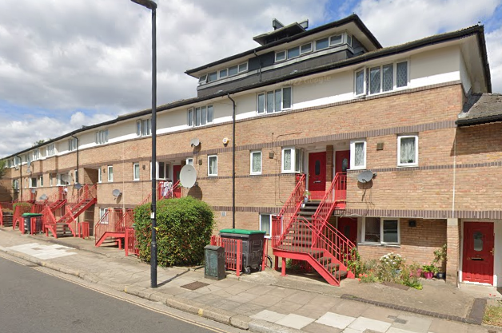
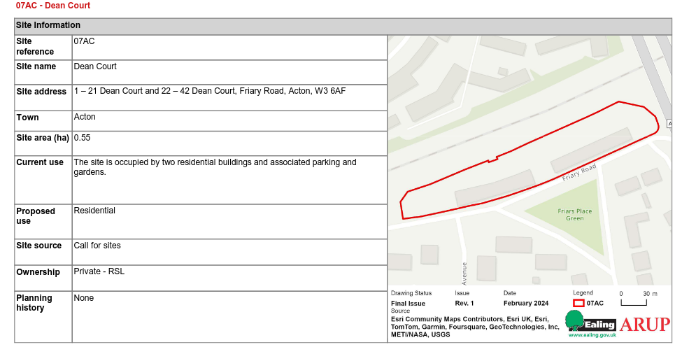

Circa 50 homes at Dean Court in Acton have been earmarked for demolition in Ealing's [2024 Local Plan](https://www.ealing.gov.uk/download/downloads/id/19587/appendix_e_-_results.pdf).

The Local Plan's site allocation states that _"The site is in single ownership and was submitted through Call for Sites by the Housing Association, who are keen to see it regenerated and the site optimised."_

It is not known if residents have been made aware of the proposals.

---

<!------------THE CODE BELOW RENDERS THE MAP - DO NOT EDIT! ---------------------------->

---