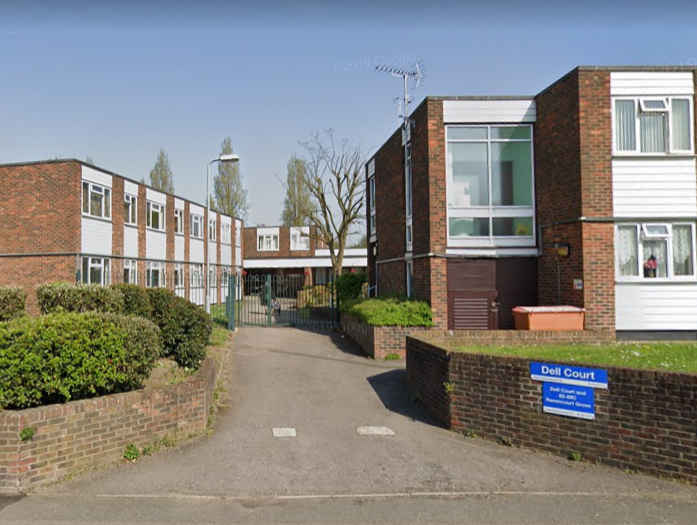

29 homes are under threat of demolition at Havering's Dell Court in Hornchurch.

The estate has been earmarked for redevelopment as part of Havering's [£1bn joint venture with developer Wates Residential](https://www.wates.co.uk/articles/case-study/borough-of-havering-housing-redevelopment/) which will see 12 of the borough's estates redeveloped.

It is unclear whether Havering intends to ballot residents at this stage.

Havering's [investment prospectus](https://www.investinhavering.co.uk/wp-content/uploads/2017/03/Vision-interactive-map.pdf) provides further details of the scheme.

---

<!------------THE CODE BELOW RENDERS THE MAP - DO NOT EDIT! ---------------------------->

---

![Dell Court estate image](src/images/dell2.png", "Dell court" %}
![Dell Court estate image](src/images/dell3.png", "Dell court" %}
![Dell Court estate image](src/images/dellaerial.png", "Dell court" %}
