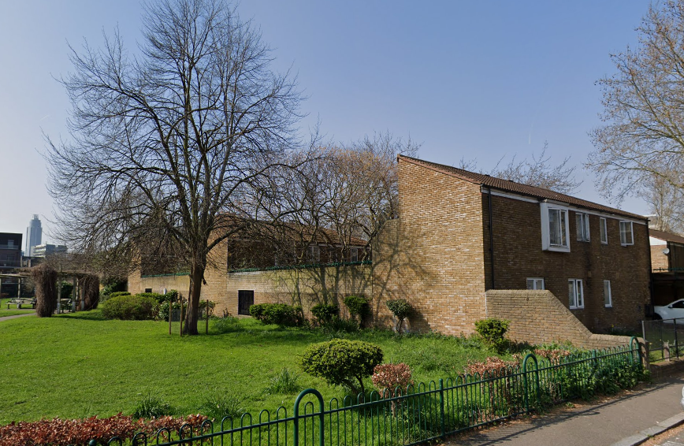
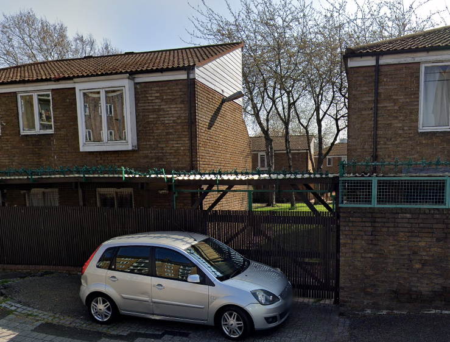
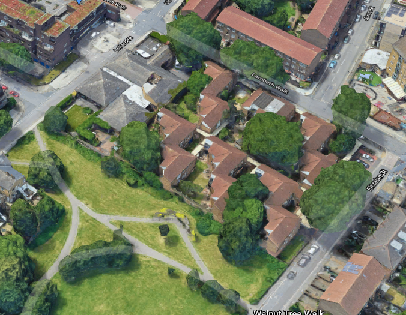

 
42 homes have been earmarked for demolition by Lambeth Council at Denby Court in Kennington.

Lambeth proposes to demolish this former sheltered housing block, which is currently being used as temporary accommodation for families on its housing waiting list.

The site also contains a former education facility, which will also be demolished as part of the scheme.

In January 2021, residents were informed by the Council that they would be moved out imminently to temporary accommodation elsewhere. Residents are resisting the move and lobbying the Council to stay put until they are rehoused permanently in the local area. Many of them have lived in Denby Court for several years. Their plight was covered by the Guardian newspaper in [this Jan 2021 article](https://www.theguardian.com/society/2021/jan/31/dont-make-us-move-in-a-pandemic-plead-tenants-in-dire-council-housing).

In March 2022, Lambeth Council granted itself planning permission for demolition and construction of 141 new homes comprising: 41 social rent, 22 shared ownership and 78 private-for-sale homes. 

In October 2024, Lambeth published a [report](https://moderngov.lambeth.gov.uk/documents/s159375/OSC_New%20Homes%206_October%2024%20vFINAL.pdf?ref=se1.news) which says that _"the design has since been amended due to new fire building regulations to introduce a second stair core. Further changes will be required to meet the Building Safety Act and secure a financially viable scheme."_

The report concludes: _"Denby Court will be a mixed tenure scheme, and therefore delivered under a Development Agreement, subject to the SBC approval. The Council will have the option to purchase any affordable homes, but it is likely that, given the financial constraints outlined earlier in the report."_

---

<!------------THE CODE BELOW RENDERS THE MAP - DO NOT EDIT! ---------------------------->

---

