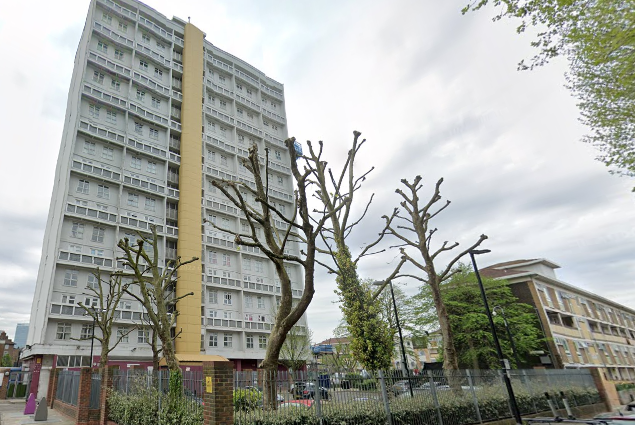
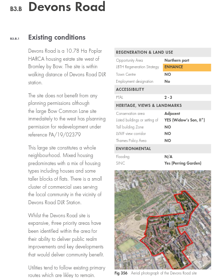
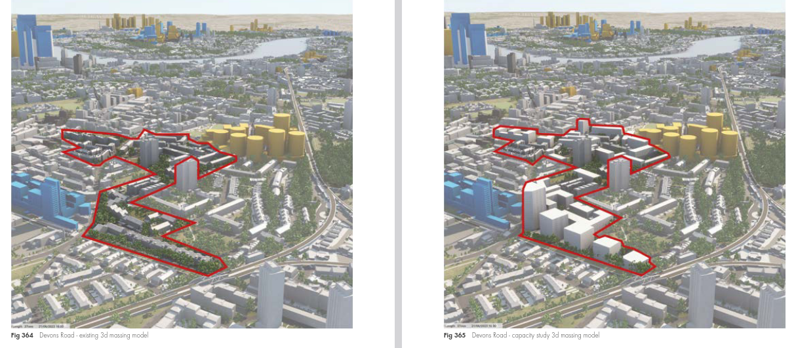

Circa 300 homes have been earmarked for potential redevelopment at the Devons Road estate in Tower Hamlets.

The 11-hectare estate has been identified in Tower Hamlet's new [Local Plan](https://ehq-production-europe.s3.eu-west-1.amazonaws.com/d7aa04f5272beeade98508fa9ff67bd01b02d054/original/1726156503/cc728bc71cc00a623ecafcf84f41041d_SAE01_Tower_Hamlets_Site_Capacity_Study.pdf) as a site for redevelopment.

The Local Plan's capacity study shows how the estate could look after redevelopment:

---

<!------------THE CODE BELOW RENDERS THE MAP - DO NOT EDIT! ---------------------------->

---

