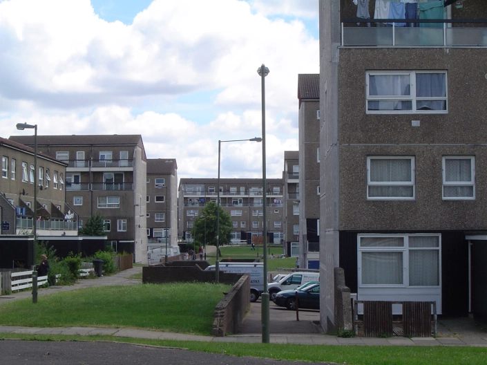
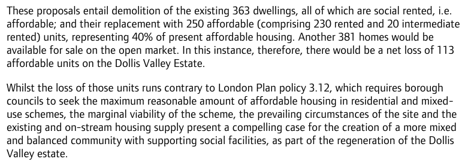

363 of the 440 homes on Barnet's Dollis Valley estate are under threat of demolition. Whilst the low-rise terraced properties on the south side of the estate will be retained, all 363 of the 5-storey maisonette blocks on the north side will be demolished.

Phase 1 of the scheme is currently underway. The [GLA report](https://www.london.gov.uk/sites/default/files/public%3A//public%3A//PAWS/media_id_213093///dollis_valley_estate_report.pdf) approving the scheme justifies the net loss of social rented housing as follows:

The scheme is being progressed in partnership with developer Countryside Properties, which has a dedicated website for the scheme: [www.dollisvalley.co.uk](http://www.dollisvalley.co.uk/)

There is no section 106 agreement publicly available to know whether the replacement 'social' housing is affordable rent or social rent. The planning reference number for the application documents is [B/00354/13](https://publicaccess.barnet.gov.uk/online-applications/applicationDetails.do?activeTab=documents&keyVal=ZZZULZJIJV526)

---

<!------------THE CODE BELOW RENDERS THE MAP - DO NOT EDIT! ---------------------------->

---

 ![Dollis valley estate image](src/images/dvalley3.jpg", "Dollis Valley" %}
  ![Dollis valley estate image](src/images/dvalley.png", "Dollis Valley" %}
  ![Dollis valley estate image](src/images/dvalley2.png", "Dollis Valley" %}
  ![Dollis valley estate image](src/images/dvalley4.png", "Dollis Valley" %}
