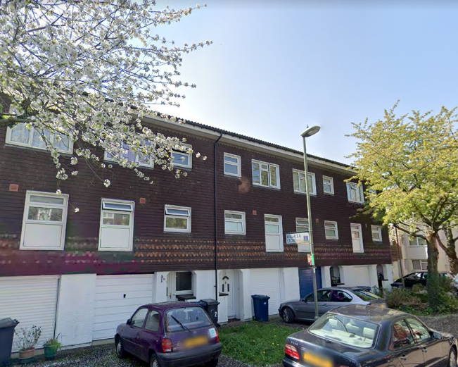
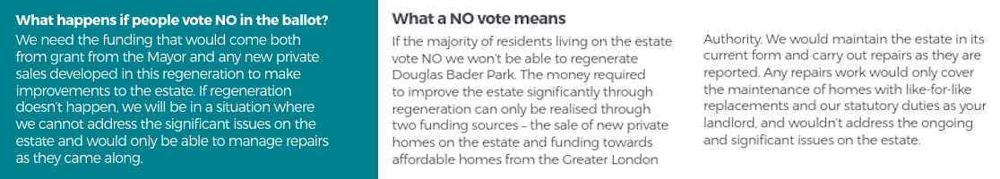
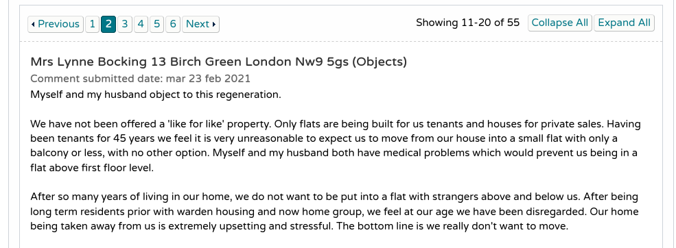
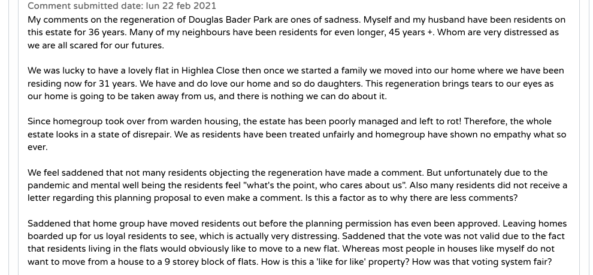
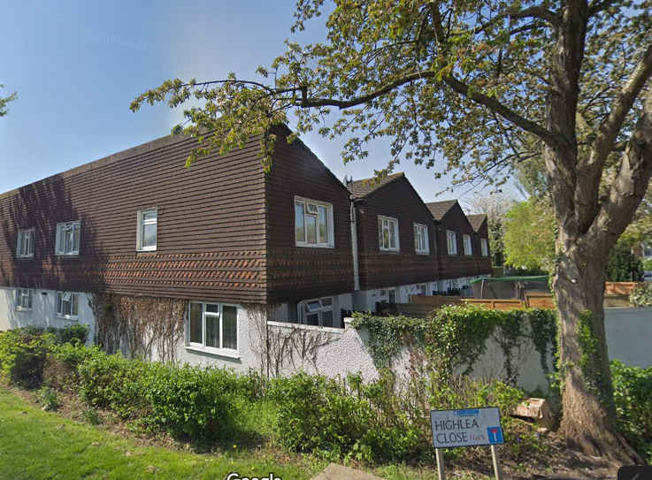
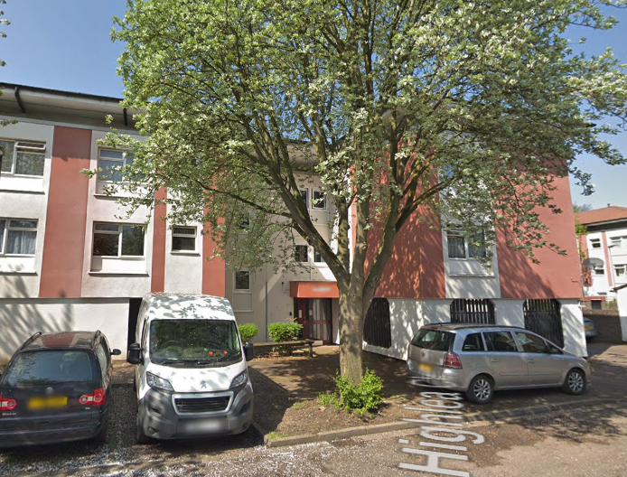
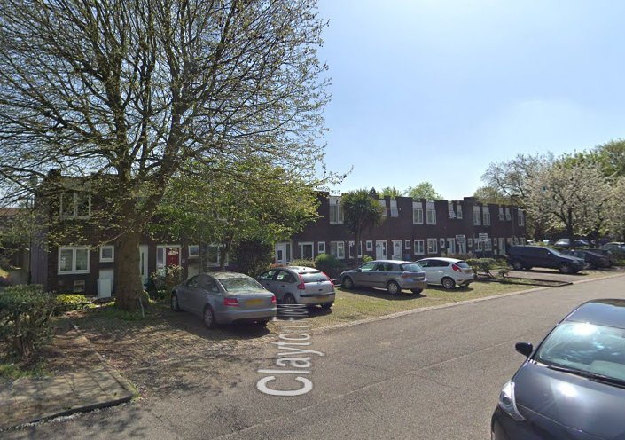
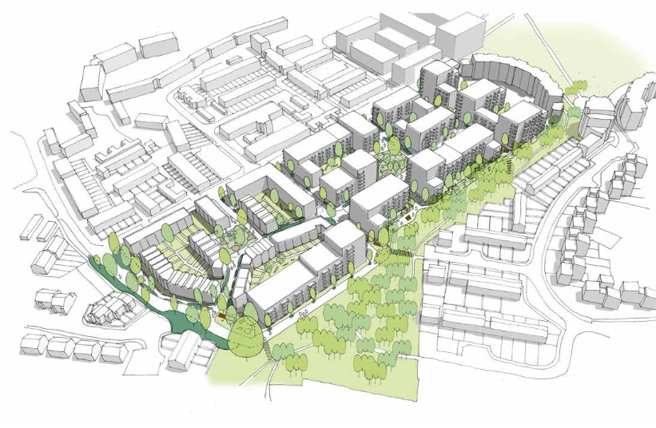
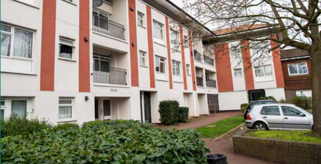

271 homes are earmarked for demolition on Barnet's Douglas Bader Park estate in Colindale.

The estate is owned by housing association [Home Group](http://homegroup.org.uk) and housebuilder [Hill Group](http://hill.co.uk).

In May 2019, residents were balloted on the redevelopment options for the estate, but were [told](/images/DouglasBaderParkBallot.pdf) that if they voted against full redevelopment then only essential repairs would be carried out on their homes:

This is slowly [becoming standard practice](/approved/ballotexemptions/) in the ballot process - residents are faced with the choice of redevelopment or continued neglect and disinvestment; the option of having their homes refurbished is simply not on the table.

In January 2021, a [planning application](https://publicaccess.barnet.gov.uk/online-applications/applicationDetails.do?activeTab=documents&keyVal=QLUOGJJI09100) was submitted for redevelopment of the estate.

In February 2021, the Mayor has published his ['stage 1' planning report](https://gla.force.com/pr/s/planning-application/a0i4J000002fSv8QAE/20210141?tabset-c2f3b=2) giving in principle approval to the [redevelopment of Barnet's Douglas Bader Park estate](https://estatewatch.london/estates/barnet/douglasbaderpark/).

The estate is owned by housing association ['Home Group'](https://homegroup.org.uk), which is one of the Mayor's [strategic partners](https://www.insidehousing.co.uk/news/news/six-partnerships-announced-as-490m-grant-allocated-59289) in receipt of £46m GLA funding for agreeing to provide at least 60% affordable housing across its pipeline (see para 3.17 of the Mayor's [funding guidance](https://www.london.gov.uk/sites/default/files/smha_offer_2019.pdf) for more info).

The Mayor's report confirms that the estate's 271 existing homes will be replaced by 753 new homes of which 272 will be affordable in a mix of social rent and London Affordable Rent. While it praises the _'like for like replacement of social rent accommodation'_, it conflates social rent with London Affordable Rent and is silent on the application's failure to meet the Mayor's minimum 50% affordable housing requirement for estate regenerations.

The Mayor's report is also silent on how the affordable housing offer (36% by unit/40% by habitable room) complies with the strategic partnership commitment of 60% affordable housing.

Neither does it say anything about the Mayor's requirement to show that alternatives to demolition have been properly considered. It is therefore impossible to know whether the Mayoral funding might have been better spent elsewhere, building new social rented homes rather than replacements.

The estate is located directly adjacent to another of Barnet's large scale estate redevelopments - the [Grahame Park estate](estates/grahamepark/).

In September 2021, Barnet's planning committee narrowly approved the planning application, with four Labour councillors and a Liberal Democrat member voting against the plan. Five Conservatives voted in favour, and committee chairman Cllr Eva Greenspan used her casting vote to approve the scheme. 

---

__Links:__ 
Planning application and supporting documents: [https://publicaccess.barnet.gov.uk/online-applications/applicationDetails.do?activeTab=documents&keyVal=QLUOGJJI09100](https://publicaccess.barnet.gov.uk/online-applications/applicationDetails.do?activeTab=documents&keyVal=QLUOGJJI09100) (ref: 20/6277/FUL)

Planning officer report for the rejected planning application: [https://barnet.moderngov.co.uk/documents/s65028/Douglas%20Bader%20Park%20Estate.pdf](https://barnet.moderngov.co.uk/documents/s65028/Douglas%20Bader%20Park%20Estate.pdf)

The Mayor's stage 1 report: [https://gla.force.com/pr/s/planning-application/a0i4J000002fSv8QAE/20210141?tabset-c2f3b=2](https://gla.force.com/pr/s/planning-application/a0i4J000002fSv8QAE/20210141?tabset-c2f3b=2)

---

<!------------THE CODE BELOW RENDERS THE MAP - DO NOT EDIT! ---------------------------->

---

