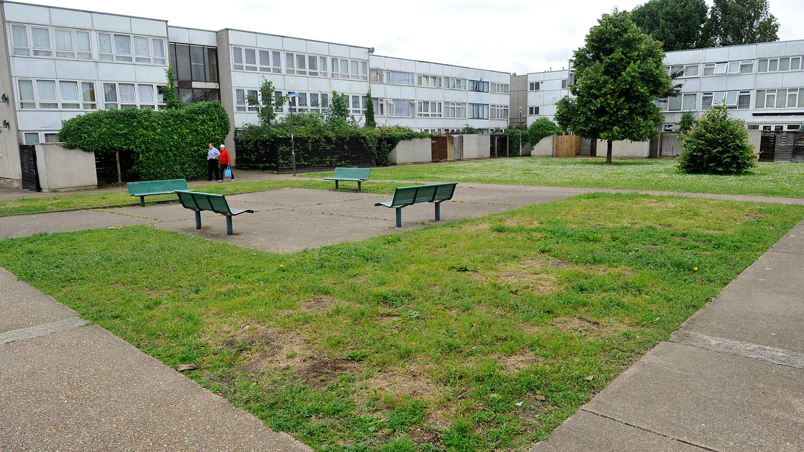
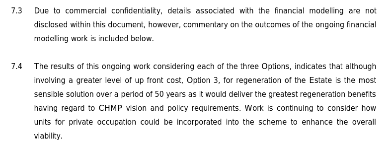
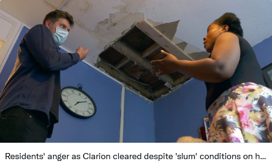
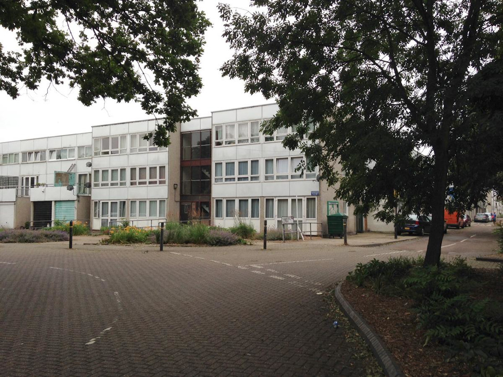
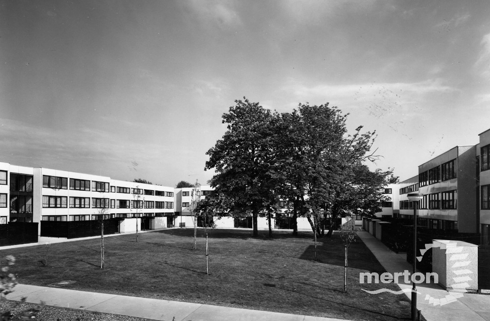

In Nov 2018, the Mayor approved the demolition of 446 homes on Merton's Eastfields estate, to be replaced by 800 homes of which only 262 affordable (all at affordable rent of up to 80% market rent or [LHA levels](https://www.gov.uk/government/publications/understanding-local-housing-allowances-rates-broad-rental-market-areas) - whichever is lower).

The Mayor's [approval notice](https://www.london.gov.uk/sites/default/files/public%3A//public%3A//PAWS/media_id_437651///eastfields_estate_report.pdf) confirms that replacement 'social' housing will be affordable rent tenure and confirms that he has granted an [exemption](/approved/ballotexemptions) from his requirement to ballot residents on the demolition of their homes.

The estate is a seven hectare site overlooking Streatham Park Cemetery, comprising a mix of houses and three storey blocks of flats. It also contains a large area of open space at the centre of the estate.

The scheme is being progressed in five phases over a 13-year period. According to the [latest newsletter](https://www.myclarionhousing.com/your-community-and-local-area/regeneration-projects/merton/eastfields/consultation_archive/) submission of the detailed planning application for phase 1 has been delayed.

The [section 106 agreement](/images/mertons106.pdf) secures the right of any tenants who wish to return to the estate to do so under a social rented tenancy, but enables subsequent re-lets at affordable rent (up to 80 % market rent or LHA rates - whichever is lower).

The scheme is being progressed by Clarion Housing Association (formerly Circle/Affinity Sutton), which took over the Council's housing estate under a 2010 stock transfer agreement. The agreement required Clarion to bring the homes up to Decent Homes Standard by the end of 2015, but Clarion subsequently [persuaded](https://www.merton.gov.uk/assets/Documents/04_merton_report_of_consultation_stage_2_estates_local_plan.pdf) the Council to agree to waiver this requirement for two estates which it claimed would benefit from full redevelopment - [High Path estate](/estates/merton/highpath/) and the Eastfields estate, and partial redevelopment of the smaller Ravensbury estate. 

The three Merton schemes have been [awarded](https://planning.merton.gov.uk/MVM.DMS/Planning%20Application/1000098000/1000098159/17P1721_Clarions%20Financial%20Viability%20Appraisal%20Summary%20Report.pdf) £43m funding by the Mayor from his current affordable housing programme (of which £15m for the Eastfields estate) and have been [granted an exemption](https://www.london.gov.uk/sites/default/files/12.04.19_for_website_-_list_of_exemptions.pdf) from his requirement to ballot residents.

The [options appraisal](https://www.merton.gov.uk/assets/Documents/www2/eastfields_-_chmp_case_for_regen.pdf) was carried out by Savills and made several interesting conclusions, firstly that residents were satisfied with their current homes: _"There is a strong community spirit and many of the residents of the High Path Estate enjoy living on the Estate (evidenced by low turnover of tenants, as well as feedback received from residents.)"_ - (para 2.1).

Secondly, that the existing buildings are structurally sound. (para 2.21)

Thirdly, that whilst the cost of redevelopment was higher than that of refurbishment, the difference wasn't disclosed because of 'commercial confidentiality':

Savills was later also instructed to produce a [financial viability appraisal](https://planning.merton.gov.uk/MVM.DMS/Planning%20Application/1000098000/1000098159/17P1721_Clarions%20Financial%20Viability%20Appraisal%20Summary%20Report.pdf) justifying Clarion's claim that it couldn't provide a policy-compliant level of affordable housing for the scheme.

It is worth noting that the three Merton estates provide something that no other regeneration scheme has offered - namely, a very generous [re-housing offer](http://35percent.org/img/mertonoffer.pdf) to leaseholders which gives them full equity of one of the new-build replacement homes after 11 years. Although these have reported that replacement properties offered are smaller than their existing ones.

In June 2021, the estate was in the news after an [ITV investigation](https://www.itv.com/news/2021-06-16/collapsed-ceilings-mice-and-mould-appalling-conditions-uncovered-across-an-entire-housing-estate-of-nearly-500-homes) uncovered the apalling conditions that tenants were being made to endure in their homes.

The rats, leaks and collapsed ceilings found in the ITV report led to an inquiry by the Social Housing Regulator. But in August that inquiry cleared Clarion of any wrongdoing, finding no evidence of “organisational failure.”

It has since emerged that not a single tenant was spoken to or property inspected by the Regulator as part of the inquiry.

It also [turns out](https://www.mylondon.news/news/south-london-news/thousands-living-london-slum-estates-21308221) that the Regulator waived the ‘Decent Homes Standard’ upon Clarion’s request on the Eastfields estate in 2014, meaning housing conditions were allowed to fall below basic legal requirements a long time ago.

Ownership of the Estate was acquired by Circle Housing Group in 2010 as part of Stock Transfer Agreement containing all of Merton's council housing stock, totalling circa 9,500 homes.

The stock transfer agreement committed Circle to improving the quality of accommodation to at least Decent Homes Standard by 2015. Circle then became Clarion after its merger with Affinity Sutton and decided in 2016 to demolish instead of improve the estate, following an [options appraisal assessment](https://www.merton.gov.uk/assets/Documents/www2/eastfields_-_chmp_case_for_regen.pdf) carried out by Savills. 

The Mayor then approved £15m grant funding for the Eastfields estate scheme in June 2017 and [signed off](https://www.london.gov.uk/sites/default/files/public%3A//public%3A//PAWS/media_id_437651///eastfields_estate_report.pdf) outline planning permission for the scheme in November 2018, despite it not meeting with his minimum affordable housing requirements (30% instead of 50% affordable and affordable rent rather than social rent).

In September 2021, Merton Council [agreed](https://www.housingtoday.co.uk/news/merton-council-agrees-deal-with-clarion-to-kickstart-unviable-2600-home-regen-project/5113627.article) to forgo a 5% profit share deal that it had with Clarion in order to help 'kick-start' the scheme, which had been declared unviable.

The 2018 outline planning consent said that the scheme would be progressed in five phases over a 13-year period, each of the five phases requiring a detailed (reserved matters) planning application to be submitted. In Clarion's most recent [Autumn 2023](https://eastfieldslive.com/pages/documents) it said that work is about to start on phase 1 of the scheme. As at October 2024, no further newsletters have been published.

In 2023, Clarion negotiated a [revised section 106 agreement](https://planning.merton.gov.uk/MVM.DMS/Planning%20Application/1000120000/1000120762/22P3686_Section%20106%20Agreement.pdf) with Merton Council, which replaces the previous definition of affordable housing with a much looser one:

---

__Links:__  

June 2021 ITV report - [https://www.itv.com/news/2021-06-16/collapsed-ceilings-mice-and-mould-appalling-conditions-uncovered-across-an-entire-housing-estate-of-nearly-500-homes](https://www.itv.com/news/2021-06-16/collapsed-ceilings-mice-and-mould-appalling-conditions-uncovered-across-an-entire-housing-estate-of-nearly-500-homes)

Mayor's [Stage 1 and Stage 2 planning reports](https://www.london.gov.uk/what-we-do/planning/planning-applications-and-decisions/planning-application-search/eastfields-estate) - approved Nov 2018

Clarion's website for the scheme: <https://eastfieldslive.com>

---

<!------------THE CODE BELOW RENDERS THE MAP - DO NOT EDIT! ---------------------------->

---

  
  
  

