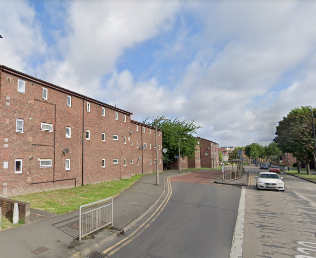
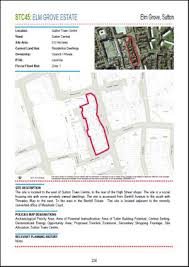
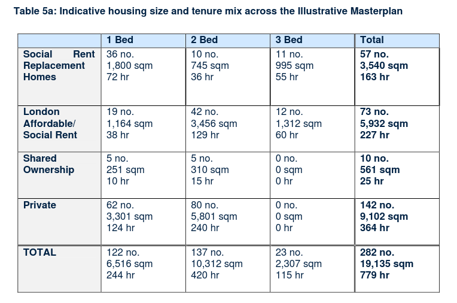

73 homes on Sutton's Elm Grove estate have been earmarked for potential demolition.

The Elm Grove estate is a small estate situated behind Sutton High street. It comprises approximately two-dozen blocks of two or three-storey terraced housing and maisonettes. In 2018, the site was designated for redevelopment in the Council's Local plan (site STC45) and a [masterplan](https://www.sutton.gov.uk/info/200502/housing_advice_and_options/1659/elm_grove/2) was drawn up by architects Levitt Bernstein. 

The estate is one of seven estates listed in [Sutton's Local Plan (2018)](https://drive.google.com/file/d/1MdX6GlaHDoBdG6CTsvjFaIuPtIa9id5O/view) for potential redevelopment.

The Council has [set up a steering group](https://www.sutton.gov.uk/info/200502/housing_advice_and_options/1659/elm_grove/6) to represent residents on the estate and in February 2021 a [draft Resident's Charter](https://drive.google.com/file/d/1pqib0zDnHOFMbobnRhaFC-ReJKxMQ2Hh/view) was published.

In 2021, Sutton commissioned Savills to conduct an options appraisal study for the estate. The [Options Appraisal](src/images/elmgroveoptionsappraisal.pdf) found that _"Elm Grove's investment requirement over the next ten years, (£522,300 total investment, average of £9,164 per property) to be less than the average for the whole stock, (i.e. £14,900 per property)."_ Notwithstanding this, the report concluded that the estate should be demolished and redeveloped. All financial figures involving the cost of redevelopment have been redacted from the report.

A ballot was held in January 2022 with 79% of eligible residents voting in favour of demolition on an 82% turnout.

A planning application (prepared by Savills) was approved in 2024, with the redevelopment seeing 282 new and replacement homes built in towers ranging from 5 to 16 storeys. Just 57 of which will be replacement social rented homes, a further 73 are described as 'London affordable/social rent', 10 shared ownership and the remainder will be private housing.

There is no publicly available section 106 agreement sothe precise tenure of the approved affordable housing is unknown. 

The Mayor has allocated £26.6m grant funding to this scheme.

A compulsory purchase order was served in 2024. According to the [CPO documents](src/images/elmgrovecpo.pdf), just 9 of the estate's tenanted households have applied to return to new homes on the redeveloped estate (para 1.8). 

---

__Links:__  

[Sutton Council website: https://www.sutton.gov.uk/info/200502/housing_advice_and_options/1659/elm_grove/2](https://www.sutton.gov.uk/info/200502/housing_advice_and_options/1659/elm_grove/2)

[Sutton Council - rehousing policy for tenants & Leaseholders](https://moderngov.sutton.gov.uk/ieDecisionDetails.aspx?AIId=39427)

Sutton's [planning application](https://planningregister.sutton.gov.uk/online-applications/applicationDetails.do?activeTab=documents&keyVal=SAEIWSKCJN900)

Sutton's [Landlord Offer](src/images/elmgrovelandlordoffer.pdf)

---

<!------------THE CODE BELOW RENDERS THE MAP - DO NOT EDIT! ---------------------------->

---

