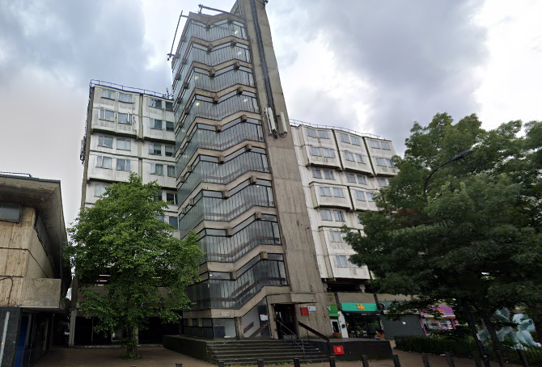
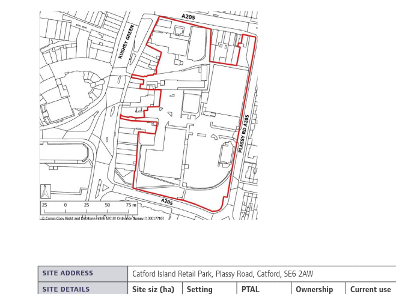

60 homes have been earmarked for potential redevelopment at Eros House in Catford.

The block is currently being used as temporary accommodation for families on Lewisham's housing waiting list and is managed by District Homes.

The block has been earmarked for potential redevelopment in Lewisham's [Local Plan](https://s3-eu-west-2.amazonaws.com/commonplace-customer-assets/lewishamlocalplan/Central%20Jan%202021%20LEWISHAM%20LOCAL%20PLAN_accessible.pdf) (site 20 - Plassy Island)

---

<!------------THE CODE BELOW RENDERS THE MAP - DO NOT EDIT! ---------------------------->

---