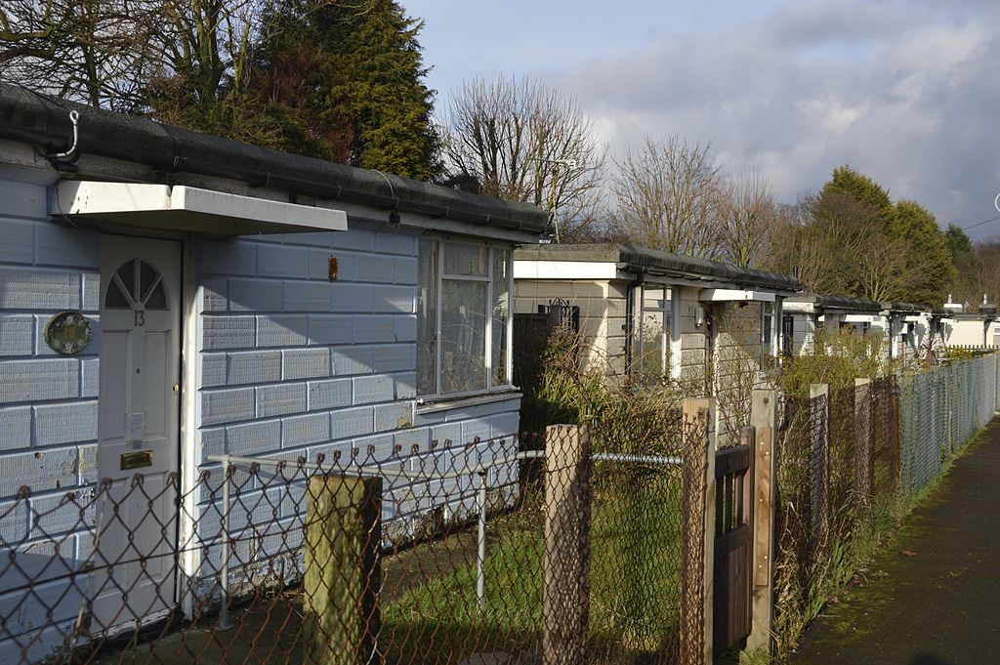

Circa 100 homes remain earmarked for demolition in phases 3 and 4 of Lewisham's redevelopment of the Excalibur estate in Catford.

Phases 1 and 2 of the scheme are nearing completion but it would appear that phases 3 and 4 have stalled.

The estate's initial 189 homes are being redeveloped by housing association L&Q in conjunction with Lewisham Council.

Permission was granted in 2013 for 362 new homes of which 166 social/affordable rent.

---

__Links:__

GLA reports: <https://www.london.gov.uk/sites/default/files/PAWS/media_id_108382/excalibur_estate_report.pdf>

Lewisham planning docs [(ref:DC/13/084180)](https://planning.lewisham.gov.uk/online-applications/propertyDetails.do?previousCaseType=Application&keyVal=_LEWIS_PROPLPI_322215_1&previousCaseNumber=DC%2F13%2F084180&activeTab=summary&previousKeyVal=_LEWIS_DCAPR_70779)

---

<!------------THE CODE BELOW RENDERS THE MAP - DO NOT EDIT! ---------------------------->

---
