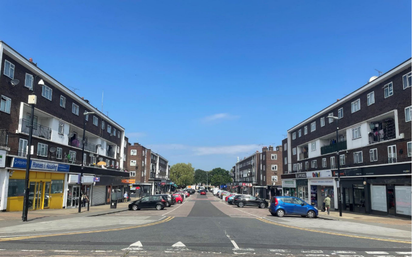
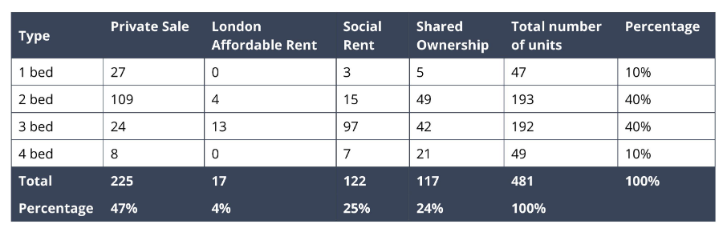
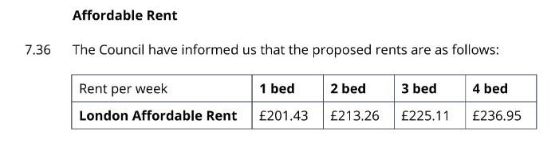

117 homes are under threat of demolition at Havering's Farnham and Hilldene estate in Harold Hill. 

The proposals also include the parades of shops above which the homes are situated.

The estate has been earmarked for redevelopment as part of Havering's [£1bn joint venture with developer Wates Residential](https://www.wates.co.uk/articles/case-study/borough-of-havering-housing-redevelopment/) which will see 12 of the borough's estates redeveloped.

The scheme has not yet applied for [funding](/approved/funding) from the Mayor or been exempted from his [requirement](/approved/ballotexemptions) to ballot residents on the demolition of their homes. It is unclear whether Havering intends to ballot residents at this stage.

In Havering's [investment prospectus](https://www.investinhavering.co.uk/wp-content/uploads/2017/03/Vision-interactive-map.pdf), it originally said it wanted to explore building above the existing homes and shops. But in March 2019 the Council [said](https://www.romfordrecorder.co.uk/news/havering-council-plans-for-regeneration-in-harold-hill-1-5944449) that it prefers the option of wholesale redevelopment. provides further details of the scheme. It is now [consulting](https://www.havering.gov.uk/news/article/722/harold_hill_residents_encouraged_to_share_views_on_regeneration_project) residents on redevelopment options.

In November 2024, a ballot was held and 96.3% of residents voted in favour of redevelopment but on a turnout of just 49.8%.

In April 2025, Wates applied for planning permission for 481 new homes with the following tenure mix:

The planning application documents state that the rents for the London Affordable Rent homes will be set as follows:

---

__Links:__

[Planning application documents ref:P0421.25](https://development.havering.gov.uk/OcellaWeb/planningDetails?reference=P0421.25&from=planningSearch)

---

<!------------THE CODE BELOW RENDERS THE MAP - DO NOT EDIT! ---------------------------->

---

