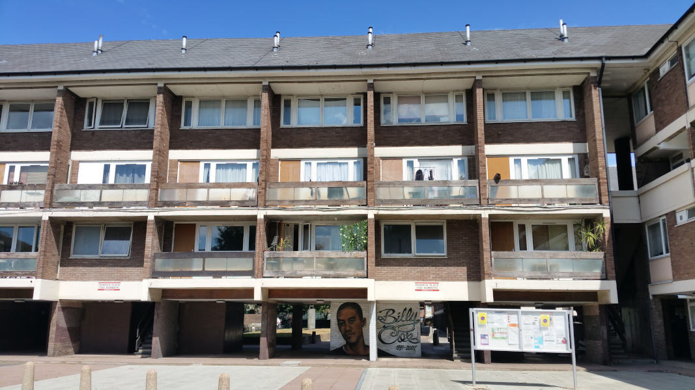
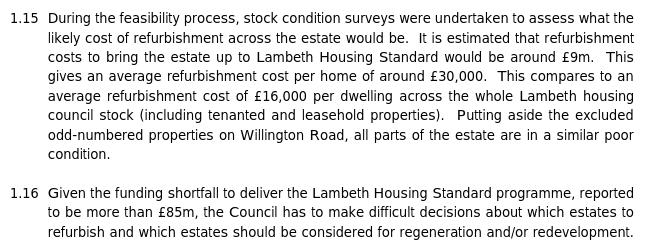
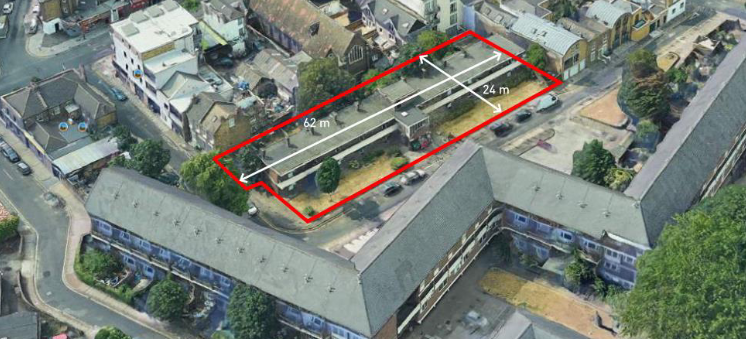
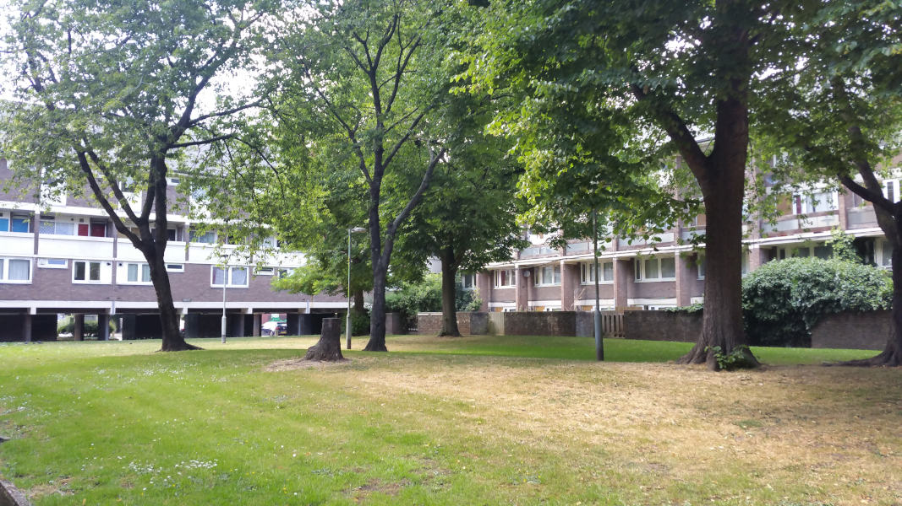
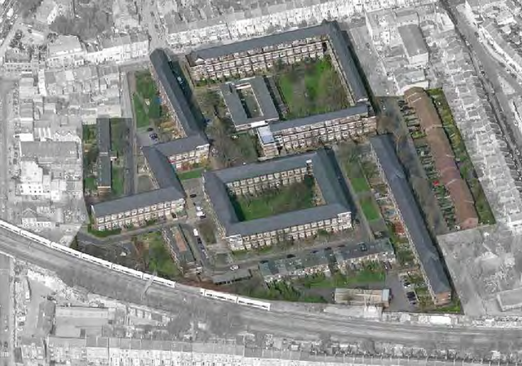
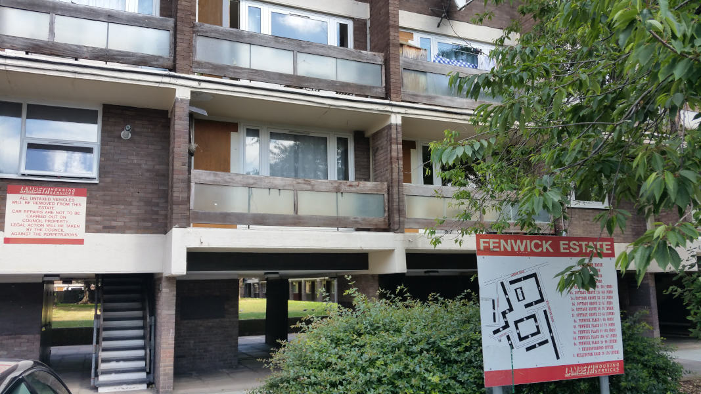

431 homes are earmarked for demolition on Lambeth's Fenwick estate in Clapham.

Fenwick is one of the largest of Lambeth's [five estates](/underthreat/lambeth) earmarked for demolition.

It was first earmarked for potential redevelopment in a [December 2014 Cabinet decision](https://moderngov.lambeth.gov.uk/documents/s70441/03_Lambeth%20Estate%20Regeneration%20and%20Housing%20Delivery%20-%20December%202014%20v3%20docx.pdf).

Lambeth [says](https://moderngov.lambeth.gov.uk/documents/g9750/Publicreports%20pack%20Monday%2011-Jul-2016%2019.00%20Cabinet.pdf?T=10) that it is demolishing the estate because the cost of refurbishing the existing homes is £14,000 per dwelling higher than the average for its other estates and that the £9m overall cost of refurbishment is poor value for money:

The scheme was stalled in 2018, when the Council was [forced](https://www.architectsjournal.co.uk/news/karakusevic-carson-forces-council-to-rerun-flawed-estate-contest/10028456.article) to re-run its procurement process because of a conflict of interests.

The estate was initially awarded grant funding by the Mayor and exempted from his requirement to ballot residents. In September 2020, the Mayor announced that funding had been [withdrawn from the scheme](https://www.insidehousing.co.uk/news/news/gla-funding-withdrawn-for-three-major-council-estate-regeneration-schemes-68045), but Lambeth vowed to proceed with demolition regardless using its own funds.

Lambeth now appear to be proceeding with the scheme entirely without mayoral funding, thereby avoiding the Mayor's requirement that residents are balloted on the demolition of their homes.

Whilst the decant and re-housing programme started in 2016, the estate remains fully occupied with [void units being let out at full market rents or as temporary accommodation at LHA rates](https://www.whatdotheyknow.com/request/581698/response/1393236/attach/4/Attachment%202.pdf).

In November 2020, Lambeth approved a 'kick-start' phase involving the redevelopment of a small, decanted former supported housing block on the corner of the estate. You can read more about the application on Lambeth's planning portal [here](https://moderngov.lambeth.gov.uk/documents/s122755/PAC%20-%20Fenwick%2020-02374-RG3%20FINAL.pdf).

In early 2023, Lambeth Council announced that is was pausing the redevelopment of the Fenwick estate and two other estates (Central Hill and Cressingham Gardens) after a critical report recommended a ‘fundamental reset’ to the way it handles the long-running projects.

In September 2024, Lambeth published a report highlighting the Council’s plans to reset key estate renewal projects and regain control of properties previously under HfL’s management.

The Kerslake Review, which took place in December 2022, was a pivotal moment for the Council’s housing strategy.

Two primary recommendations emerged: first, to dissolve Homes for Lambeth and return the Council’s social housing delivery to in-house management, and second, to address long-standing failures in engaging with residents.

These recommendations have led to a fundamental reshaping of Lambeth’s estate regeneration plans, effectively putting many estates back to square one.

The Overview and Scrutiny report indicates that estates such as Central Hill, Cressingham Gardens, and Fenwick are facing a complete reset.

---

__Links:__

[Fenwick Against Demolition campaign - (Twitter link)](https://twitter.com/fenwick_place)

Fenwick info page on Lambeth Council's [website](http://engage.homesforlambeth.co.uk/what_s_happening_on_fenwick_estate).

---

<!------------THE CODE BELOW RENDERS THE MAP - DO NOT EDIT! ---------------------------->

---

