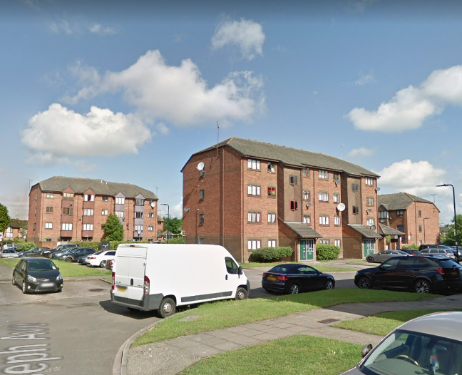
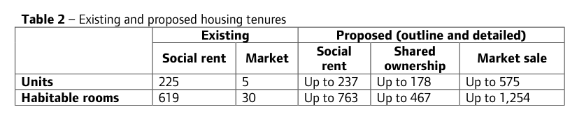

230 homes are under threat of demolition on Ealing's Friary Park estate in Acton.

The estate comprises 230 homes, including 225 social rent units and 5 privately owned units. It was constructed in the 1980s and comprises predominantly flats and terraced homes laid out in buildings up to four stories in height.

The estate also contains a community hall of 211sqm and a basketball court. It sits opposite Acton Main Line rail station, which will benefit from Crossrail services once the Elizabeth Line is operational.

Planning permission for the redevelopment of the estate was granted in November 2019 to a [joint venture between Catalyst Housing Association and developer Mount Anvil](https://www.chg.org.uk/development-regeneration/regeneration/friary-park-ealing/friary-park-rumour-busters/). Despite being [funded](https://www.london.gov.uk/programmes-strategies/housing-and-land/homes-londoners/estate-regeneration/estate-regeneration-data) by the Mayor and [exempted](https://www.london.gov.uk/programmes-strategies/housing-and-land/homes-londoners/estate-regeneration/estate-regeneration-data) from his requirement to ballot residents, there is no stage 2 report available on the [GLA planning portal](https://www.london.gov.uk/what-we-do/planning/planning-applications-and-decisions/planning-application-search/friary-park-estate) confirming the Mayor's approval of the scheme. 

The Mayor's [stage 1 planning report](https://www.london.gov.uk/sites/default/files/public%3A//public%3A//public%3A//public%3A//PAWS/media_id_477438/////friary_park_estate_report.pdf) says that the redeveloped site will increase three-fold in density providing 1,228 new homes of which 50% affordable, including _"up to"_ 237 social rented replacement homes.

In November 2019, it was [reported](https://www.insidehousing.co.uk/news/news/london-housing-association-moves-step-closer-on-990-home-scheme-but-affordable-share-reduced-64284) that the proposed affordable housing quota had been reduced.

There is no section 106 agreement publicly available so it is not clear exactly how many replacement social rented homes there will be or whether it will be truly social rented tenure or affordable rent (up to 80% market rent) - or whether it has been secured in perpetuity.

---

<!------------THE CODE BELOW RENDERS THE MAP - DO NOT EDIT! ---------------------------->

---

